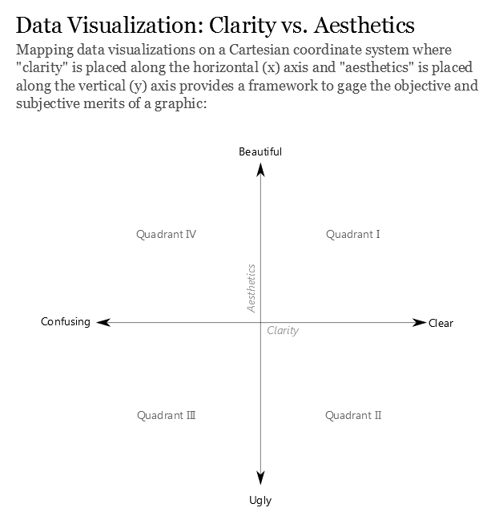
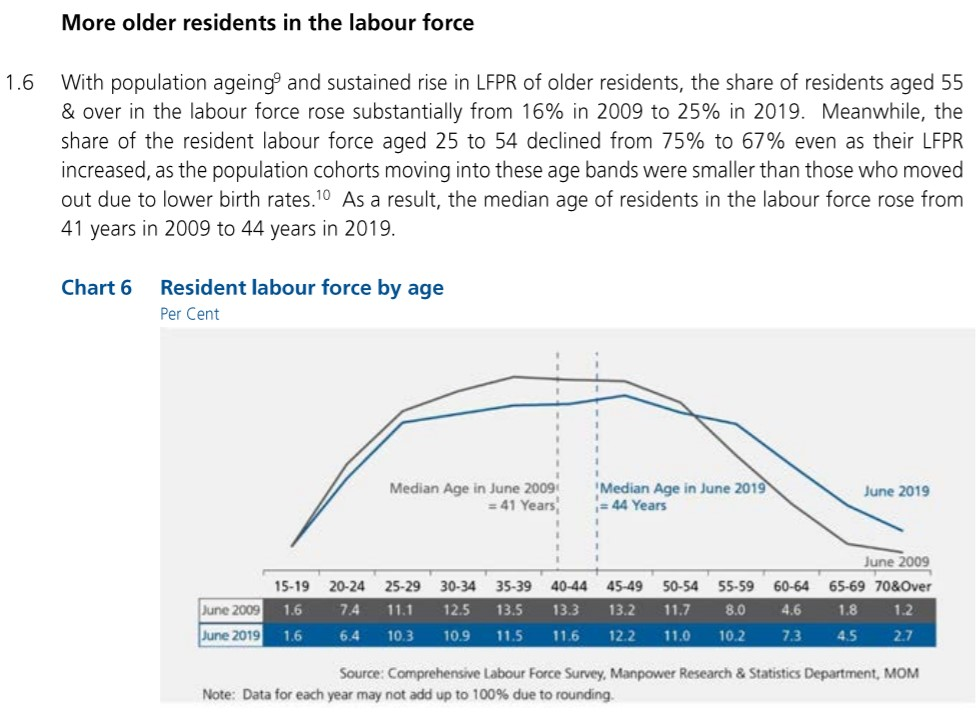
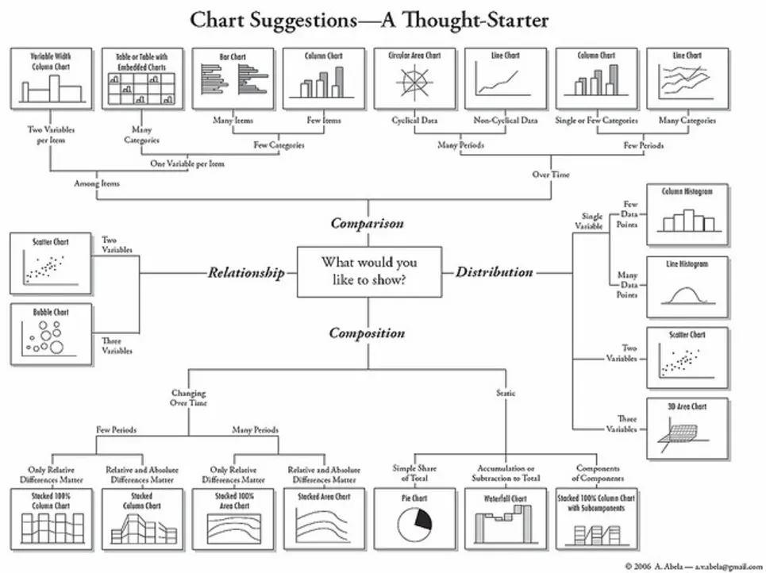
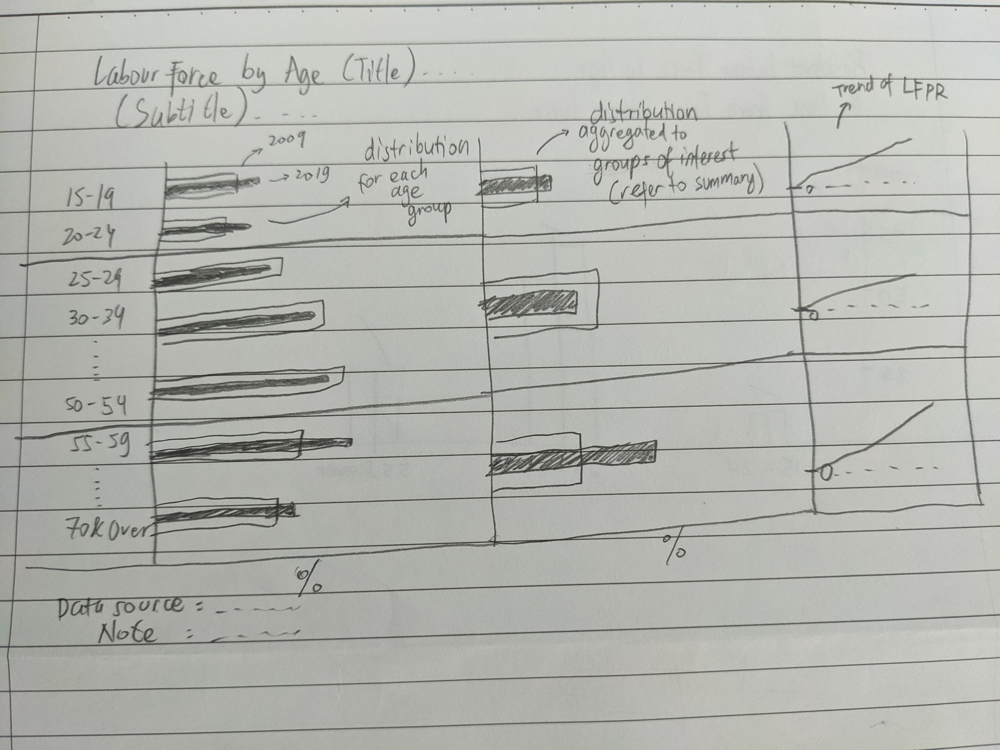
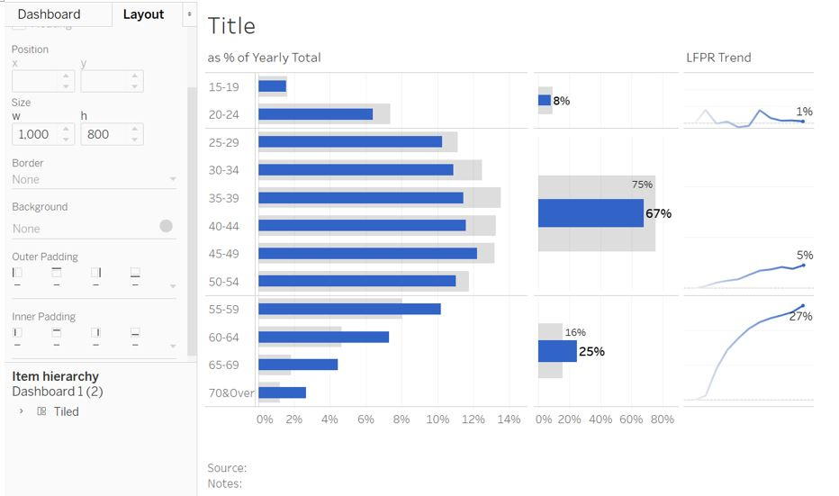

```{r setup, include=FALSE}
knitr::opts_chunk$set(echo = FALSE)
library(knitr)
```

# 1. Introduction

This post is part of the submission for ISSS608 DataViz Makeover assignment 1. Data visualisation critique and makeover is done on one of the excerpt from "Labour Force in Singapore" 2019 annual report by Singapore Ministry of Manpower ([link](https://stats.mom.gov.sg/Pages/Labour-Force-In-Singapore-2019.aspx)).

Data tables used are:  
  - Resident Labour Force Participation Rate by Age and Sex, 2009-2019 (June) - __T5__  
  - Resident Labour Force Aged Fifteen Years and Over by Age and Sex, 2009-2019 (June) - __T7__  
Both of them can be found [here](https://stats.mom.gov.sg/Pages/Labour-Force-Tables2019.aspx)
  
The assessment criteria will be based on the visualisation's clarity and aesthetic, taking reference from ["Data Visualization: Clarity or Aesthetics?"](https://dataremixed.com/2012/05/data-visualization-clarity-or-aesthetics/) by Ben Jones. 

He points out that a suitable visualisation type is critical to the clarity of information that we want to convey. A good visualisation should guide the reader in arriving at the correct conclusion as intended by the author. In addition, visual aesthetic plays important role in keeping the reader engaged and giving pleasant experience when looking at the visualisation. This could be in a form of good font and layout, as well as minimising/eliminating harmful ["chartjunk"](https://eagereyes.org/blog/2012/three-types-chart-junk).

To quantify his assessment, he mapped the clarity and aesthetics of a visualisaiton into a cartesian coordinate system with 4 quadrants.

```{r, echo=FALSE, fig.align='center',fig.cap="Clarity and aesthetics of data visualisation"}

```

The top left (Q4) refers to visualisation with low clarity but high aesthetics. This could be a visualisation with good design and layout, but the message is not clear. What we are trying to achieve is the ideal state (Q1), where the visualisation delivers clear message and aesthetically pleasant.

# 2. Critique and suggestion

The original data visualisation that will be assessed can be found in page 5 of the report.

```{r, echo=FALSE, fig.align='center',fig.cap="Original data visualisation of labour force by age group", out.extra='style="background-color: #000000; padding:1.5px; display: inline-block;"'}

```

In the 4 quadrant system, the original visualisation can be mapped into Q4 as it has a good aesthetic view, but the reader may find it difficult to tally the visualisation with the underlying conclusion.

## Clarity

According to the explanation text preceding the visualisation, the author intends to compare the age distribution of labour force between 2009 and 2019 and highlight the increasing median age due to the following two observations:

- Increasing share of older residents _(age 55 & above)_ in the labour force
- Declining share of younger residents _(age 25-54)_ in the labour force

1. While the median age is clearly represented by the two reference lines, the two observations above are not directly apparent. In this visualisation,    the line chart provides the reader with a quick overview of the shape of distribution among different age groups. However, bar chart is a better option to compare 2009 and 2019 values. As a reference, the following rule of thumb suggest that bar chart is a suggested visualisation type to compare value among few categories, while line chart is more suitable for comparison across many periods.

(ref:caption2) [Choosing visualisation type _(Lifehacker, 2012)_](https://lifehacker.com/how-to-choose-the-best-chart-for-your-data-5909501)

```{r, echo=FALSE, fig.align='center', fig.cap='(ref:caption2)'}

```

2.	The current visualisation does not directly provide the percentage change between the two group of interest (25-54 and 55 & above) between 2009 and 2019. Although the value for individual age group in the table allows reader to get to the percentage change (with some mental calculation), it could be added to the visualisation to make the conclusion more visible.

3.	The title of the visualisation does not explain the basis of the percentage used. Although the preceding paragraph alludes to the percentage being a share from total labour force in the year, the title can do more to help reader understand the visualisation. We can amend the title to emphasise the percentage is based on the yearly total labour force.

## Aesthetic  
1.	The choice of font type and its size are good and clear, which is also consistent throughout the report itself. In addition, differentiation of 2009 and 2019 are consistently done through both colour difference and labelling of line chart, making it easy for reader to differentiate between the two periods.

2.	The author also removes unnecessary data-ink by omitting the y-axis which directs reader straight to the shape of the distribution. However, this requires the author to provide the percentage value in tabular format for reader to make comparison. Positioning of median age at the centre draws the attention to the main conclusion. While the x-axis is of ordinal type (age group), the reference line treats the x-axis as continuous. Although this may contradict the usage of x-axis, the message on "shifting median age" is made clearer by positioning the reference line apart.

3.	The data source and note at the bottom of the visualisation are aligned to the opposing side. Though it may be subjective, having both of them aligned to the same side will keep the layout tidier. Also, it is preferably left aligned, following reading direction from left to right.


# 3. Proposed visualisation
## Sketch
The following sketch shows the proposed visualisation and the rationale behind the choices made are given below.

```{r, echo=FALSE, fig.align='center', fig.cap='Sketch of proposed visualisation'}

```

## Rationale
1. The comparison of two different values (2009 and 2019) is made clearer through the use of bar chart. Specifically, overlapping bar chart is chosen, as opposed to side-by-side bar chart, in order to save some space. It is also less cluttered in comparing 12 different age groups.

2. To connect the visualisation with the preceding text, additional bar chart is used to aggregate 12 age groups into 3 higher level groups, where 2 of them represent older and younger residents. This makes connecting the statement between the text and visualisation easier.

3. The author makes reference to the increasing Labour Force Participation Rate (LFPR) to support the conclusion. As this important data is unavailable in the original visualisation, the trend of LFPR is added using line chart to visualise the increasing LFPR stated in the preceding text.

## Realising the proposed visualisation
The proposed visualisation is made using Tableau with the 2 tables (mentioned in the first section of this post) as the data source.

### Importing data table
Before importing to Tableau, we first open both tables in Excel to look at the table layout.

```{r, echo=FALSE, out.width="50%", fig.show='hold', fig.align='center', fig.cap='Raw T7 table (T5 has similar layout)'}
include_graphics("images/T7_raw.jpg")
```

The data table is not readily usable as it includes the title text, side note, data source text, and several patches of empty cells. However, Tableau has a "Data Interpreter" function which could help with data preparation. After importing T7 excel file into Tableau, click on "Data Interpreter" and drag __T7_T__ (referring to total) into the table area.

```{r, echo=FALSE, fig.align='center', fig.cap='Using data interpreter and import table'}
include_graphics("images/DataImportT7.jpg")
```
Looking at the table view, the first column can be hidden as it does not carry any relevant data (in fact it is the side note of the raw table).
Click on the small dropdown menu of the first column and select "Hide"

```{r, echo=FALSE, fig.align='center', fig.cap='Hide first column'}
include_graphics("images/T7_Col1.jpg")
```

To add the next data source __(T5)__, click on the side of T7 data source and select _New Data Source_. Subsequently, select "data interpreter" option and drag __T5_T__ into the table area. At this point, both __T5__ and __T7__ have been imported into Tableau.

```{r, echo=FALSE, fig.align='center', fig.cap='Adding T5 as a new data source'}
include_graphics("images/addT5.jpg")
```

### Preparing data

For both __T7__ and __T5__, we will remove multiple whitespaces in the original age group text by creating a new calculated field _Age group_ using _REPLACE_ formula. The original age group column can then be hidden.

```{r, echo=FALSE, fig.align='center', fig.cap='Tidying up age group'}
include_graphics("images/AgeGroup.jpg")
```

At this point, the yearly labour force data in __T7__ is separated into different columns. This is fine as the first 2 plots will compare the value between 2009 and 2019. The _null_ value under the _Age group_ columnn refers to the total of the entire age group, which we are not going to use.

```{r, echo=FALSE, fig.align='center', fig.cap='T7 final appearance'}
include_graphics("images/T7_wide.jpg")
```

Currently, the 2009-2019 LFPR data in __T5__ are stored separately (each year has its own individual column). For the last plot in the visualisation, we are going to visualise the trend of LFPR, which means the Year has to be one of the measure. To do so, _Pivot_ function is used by selecting all year columns, right click and select Pivot.

```{r, echo=FALSE, fig.align='center', fig.cap='Pivoting T5 columns'}
include_graphics("images/T5_pivot.jpg")
```

Once pivoted, we can change the field name to _Year_ and _LFPR_ for ease of reference. The field type for _Year_ is then changed to represent _Date_.

```{r, echo=FALSE, fig.align='center', fig.cap='T5 final appearance'}
include_graphics("images/T5_pivoted.jpg")
```

### Main chart on distribution by age group

The first part of the visualisation basically transforms the original labour force distribution curve into bar charts. Open a new worksheet and select __T7_T__ as the data source.

First, drag the _Age group_ from the Data pane to the _Filters_ shelf. In the dialog box, click _Exclude_ and select the _Null_ value from the list. This will exclude _Null_ row (which refer to the total value) from our plot.

```{r, echo=FALSE, out.width="110%", fig.align='center', fig.cap='Filter to exclude _Null_ value'}
include_graphics("images/T7_exclude_null.jpg")
```

Next, drag _2009_ and _2019_ to the _Columns_ shelf and _Age group_ to the _Rows_ shelf. Right click on _2019_ field and select _Dual Axis_. In the _Marks_ shelf, change the chart type to bar chart for both _SUM(2009)_ and _SUM(2019)_. Right click on the x-axis and set _Synchronize Axis_. Set the Worksheet View to _Entire View_.

```{r, echo=FALSE, out.width="110%", fig.align='center', fig.cap='Dual axis for 2019 and 2019 value'}
include_graphics("images/T7_dualaxis.jpg")
```

At this point of time, the difference between 2009 and 2019 can be seen between 20-24 and 30-44 age groups. To get the percentage for each age group, right click on the _SUM(2009)_ field, select _Quick Table Calculation_, and choose _Percent of Total_. Do the same for _SUM(2019)_. To make the comparison clearer, some adjustments are made:  
  - in the _Columns_ shelf, shift _SUM(2019)_ to the left of _SUM(2009)_ so that it will be displayed on top  
  - under _All_ pane, change the type of _Measure Names_ from color to size to differentiate bar chart size between 2009 and 2019  
  - grey and blue color is set for _SUM(2009)_ and _SUM(2019)_ correspondingly  
  - 20% opacity is set for 2009 to send a message that it is of older time period  

At this stage, the chart should look like this.

```{r, echo=FALSE, out.width="110%", fig.align='center', fig.cap='Bar chart with different size'}
include_graphics("images/T7_barsize.jpg")
```

Double click on the legend at the top right, and select _Reversed_ so that 2019 bar chart is smaller than the 2009. Also adjust the right hand slider towards the middle so that the bar size is more comparable. Next, we can remove the top x-axis header, hide the _Age group_ field label, adjust x-axis tick mark, and add the title of the plot.

```{r, echo=FALSE, out.width="110%", fig.align='center', fig.cap='Further adjustment'}
include_graphics("images/T7_tidier.jpg")
```

Additional row divider is then added to clearly show the 2 main groups of interest mentioned in the text. First, we need to create an aggregated age group from _Age group_. To do so, right click on _Age group_, go to _Create_ and select _Group_. In the dialog box, simply select multiple age group (e.g. 15-19 and 20-24), click on _Group_, and assign a new group name.

```{r, echo=FALSE, out.width="110%", fig.align='center', fig.cap='Creating new age group'}
include_graphics("images/T7_newgroup.jpg")
```

A new measure _Age group (group)_ is then created. Drag this to the _Rows_ shelf to the left of our initial _Age group_. Once the row divider is seen, we can remove the header for _Age group (group)_. The final appearance of the plot should look like this. Rename the worksheet as "Part 1" for ease of reference.

```{r, echo=FALSE, out.width="110%", fig.align='center', fig.cap='First part of visualisation'}
include_graphics("images/T7_final_part1.jpg")
```


### Second chart on distribution by aggregated age group

Duplicate the first worksheet and rename it to "Part 2". Next, remove the _Age group_ field from the _Rows_ shelf so that the distribution is grouped into just the 3 aggregated age groups. Right click on the _Age group (group)_ field and enable _Show Header_. Adjust the x-tick mark accordingly so that it shows the entire range of bar chart. The bar chart is also adjusted to be slightly thinner.

```{r, echo=FALSE, out.width="110%", fig.align='center', fig.cap='Aggregated age group'}
include_graphics("images/T7_part2_start.jpg")
```

There is enough room to show the data label in order to help reader connects the text and the visualisation. Under _All_ pane, click on _Label_ and select _Show mark labels_. Choose _Min/Max_ and _Cell_ for the label and scope. The minimum label is not required in this case and can be turned off from the _Options_ menu.

```{r, echo=FALSE, out.width="110%", fig.align='center', fig.cap='Enabling label'}
include_graphics("images/T7_part2_marklabel.jpg")
```

To differentiate the label value between 2009 and 2019 data, some adjustments are made:  
  - font size for 2009 is made smaller (8pt) with Top-Right alignment  
  - font size for 2019 is made bigger (10pt) with __bold__ style  

The decimal place is also removed to make it clearer. First, right click on the plot area and select _Format_, this will open a _Format_ pane on the left side of the interface. Click on the _Fields_ menu and select _% of Total SUM(2009)_. Click on _Pane_, _Numbers_, and choose _Percentage_ with 0 decimal place. Do the same thing for _% of Total SUM(2019)_ field.

```{r, echo=FALSE, out.width="110%", fig.align='center', fig.cap='Formatting label'}
include_graphics("images/T7_part2_labelformatting.jpg")
```

We also activate the row divider for the aggregated age group by setting the slider for the _Row Divider_ level accordingly.

```{r, echo=FALSE, fig.align='center', fig.cap='Second part of visualisation'}
include_graphics("images/T7_part2_rowdivider.jpg")
```

We may want to look at how it pans out when the two plots are joined together. First, we create a new dashboard and drag the 2 worksheets to the dashboard side-by-side.

```{r, echo=FALSE, out.width="110%", fig.align='center', fig.cap='Joined view of Part 1 and Part 2'}
include_graphics("images/T7_predashboard.jpg")
```

Now the visualisation has both the granularity of individual age group and the aggregated age group. The reader can now afford to connect the percentage in the text (67% and 25% for 2019) with the visual. However, there is a downside with this view as the row dividers are not aligned between the 2 plots as compared to the initial sketch. We will address this issue later.

### Third chart on LFPR trend by aggregated age group

The last part of the visualisation is to show the reader that the LFPR for the younger and older residents have increased since 2009, as what the original author has highlighted. For this, we will use the data from __T5__.

First, we create new worksheet called "Part 3" and select __T5_T__ in the data pane. Take note that __T5_T__ contains overlapping age group, hence we should first filter out those groups and keep only the individual age groups similar to __T7__.

```{r, echo=FALSE, out.width="110%", fig.align='center', fig.cap='Filter T5 age group'}
include_graphics("images/T5_filter.jpg")
```

Similar to part 2, we then proceed to create a new aggregated age group. As there are predefined aggregated group inside __T5_T__, we add "group" to the group name to differentiate.

```{r, echo=FALSE, out.width="110%", fig.align='center', fig.cap='Create aggregated age group'}
include_graphics("images/T5_grouping.jpg")
```

To plot the trend of average LFPR within each group, drag the _Year_ to _Columns_ shelf while _Age group (group)_ and _LFPR_ to the _Rows_ shelf. Change the _SUM(LFPR)_ to _AVG(LFPR)_ by right clicking the field, select _Measure_ and _Average_.

```{r, echo=FALSE, out.width="110%", fig.align='center', fig.cap='Calculate average value'}
include_graphics("images/T5_line.jpg")
```

As each group has different initial average LFPR value, it is difficult to compare among them. Therefore, we will set the _AVG(LFPR)_ in 2009 as the baseline and chart the difference in each year as compared to 2009. To do so, right click on the _AVG(LFPR)_ field, select _Quick Table Calculation_, and choose _Percent Difference_. To use 2009 (first value) as the baseline, select _Relative to_ and choose _First_.

```{r, echo=FALSE, out.width="110%", fig.align='center', fig.cap='Average LFPR difference from 2009'}
include_graphics("images/T5_percentdiff.jpg")
```

Color gradation is then added to the line chart from 2009-2019. However, we have to first change the _Year_ measure from _Discrete_ to _Continuous_ type.

```{r, echo=FALSE, out.width="110%", fig.align='center', fig.cap='Continuous _Year_ measure'}
include_graphics("images/T5_year_continuous.jpg")
```

Hold Ctrl in the keyboard while clicking the continuous _Year_ field, drag it from _Columns_ shelf into the _Color_ pane to activate coloring on the line chart.

```{r, echo=FALSE, out.width="110%", fig.align='center', fig.cap='Line chart with color gradation'}
include_graphics("images/T5_color_line.jpg")
```

As the whole visualisation is about comparing 2009 and 2019, we can remove the x-axis title to reduce non data-ink. In addition, the color gradation helps to allude a trend towards 2019. Y-axis is also removed as the starting point for all 3 age groups is zero. Data label for 2019 is added to provide reader a comparative value between 2009 and 2019. Click _Show mark labels_ and select _Most Recent_.

```{r, echo=FALSE, out.width="110%", fig.align='center', fig.cap='Adding label to the most recent data point'}
include_graphics("images/T5_label.jpg")
```

Right click on one of the data label and select _Format_. Click _Fields_ and select _% Difference in AVG(LFPR)_. Click _Pane_ and change the _Numbers_ format to _Percentage_ with 0 decimal place.

```{r, echo=FALSE, fig.align='center', fig.cap='Label formatting'}
include_graphics("images/T5_label_format.jpg")
```

The final appearance for the third part of visualisation will look like this.

```{r, echo=FALSE, out.width="110%", fig.align='center', fig.cap='Third part of visualisation'}
include_graphics("images/T5_final.jpg")
```


### Putting it all together

If we put all 3 parts together, we will get something like shown below. As pointed out before, the row divider among 3 parts are not the same as in the initial sketch. The label for the LFPR trend plot also now becomes illegible as it overlaps with the line plot, hence text alignment has to be adjusted. The height of the LFPR trend plot also jutted out of alignment as compared to the other 2 plots.

```{r, echo=FALSE, out.width="110%", fig.align='center', fig.cap='Putting it all together, _not quite right_'}
include_graphics("images/DraftDashboard.jpg")
```

In order to have the intended row divider for the last 2 plots, we have to create 3 different plots to represent each aggregated age group.

```{r, echo=FALSE, out.width="110%", fig.align='center', fig.cap='Putting it all together, _with some workaround_'}
include_graphics("images/DraftDashboardPatch.jpg")
```

Duplicate part 2 into 3 new worksheets where in each worksheet, we will show only 1 age group. Reactivate _Show Header_ for _Age group (group)_, right click the group to be hidden, and select _Hide_.

```{r, echo=FALSE, out.width="110%", fig.align='center', fig.cap='Hide specific age group from view'}
include_graphics("images/Hide_age_group.jpg")
```

We then hide the title and x-axis according to the order of the plots in the dashboard i.e. only the bottom plot require x-axis, only the top plot requires title.

```{r, echo=FALSE, out.width="110%", fig.align='center', fig.cap='Putting it all together, _with duplicated worksheets_'}
include_graphics("images/DraftDashboardPart2.jpg")
```

Adjustment to the border setting and x-axis range for each plot are done to get standardised format. Only the top and bottom plot would have horizontal border line, while the middle plot is left borderless.

```{r, echo=FALSE, out.width="110%", fig.align='center', fig.cap='Formatting borders and lines'}
include_graphics("images/Border_Lines.jpg")
```

Slight layout padding adjustment is also made in the dashboard setting to achieve better alignment between the plots. Finally, we can achieve the following appearance. 

```{r, echo=FALSE, out.width="110%", fig.align='center', fig.cap='Putting it all together, _part 2 segregated and aligned_'}
include_graphics("images/DraftDashboardPart2Done.jpg")
```

Repeating the same process for LFPR trend plot, we arrive at the following appearance where all 3 plots are now aligned properly.

```{r, echo=FALSE, out.width="110%", fig.align='center', fig.cap='Putting it all together, _part 3 segregated and aligned_'}

```

Adding the main conclusion into the title and subtitle with some formatting done to highlight the key points:  
  - Year 2019 uses __bold__ style and colored <span style="color: blue;font-weight:bold">blue</span> so that reader may relate blue color with 2019  
  - Younger and older residents are highlighted in __bold__ style  
  - Percentage change and LFPR are also highlighted in __bold__ style  
  - Shift in median age is in __bold__ and inserted as the final statement to end the subtitle

Finally, inserting data source and notes at the bottom to complete the visualisation.

```{r, echo=FALSE, out.width="110%", fig.align='center', fig.cap='Putting it all together, _final visualisation_'}
include_graphics("images/Final_viz.jpg")
```

_Note: The final visualisation is saved under "Desktop" dashboard. Uploading to Tableau Public makes the row divider misaligned and hence requires additional adjustment. The Tableau Public version is saved under "Public" dashboard [(Tableau Public)](https://public.tableau.com/views/Y210127_VizMakeover1/Public?:language=en&:display_count=y&publish=yes&:origin=viz_share_link)._

# 4. Observations from visualisation

1. There is less younger residents aged 25-54 in the 2019 labour force. Their percentage share in the total labour force drops from 75% in 2009 to 67% in 2019. In contrast, the share of older residents aged 55 & above increases from 16% to 25%.  
2. The distribution in 2009 has its peak percentage residing in the 35-39 age group. The peak has moved to 45-49 age group in 2019, pointing to the insufficient influx of younger age group in the labour force to balance Singapore's aging population. This could be attributed to Singapore's lower birth rate as pointed out by the original author.  
3. Average participation rate of older residents (age 55 & above) into the labour force increases by 27% as compared to 2009. This is in contrast to the 5% increase in the average participation rate of younger age group. This comparison helps to explain why the share of younger resident falls despite the increasing participation rate. In addition, this observation could be useful to initiate further exploration on the retirement and re-employment policy that Singapore took towards 2019.  

# 5. Conclusion

A critique and makeover on labour force distribution plot have been done by first assessing both clarity and aesthetics aspects of the original visualisation. Subsequently, a proposed new visualisation has been developed with the intention to improve the clarity of author's intended message and visual aspects of the original visualisation. The rationale behind the choice of visualisation type and components have also been provided. Lastly, the visualisation has been realised in Tableau, with observations from the new visualisation explained.

_Any suggestion and feedback is much appreciated! Email: kevin.albindo@gmail.com_