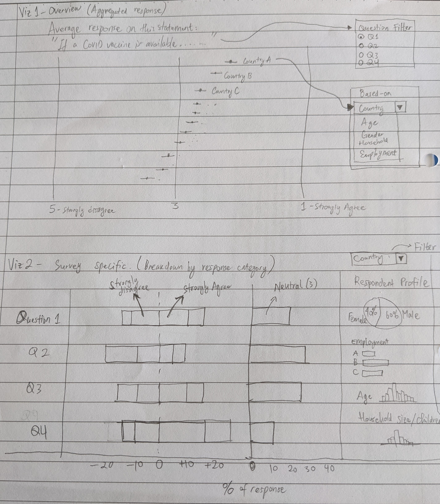
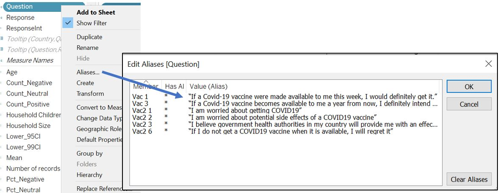
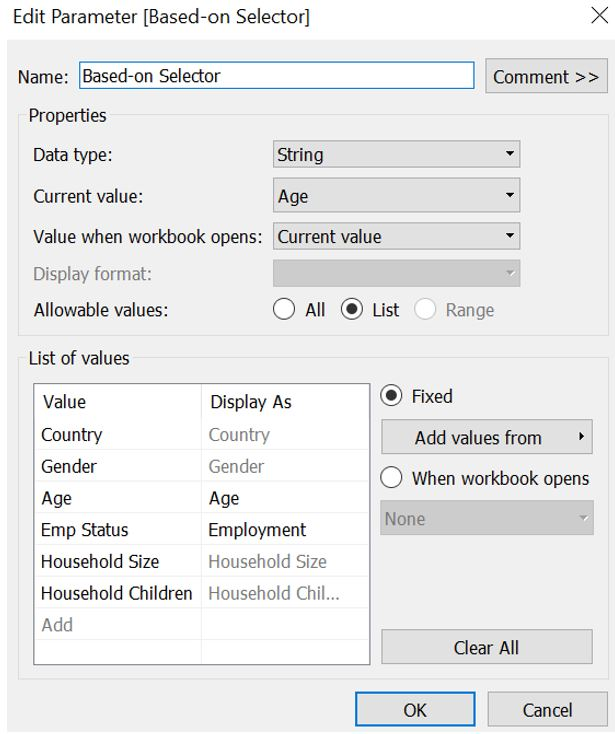
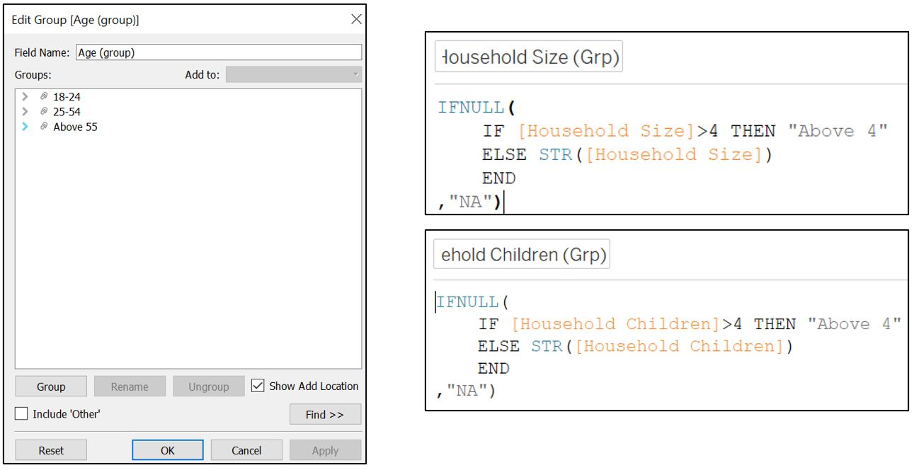
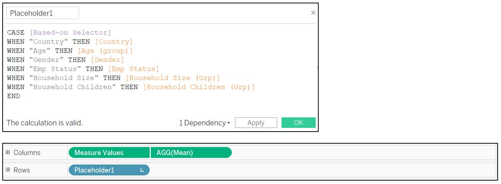

```{r setup, include=FALSE}
knitr::opts_chunk$set(echo = FALSE)
library(knitr)
```

# 1. Introduction

This post is part of the submission for ISSS608 DataViz Makeover assignment 2. Data visualisation critique and makeover is done on the visualisation of survey response regarding public willingness regarding COVID19 vaccination. The data is available from “Imperial College London YouGov Covid 19 Behaviour Tracker Data Hub” [[link]](https://github.com/YouGov-Data/covid-19-tracker)

The assessment criteria will be similar to the previous blog post, based on the clarity and aesthetic aspect of the visualisation (taking reference from ["Data Visualization: Clarity or Aesthetics?"](https://dataremixed.com/2012/05/data-visualization-clarity-or-aesthetics/) by Ben Jones). 


# 2. Critique and suggestion

The original data visualisation that will be assessed is shown below.

```{r, echo=FALSE, output.width="120%", fig.align='center',fig.cap="Original data visualisation of survey response on public willingness to be vaccinated", out.extra='style="background-color: #000000; padding:1.5px; display: inline-block;"'}
include_graphics("images/excerpt.jpg")
```

There are room for improvement to enhance the clarity and aesthetic of the original visualisation. Currently, while the intention is clearly stated by the questions posed in the title, reader may find it difficult to navigate through the visualisation and make appropriate conclusion.

## Clarity
1.	The original author would like to compare the public willingness on vaccination between countries. While the first chart provides the distribution of public opinion in each country, it does not allow reader to compare between countries easily. The visualisation is sorted according to the country name in an alphabetical order, which requires reader to search for the longest blue bar to find country with highest number of strong opinions towards vaccination. In this case, the highest percentage is by any chance belongs to UK at the bottom (not so difficult to find). On the other hand, the second bar chart answers the question more directly as it is sorted in descending order by the percentage of strong opinion in each country.

2.	On the other hand, the second bar chart on the right seems to answer the question more directly as it is sorted in descending order by the percentage of strong opinion in each country. However, both the 100% stacked bar chart and the sorted bar chart fails to convey the fact that the number of respondents from each country varies between 2000 and 5000. It is important to inform the reader about the difference in sample size and hence the uncertainty that comes when estimating the average public opinion.

3.	There is also room for improvement in terms of the textual explanation. Currently, the title does a good job in posing the main question that the author would like to  answer. However, more explanation and conclusion should be added in the visualisation to emphasise the main observations that the author has regarding public opinion on vaccination.

4.	It is also beneficial to understand the respondent profile (overall or within each country) to help the reader assess the validity/significance of the different opinion between countries e.g. whether the response is skewed due to the distribution of a particular respondent's profile (age, gender, etc.).

## Aesthetic
1.	The existing color palette (green, cyan, red, orange, blue) does not help in representing the opposing view of public opinion. Alternatively, diverging color palette like blue-grey-red can be used to represent positive, neutral, and negative opinion accordingly.

2.	Legend title is not elaborated further and left with the default field name (vac_1). Reader may wonder what is the variable/survey question being visualised here. Also, there is minor inconsistency in the length of dash character (-) in the label text.

3.	Position of legend is selected at the top right corner which leaves a lot of whitespace at the bottom right. The space usage can be maximised by embedding the legend into the chart instead.

# 3. Proposed visualisation
## Sketch
The following sketch shows the proposed visualisation and the rationale behind the choices made are given below.

```{r, echo=FALSE, fig.align='center', fig.cap='Sketch of proposed visualisation'}

```

## Rationale
1.	To improve the comparison of response between countries, diverging bar chart is used instead of 100% stacked bar chart. By doing so, contrast between agree and disagree will be more apparent. I also choose to plot _Neutral_ response separately rather than distributing it equally to both sides of the response, as it is important to understand how many percentage are sitting on the fence regarding vaccination and this may warrant further investigation.

2.	It is also important to understand the uncertainty in the survey response which differs between countries due to the different sampling size. We can use dot plot with error bar to better convey the uncertainty to the reader. This will also aid in the comparison of average response between different variables.

3.	To allow more meaningful insight, respondent profile is also considered in the analysis. This is included through interactive visualisation, leveraging on the tooltip function in Tableau.

The link to Tableau visualisation can be found [here](https://public.tableau.com/profile/kevin.gunawan.albindo#!/vizhome/Y210218_VM2_v2/AverageResponse)

## Variable list

For this visualisation, we are going to consider the following variables.

__Survey questions on vaccination__

| Field      | Survey question |
| - | ------------- |
| vac_1	| “If a Covid-19 vaccine were made available to me this week, I would definitely get it.” |
|vac2_1	| “I am worried about getting COVID19” |
|vac2_2	| “I am worried about potential side effects of a COVID19 vaccine” |
|vac2_3	| “I believe government health authorities in my country will provide me with an effective COVID19 vaccine” |
|vac2_6	| “If I do not get a COVID19 vaccine when it is available, I will regret it” |
|vac_3	| “If a Covid-19 vaccine becomes available to me a year from now, I definitely intend to get it” |

__Respondent profile__

| Field	| Description |
| ----------- | ----------- |
|gender	| Gender of respondent |
|age	| Age of respondent |
|household_size	| Number of people in respondent’s household |
|household_children	| Number of children under 18 in respondent’s household |
|employment_status	| Employment status of respondent |

## Data preparation
As each data file corresponds to one country, it is easier if we combine all data tables into one before we proceed with creating the visualisation. We can do this by creating _Union_ of all countries’ data. First, add connection to one of the csv file. The list of other table within the same folder can be seen in the left side panel.

```{r, echo=FALSE, fig.align='center', fig.cap='Importing one of the csv file'}
include_graphics("images/dataPrep_1.jpg")
```
Click on the “australia.csv” table menu and select _Convert to Union_.

```{r, echo=FALSE, fig.align='center', fig.cap='Creating union'}
include_graphics("images/dataPrep_createUnion.jpg")
```
Select all the csv files to be added from the left side panel and drag them to the window box. Once all the countries are added, click OK (the union creation process may take some time).

```{r, echo=FALSE, out.width="150%", fig.align='center', fig.cap='Add files to be combined'}
include_graphics("images/dataPrep_addFiles.jpg")
```
Some columns are specific to a certain country. For example, field “UAEEmirates” is relevant only to _united-arab-emirates.csv_ data table. Therefore, we need to check if all countries have information on the relevant variables that we need. Notice that Tableau also automatically add a new field (_Table Name_) to indicate the table source.

```{r, echo=FALSE, fig.align='center', fig.cap='Variation in field names between data form different countries'}
include_graphics("images/dataPrep_filename.jpg")
```
We can use _Table Name_ field as Country indicator by creating new calculated field to remove ".csv" extension in the _Table Name_. Once created, convert the data type from _"String"_ to _“Country/Region”_.

```{r, echo=FALSE, out.width="150%", fig.align='center', fig.cap='Get country name from _Table Name_ field'}
include_graphics("images/dataPrep_Country.jpg")
```
Next, we can remove those fields that are not in our variable list by selecting them, right click, and select _Hide_.

```{r, echo=FALSE, out.width="150%", fig.align='center', fig.cap='Hide unused fields'}
include_graphics("images/dataPrep_hideFields.jpg")
```
However, there are some fields with similar name and not indicated in the data codebook. We can display the metadata of our table by clicking on the _Manage metadata_ icon shown below. Upon further check of the csv files, some countries like Sweden and Norway have different encoding format for _Employment Status_ where one-hot-encoding is used (the fields _employment_status_N_ are of Boolean type - zero or one). Other fields with similar name are _profile_household_children_ and _profile_work_stat_. We should investigate this further to understand what data resides within these fields.

```{r, echo=FALSE, fig.align='center', fig.cap='Different encoding for employment status'}
include_graphics("images/dataPrep_similarFields.jpg")
```
By tabulating the count of records for each ambiguous field by countries, we can assess if we need to clean the data further. In the screenshot below, we first find out the countries with response recorded for _Vac_1_, which is our main variable of interest. Sweden, Norway, Finland, and Denmark have different employment status record and they also have records on _Vac_1_. Therefore, we cannot exclude those _employment_status_N_ fields and we need to standardise them with records from other countries.

```{r, echo=FALSE, out.width="150%", fig.align='center', fig.cap='Checking data in our table'}
include_graphics("images/dataPrep_fieldsCheck.jpg")
```
On the other hand, we can hide _profile_household_children_ and _profile_work_stat_ as they have zero record for countries with response to _Vac_1_ variable. Select both from the _Data_ pane and right click to select _Hide_.

```{r, echo=FALSE, fig.align='center', fig.cap='Hide fields with zero record'}
include_graphics("images/dataPrep_hideProfileHseWrk.jpg")
```
As the data volume is quite huge, we can improve the performance by creating a [_Context Filter_](https://help.tableau.com/current/pro/desktop/en-us/filtering_context.htm) to include only countries of interest . Drag _Country_ to _Filters_ pane and set the filter criteria using _Condition_ tab as shown below.

```{r, echo=FALSE, fig.align='center', fig.cap='Filter country with response to _Vac_1_ question'}
include_graphics("images/dataPrep_filterCountry.jpg")
```
Click on the _Country_ pill in the _Filters_ pane and select _Add to Context_. Click on _Apply to Worksheets_ and select _All Using Related Data Sources_.

```{r, echo=FALSE, fig.align='center', fig.cap='Apply country filter as context filter to all visualisation using related data sources'}
include_graphics("images/dataPrep_contextFilter.jpg")
```
To standardise the employment status into 1 field, we need to create a new calculated field with the following formula.

```{r, echo=FALSE, out.width="150%", fig.align='center', fig.cap='Standardise employment status field from different countries'}
include_graphics("images/dataPrep_standardiseEmpStatus.jpg")
```
To check if the new field works correctly, drag the new _Emp Status_ field to the _Columns_ shelf, change the _Measure_ to _Count_ and drag it to _Measure Values_ pane.

```{r, echo=FALSE, fig.align='center', fig.cap='Check new field _Emp Status_'}
include_graphics("images/dataPrep_checkEmpStatus.jpg")
```
Now, all employment status info is consolidated into _Emp Status_ field. Note that there is no employment info for Israel. As we would like to compare the respondent profile (which include employment status), we should exclude Israel from our visualisation (the original author also excludes Israel from the list).

We can then proceed to hide _Employment Status_ and _employment_status_N_ fields by selecting them in the _Data_ pane and right click to select _Hide_ (note that we have to remove them from the _Measure Values_ pane before we can hide it).

```{r, echo=FALSE, fig.align='center', fig.cap='Hide original employment status fields'}
include_graphics("images/dataPrep_hideEmployment.jpg")
```
Notice that the count of _Emp Status_ entries are higher than the count of _Vac 1_ which means not all respondents have answered vaccination questions. As the number of respondents who answer the _Vac 1_ question is roughly only 20% of the total respondent, there are significant number of records that will not be used. But first, let’s see if all _Vac 1_ responses are accompanied by the respondent information (age, employment status, household size, etc.).

Drag the _Age_, _Household Children_, and _Household Size_ fields to the _Measure Values_ shelf and change the aggregation for _Age_ to _Count (CNT)_. Also, drag the _Vac 1_ field to _Filters_ pane and exclude _Null_ value. At this point, we can see that the number of counts for all fields are equal (except Israel).

```{r, echo=FALSE, out.width="150%", fig.align='center', fig.cap='Check information completeness for _Age_, _Household Children_, and _Household Size_'}
include_graphics("images/dataPrep_checkInfoCompleteness.jpg")
```
Next, for _Gender_, _Vac 3_, _Vac2 1_, _Vac2 2_, _Vac2 3_, _Vac2 6_, select all of them and drag to the _Rows_ shelf. Select all of them by using Shift and mouse click, use right click to change the _Measure_ to _Count_.

```{r, echo=FALSE, fig.align='center', fig.cap='Create _Gender_, _Vac 3_, _Vac2 1_, _Vac2 2_, _Vac2 3_, _Vac2 6_ as measure _Count_'}
include_graphics("images/dataPrep_checkInfoCompleteness2.jpg")
```
Once they are converted to measure _Count_, select and drag all of them to _Measure Values_ shelf.

```{r, echo=FALSE, fig.align='center', fig.cap='Count records of _Gender_, _Vac 3_, _Vac2 1_, _Vac2 2_, _Vac2 3_, _Vac2 6_'}
include_graphics("images/dataPrep_checkInfoCompleteness3.jpg")
```
Now, we know that the count for _Vac 3_ is less than the other fields. This means not all respondent answer _Vac 3_ question even though they have responded to _Vac 1_ question. However, we are also convinced that all countries in the list (except Israel) that has responded to _Vac 1_ question are accompanied by the respondent profile information (they all have the same count of records).

```{r, echo=FALSE, fig.align='center', fig.cap='Check information completeness for _Gender_, _Vac 3_, _Vac2 1_, _Vac2 2_, _Vac2 3_, _Vac2 6_'}
include_graphics("images/dataPrep_checkInfoCompleteness4.jpg")
```
As we navigate the steps so far, it takes quite some time for Tableau to process/query the data. Therefore, it is better to exclude those unused records from the data set, rather than using context filter. To do so, export the current data into csv by choosing _View Data_ and _Export All_. Save it as "FilteredData.csv".

```{r, echo=FALSE, out.width="150%", fig.align='center', fig.cap='View and export data'}
include_graphics("images/dataPrep_viewExportData.jpg")
```
With the help of excel, we can remove those records where _Vac 1_ column is blank. We can first sort _Vac 1_ column ascendingly.

```{r, echo=FALSE, fig.align='center', fig.cap='Sort _Vac 1_ ascendingly'}
include_graphics("images/dataPrep_sortVac1Asc.jpg")
```
Delete rows with empty _Vac 1_ column at the bottom of the table.

```{r, echo=FALSE, fig.align='center', fig.cap='Delete rows with empty _Vac 1_ at the bottom of table'}
include_graphics("images/dataPrep_deleteEmptyVac1.jpg")
```
Also, delete all rows which correspond to Israel.

```{r, echo=FALSE, fig.align='center', fig.cap='Delete rows corresponding to Israel data'}
include_graphics("images/dataPrep_deleteIsrael.jpg")
```
Finally, we can save the filtered file (at this point, the file size is around 6MB) and connect the data to Tableau.

```{r, echo=FALSE, out.width="150%", fig.align='center', fig.cap='Import filtered data to Tableau'}
include_graphics("images/dataPrep_reimportData.jpg")
```
As recommended in the Tableau blog on [preparing survey data](https://www.tableau.com/about/blog/2018/2/prepare-survey-data-analysis-three-easy-steps-83122), it is a good practice to have a ‘tall and thin’ data. To do so, we can pivot the _Vac_ fields. Rename the new header accordingly to _Question_ and _Response_. 

```{r, echo=FALSE, out.width="150%", fig.align='center', fig.cap='Reshape survey response fields'}
include_graphics("images/dataPrep_reshape.jpg")
```
The response is currently of _String_ type and we can better handle the values by converting it to integer 1-5 through calculated field. Subsequently, change the data type to _Number (whole)_.

```{r, echo=FALSE, out.width="150%", fig.align='center', fig.cap='Convert response to integer 1 to 5'}
include_graphics("images/dataPrep_responseInt.jpg")
```
The final data table will look like this.

```{r, echo=FALSE, fig.align='center', fig.cap='Final appearance of  data table'}
include_graphics("images/dataPrep_final.jpg")
```

## Visualisation part 1 – Dot plot with error bar
As the sample size between countries is different, we convey this fact by using a dot plot to represent the average response and error bars to represent the uncertainty. To do so, we create new calculated fields for these estimates: mean, upper, and lower bound for 95% and 99% confidence interval. But first, create new calculated field to count the number of records easier.

```{r, echo=FALSE, out.width="150%", fig.align='center', fig.cap='Calculated Fields for number of records, mean, and confidence interval'}
include_graphics("images/plot1_meanCIfields.jpg")
```
Drag _Measure Values_ to the _Columns_ shelf. Remove all the fields from _Measure Values_ pane except for the lower and upper 95% and 99% confidence interval. Subsequently, drag _Country_ field to _Rows_ shelf. Change the chart type to _Line_ and add _Measure Names_ to the _Path_ in _Marks_ shelf to connect our upper and lower bound values. To differentiate 95% and 99% bar, once again drag _Measure Names_ to the _Color_ in _Marks_ shelf.

```{r, echo=FALSE, out.width="150%", fig.align='center', fig.cap='Displaying confidence interval as line'}
include_graphics("images/plot1_CIbar.jpg")
```
To show our mean value as a dot plot, drag _Mean_ field to _Columns_ shelf, select _Dual Axis_ and choose _Synchronize Axis_. Change the chart type for _Mean_ field to _Circle_ type. Edit the X-axis and uncheck _Include zero_ option so that the dot and error bar is more visible. Sort the X-axis based on _Mean_ and hide the top X-axis as it is redundant.

```{r, echo=FALSE, out.width="150%", fig.align='center', fig.cap='Displaying mean as dot plot'}
include_graphics("images/plot1_meanDot.jpg")
```
We should filter by _Vac 1_ question to show the response on public willingness to be vaccinated. Drag _Question_ field to _Filters_ shelf and select _Vac 1_. We can then add a reference line at value equals to 3 which represent the neutral response. In general, the negative response is usually positioned at the left side and positive response is on the right side. Hence, we reverse the X-axis so that response towards 5 (strongly disagree) is on the left while response towards 1 (strongly agree) is on the right side.

```{r, echo=FALSE, out.width="150%", fig.align='center', fig.cap='Reverse X-axis and reference line'}
include_graphics("images/plot1_refLine.jpg")
```
Adjust the error bar color by clicking on the _Measure Names_ color legend and the bar size by adjusting _Size_ in the _Marks_ shelf. Note that the order of the lower and upper bound in the legend affect the display accordingly (arrange such that 99% confidence interval at the top, followed by 95% confidence interval and mean value).

```{r, echo=FALSE, fig.align='center', fig.cap='Adjust plot color'}
include_graphics("images/plot1_color.jpg")
```
Set the X-axis from 1 to 5 with interval of 1 and remove its title. Also, right click on the X-axis and add reference line at 5 and 1 value with label “Strongly Disagree” and “Strongly Agree” to orientate the reader that left side is negative and vice versa.

```{r, echo=FALSE, fig.align='center', fig.cap='Reference line with label'}
include_graphics("images/plot1_strongRefLine.jpg")
```
As it is difficult to trace the dot plot to the country label at the left header, we can instead label each dot with the country name and remove the Y-axis. To do so, drag _Country_ field to _Label_ of _Measure Values_ in _Marks_ shelf, change the alignment to _Middle_ vertical.

```{r, echo=FALSE, out.width="150%", fig.align='center', fig.cap='Create label near the data point'}
include_graphics("images/plot1_labelDot.jpg")
```
To allow reader to cycle among different survey question, we can show the filter by _Show Filter_ for _Question_ field. However, the value under _Question_ is not intuitive and hence we need to create aliases for each question. Right click on _Question_ in the _Data_ pane and choose _Aliases…_. Fill the _Value (Alias)_ column according to the actual survey question.

```{r, echo=FALSE, fig.align='center', fig.cap='Create alias for _Question_'}

```
Click on the _Question_ filter card and select single _Single Value (list)_. Also, go to _Customize_ and turn off _Show “All” Value_.

```{r, echo=FALSE, fig.align='center', fig.cap='Show filter for _Question_'}
include_graphics("images/plot1_filterQuestion.jpg")
```
Next, we would like to provide options for reader to select how they want to split the average response; not only by _Country_, but also by other respondent profile such as age, gender, household size, and employment status. To do so, create a new parameter _Based-on Selector_ and add these attributes to the _List of values_ (taking reference from [here](https://help.tableau.com/current/pro/desktop/en-us/parameters_swap.htm)). Right click on the parameter and select _Show Parameter_.

```{r, echo=FALSE, fig.align='center', fig.cap='Create new parameter to select attributes'}

```
We also need to create new calculated fields for the respondent profile data. For Age, create new group so that we can assign respondents into one of the age group. For _Household Size_ and _Household Children_, we need to right click and choose create new calculated field for new categorical fields _Household Size (Grp)_ and _Household Children (Grp)_.

```{r, echo=FALSE, fig.align='center', fig.cap='Create new calculated fields for respondent attributes'}

```
Next, create a new calculated field _Placeholder1_ to receive input from our [Based-on selector] parameter and drag it to our _Rows_ shelf (replacing _Country_). The idea is that when reader choose the attribute from the parameter list, it will change the input to our _Rows_ shelf.

```{r, echo=FALSE, fig.align='center', fig.cap='Create new calculated field to receive attribute selection'}

```
Finally, add title to link the average response towards the selected question. As we have observed previously, one of the survey questions has less respondent as compared to the rest. We can highlight this fact by showing the number of respondents in the title. Create new calculated field _SumRecords_ to sum up record excluding the grouping by variable in _Placeholder1_. Drag it to the _Detail_ in _Marks_ shelf so that it will show up when we edit the title.

```{r, echo=FALSE, fig.align='center', fig.cap='Create title with number of respondent'}
include_graphics("images/plot1_title.jpg")
```
For the individual data point, we also provide the number of respondents by dragging the _Number of records_ to the _Tooltip_ of _AGG(Mean)_ in _Marks_ shelf. Add _Placeholder1_, average response, and number of records as shown below.

```{r, echo=FALSE, fig.align='center', fig.cap='Create tooltip for _Mean_'}
include_graphics("images/plot1_tooltipMean.jpg")
```
As for the tooltip of the confidence interval bar, we can show the category (_Placeholder1_) and the value of the confidence interval. Go to _Measure Values_ card in _Marks_ shelf and click on _Tooltip_.

```{r, echo=FALSE, fig.align='center', fig.cap='Create tooltip for confidence interval'}
include_graphics("images/plot1_tooltipCI.jpg")
```
Finally, change the _Measure Names_ legend title to “Legend” and we can hide the X-axis as the reader can refer to "Strongly Agree" and "Strongly Disagree" annotation from our reference line.

```{r, echo=FALSE, fig.align='center', fig.cap='Final touch up'}
include_graphics("images/plot1_finalTouch.jpg")
```
Edit the _Filter_ title to orientate reader to the selection of questions.

```{r, echo=FALSE, fig.align='center', fig.cap='Change filter caption'}
include_graphics("images/plot1_filterCaption.jpg")
```
The visualisation for part 1 will look like this.

```{r, echo=FALSE, out.width="150%", fig.align='center', fig.cap='Final appearance for part 1'}
include_graphics("images/plot1_final.jpg")
```

## Visualisation part 2 – Likert chart for survey questions
In the next part, we want to count the percentage of responses for each category (1-5), hence we first need to count the positive, negative, and neutral response for _ResponseInt_ using calculated field.

```{r, echo=FALSE, fig.align='center', fig.cap='Count response'}
include_graphics("images/plot2_countResponse.jpg")
```
Next, create another calculated field for percentage of each response category. We need to use _EXCLUDE:[Response]_ so that the sum of number of records are calculated to include all categories (1-5) for a selected survey question.

```{r, echo=FALSE, fig.align='center', fig.cap='Count percentage of response'}
include_graphics("images/plot2_countPct.jpg")
```
We then create a dual-axis chart by dragging _Pct_Positive_ and _Pct_Negative_ to _Columns_ shelf, and _Question_ to the _Rows_ shelf. Right click on _AGG(Pct_Negative)_ and choose _Dual Axis_. For neutral response, we will show it separately at the side by dragging the _Pct_Neutral_ to the side of _AGG(Pct_Negative)_.

```{r, echo=FALSE, fig.align='center', fig.cap='Drag measure to _Rows_ and _Columns_ shelf'}
include_graphics("images/plot2_dragMeasure.jpg")
```
Synchronise the two axis and change the format of X-axis label to percentage. The top X-axis can be hidden to save space.

```{r, echo=FALSE, out.width="150%", fig.align='center', fig.cap='Sync X-axis and hide'}
include_graphics("images/plot2_syncAxis.jpg")
```
Change the plot type to _Bar_ and drag _Response_ to _Color_ in _Marks_ shelf to color the bar according to the response. Change the default color by clicking on the _Legend_. Also, adjust the color legend so that the strongly agree and strongly disagree are centred for easy comparison. This is done by arranging the label in the color legend accordingly. We can reduce the bar size as well.

```{r, echo=FALSE, fig.align='center', fig.cap='Adjust color legend'}
include_graphics("images/plot2_colorLegend.jpg")
```
In addition, 0% reference line is added to assist reader in finding the centre point. Set _Value_ at 0 and _Constant_ type, set _Label_ as _None_, and use dashed line.

```{r, echo=FALSE, out.width='150%', fig.align='center', fig.cap='Set zero reference line'}
include_graphics("images/plot2_zeroRefLine.jpg")
```
We can create _Aliases_ for _Response_ field to better clarify the response category and fix the incosistent dash character (-) between 1 and 5.

```{r, echo=FALSE, out.width='120%', fig.align='center', fig.cap='Set aliases for _Response_'}
include_graphics("images/plot2_aliasResponse.jpg")
```
To understand the respondent profile for each response category, we can make use of Tableau tooltip to show the visualisations of each respondent’s attribute. But first, we need to prepare a visualisation for each respondent attribute.

### 1. Gender

As there are only 2 categories under gender, we can use pie chart to compare the percentage between male and female respondents. Drag _Gender_ to _Rows_ shelf and _Number of records_ to _Columns_ shelf.

```{r, echo=FALSE, fig.align='center', fig.cap='Gender measure and number of records'}
include_graphics("images/plot2_gender_measures.jpg")
```
Open _Show Me_ feature from the top right corner and select pie chart.

```{r, echo=FALSE, fig.align='center', fig.cap='Select pie chart from _Show Me_ feature'}
include_graphics("images/plot2_gender_pie.jpg")
```
Drag _Number of records_ to the _Label_ in _Marks_ shelf, go to _Quick Table Calculation_ and select _Percent of Total_ to convert the value to percentage.

```{r, echo=FALSE, fig.align='center', fig.cap='Add percentage value'}
include_graphics("images/plot2_gender_percent.jpg")
```
Change the format of _% of Total_ field to remove decimal place.

```{r, echo=FALSE, fig.align='center', fig.cap='Set label decimal format'}
include_graphics("images/plot2_gender_removeDecimal.jpg")
```
Drag _Gender_ to _Label_ in _Marks_ shelf and adjust the format of the label.

```{r, echo=FALSE, out.width='150%', fig.align='center', fig.cap='Add gender and set label format'}
include_graphics("images/plot2_gender_label.jpg")
```
Set the _Fit_ setting to _Entire View_.

```{r, echo=FALSE, out.width="150%", fig.align='center', fig.cap='Final appearance for gender pie chart'}
include_graphics("images/plot2_gender_final.jpg")
```

### 2. Age

There are 3 age groups created in the previous part and we can use donut chart to represent the percentage among them. We can refer to this [blog post](https://interworks.com/blog/nmarques/2019/04/30/the-donut-chart-in-tableau-a-step-by-step-guide/) to create a donut chart in Tableau.

Double-click on _Rows_ shelf and write "avg(0)" and press enter. Repeat the same step next to the newly created _AGG(avg(0))_.

```{r, echo=FALSE, out.width="150%", fig.align='center', fig.cap='Create empty cards'}
include_graphics("images/plot2_age_createCards.jpg")
```
This will create 2 cards in _Marks_ shelf. On the first card, change the type from _Automatic_ to _Pie_. Drag _Age (group)_ and _Number of Records_ to _Label_ in _Marks_ shelf. Drag another _Age (group)_ to _Color_.

```{r, echo=FALSE, fig.align='center', fig.cap='Create pie chart'}
include_graphics("images/plot2_age_createPie.jpg")
```
Change the label to percent of total.

```{r, echo=FALSE, fig.align='center', fig.cap='Create percentage label'}
include_graphics("images/plot2_age_percentTotal.jpg")
```
Remove the decimal place through formatting.

```{r, echo=FALSE, fig.align='center', fig.cap='Remove decimal place'}
include_graphics("images/plot2_age_removeDecimal.jpg")
```
On the second card, change the type to _Circle_. Adjust the _Size_ (make it smaller) and set _Colour_ to white to get the intended donut chart. Remove the Y-axis as well.

```{r, echo=FALSE, fig.align='center', fig.cap='Create donut shape'}
include_graphics("images/plot2_age_createDonut.jpg")
```
To add “Age” in the middle of the donut chart, drag _Age (group)_ to the _Label_ for the second _AGG(avg(0))_ and change the _Text_ to “Age” instead of the age group value. Set _Alignment_ to _Middle_ and tick _Allow labels to overlap other marks_.

```{r, echo=FALSE, fig.align='center', fig.cap='Add age title in the middle of donut'}
include_graphics("images/plot2_age_title.jpg")
```
Set the _Fit_ setting to _Entire View_.

```{r, echo=FALSE, fig.align='center', fig.cap='Final appearance for age donut chart'}
include_graphics("images/plot2_age_final.jpg")
```

### 3.	Employment status  
For employment status, we will use horizontal bar chart with percentage label to show the distribution. Drag _Emp Status_ to _Rows_ shelf and _Number of records_ to the _Columns_. Right click on the _SUM(Number of records)_, go to _Quick Table Calculation_ and select _Percent of Total_ to convert the value to percentage.

```{r, echo=FALSE, fig.align='center', fig.cap='Add measure and set to Percent of Total'}
include_graphics("images/plot2_emp_addMeasure.jpg")
```
Turn on the _Label_ and change the format of _% of Total_ field to remove decimal place.

```{r, echo=FALSE, fig.align='center', fig.cap='Turn on the label and remove decimal place'}
include_graphics("images/plot2_emp_label.jpg")
```
Remove X-axis and re-arrange the order of employment status accordingly.

```{r, echo=FALSE, fig.align='center', fig.cap='Reorder employment status and remove X-axis'}
include_graphics("images/plot2_emp_reorder.jpg")
```
Set the _Fit_ setting to _Entire View_.

```{r, echo=FALSE, out.width="150%", fig.align='center', fig.cap='Final appearance for employment status bar chart'}
include_graphics("images/plot2_emp_final.jpg")
```

### 4.	Household Size and Children
For these 2 attributes, we will use vertical bar chart. Drag _Household Size (Grp)_ to _Rows_ shelf and _Number of records_ to the _Columns_. Right click on the _SUM(Number of records)_, go to _Quick Table Calculation_ and select _Percent of Total_ to convert the value to percentage.

```{r, echo=FALSE, out.width="150%", fig.align='center', fig.cap='Add measure and change to Percent of Total'}
include_graphics("images/plot2_house_addMeasure.jpg")
```
Turn on the _Label_ and change the format to remove decimal place.

```{r, echo=FALSE, out.width="150%", fig.align='center', fig.cap='Add label and change the format'}
include_graphics("images/plot2_house_labelFormat.jpg")
```
Remove the Y-axis and set the _Fit_ setting to _Entire View_.

```{r, echo=FALSE, out.width="150%", fig.align='center', fig.cap='Final appearance for household size bar chart'}
include_graphics("images/plot2_house_final.jpg")
```
Repeat the same step for _Household Children (Grp)_.

```{r, echo=FALSE, out.width="150%", fig.align='center', fig.cap='Final appearance for household children bar chart'}
include_graphics("images/plot2_house_final_2.jpg")
```

### *Tooltip integration*
Before we add the above visualisation to the tooltip, make sure that each of them has _Entire View_ selected as the _Fit_ setting. Back to the Likert scale worksheet, we want to allow reader to view country specific responses. Drag our _Country_ to the _Filters_ shelf, go to _Apply to Worksheets_, and choose _Selected Worksheets…_. Ensure all worksheets corresponding to our respondent’s attribute are selected.

```{r, echo=FALSE, fig.align='center', fig.cap='Link filter to individual visualisation of each respondent attribute'}
include_graphics("images/plot2_filterLink.jpg")
```
Activate _Show Filter_ and use _Single Value (dropdown)_ format for the filter interface.

```{r, echo=FALSE, fig.align='center', fig.cap='Show filter with dropdown list'}
include_graphics("images/plot2_showFilter.jpg")
```
Drag _Country_ and _Number of records_ to the _Tooltip_ for _All_ in the _Marks_ shelf.

```{r, echo=FALSE, fig.align='center', fig.cap='Add tooltip'}
include_graphics("images/plot2_addTooltip.jpg")
```
Click on _Tooltip_ and insert all the visualisations that we prepared before. For the _Gender_, _Age_, and _EmpStatus_ worksheet, we can fit them into one row (add a space between each of them). Press enter after we insert _Emp Status_ to go to the next row, and insert _HseSize_ and _HseChild_ worksheet. Please note that the _maxwidth_ and _maxheight_ of each worksheet has been modified to fit into the tooltip. Change the _Show tooltips_ setting to _On Hover_ so that it does not unnecessarily show the additional info when reader is moving the pointer across the visualisation (avoid overwhelming the reader).

```{r, echo=FALSE, out.width="150%", fig.align='center', fig.cap='Edit tooltip content'}
include_graphics("images/plot2_editTooltip.jpg")
```
Next, put the percentage of response as a label on the box so that the X-axis can be removed. Select _Pct_Positive_, _Pct_Negative_, _Pct_Neutral_ and drag them to the _Label_ for _All_ in _Marks_ shelf. Subsequently, adjust the format of the value to percentage with 0 decimal place.

```{r, echo=FALSE, out.width="150%", fig.align='center', fig.cap='Add label and format'}
include_graphics("images/plot2_addLabel.jpg")
```
Select _AGG(Pct_Positive)_ card in _Marks_ shelf and remove _AGG(Pct_Negative)_ and _AGG(Pct_Neutral)_ from the _Marks_ shelf. Do the same for _AGG(Pct_Negative)_ and _AGG(Pct_Neutral)_ _Marks_ shelf, but retain _AGG(Pct_Negative)_ and _AGG(Pct_Neutral)_ accordingly. 

```{r, echo=FALSE, out.width="150%", fig.align='center', fig.cap='Remove label in each card'}
include_graphics("images/plot2_removeLabel.jpg")
```
However, now we notice that the box length for the two plots are currently not proportionally the same. For example, the neutral box for 25% is bigger than the 29% of positive box side by side.

```{r, echo=FALSE, out.width="150%", fig.align='center', fig.cap='Box size is not proportional between _Neutral_ and others'}
include_graphics("images/plot2_proportionIssue.jpg")
```
To fix this, we can follow a workaround described in Steve Wexler’s [blog](https://www.datarevelations.com/resources/got-likert-data-neutrals/). However, there is a bit of adjustment required as we have different Level of Detail than the example in the blog. First, create new calculated fields to get highest range between positive and negative response. This will determine our _Neutral_ X-axis range by setting an invisible reference line with that range value.

```{r, echo=FALSE, out.width="150%", fig.align='center', fig.cap='Create new calculated fields to set up _Neutral_ reference line'}
include_graphics("images/plot2_calcFieldsNeutral.jpg")
```
Bring _Neutral_Ref_Line_ to the _Detail_ of _AGG(Pct_Neutral)_. Right click the X-axis of _Pct_Neutral_ and _Add Reference Line_. Set _Value_ to our _Neutral_Ref_Line_ with _Total_ aggregate, and set the _Label_ and _Line_ to _None_ as we don’t really need to show it.

```{r, echo=FALSE, out.width="150%", fig.align='center', fig.cap='Create new calculated fields to set up _Neutral_ reference line'}
include_graphics("images/plot2_createRefLine.jpg")
```
Now, the box size for _Neutral_ and _Positive_ / _Negative_ is proportional: the 29% response in both sides are now of similar size. We can proceed to hide the X-axis as the label has shown the percentage value.

```{r, echo=FALSE, out.width="150%", fig.align='center', fig.cap='Proportional box size'}
include_graphics("images/plot2_proportionalBox.jpg")
```
The tooltip appearance will look like this when reader hover into one of the response boxes.
_Note: if gender label overlaps with the pie chart, go to the gender worksheet and reduce the size of the pie chart_

```{r, echo=FALSE, out.width="150%", fig.align='center', fig.cap='Tooltip appearance upon hovering on the box response'}
include_graphics("images/plot2_final.jpg")
```
We can also rearrange the _Question_ to follow the original order accordingly.

```{r, echo=FALSE, out.width="150%", fig.align='center', fig.cap='Rearrange question order'}
include_graphics("images/plot2_final2.jpg")
```

### *Capitalise country label*
_This part can be skipped if you don't mind having country label in lower case._  
To capitalise the initial letter of each _Country_ label, create new calculated field _Country2_.

```{r, echo=FALSE, out.width="150%", fig.align='center', fig.cap='Capitalise country name'}
include_graphics("images/plot2_country.jpg")
```
Change all measure _Country_ in both visualisation part 1 and 2 with _Country2_.

```{r, echo=FALSE, out.width="150%", fig.align='center', fig.cap='Change country label'}
include_graphics("images/plot2_changeCountry2.jpg")
```
Finally, add title to the visualisation and edit the _Filter_ title to better orientate the reader.

```{r, echo=FALSE, fig.align='center', fig.cap='Edit title and filter caption'}
include_graphics("images/plot2_addTitle.jpg")
```
### *Creating dashboard*
Create new dashboard and drag _Average_ worksheet to the dashboard. The blue color rectangle below shows the component of our worksheet. The other components like image, text, and blank are highlighted accordingly with different colors. The image is taken from [here]( https://images.theconversation.com/files/341551/original/file-20200612-153812-ws3rqu.jpg?ixlib=rb-1.1.0&q=45&auto=format&w=754&fit=clip).

```{r, echo=FALSE, fig.align='center', fig.cap='Dashboard 1'}
include_graphics("images/dashboard1.jpg")
```
Create new dashboard and drag _Questions_ worksheet to the dashboard. Similarly, the components are highlighted with different colors below.

```{r, echo=FALSE, fig.align='center', fig.cap='Dashboard 2'}
include_graphics("images/dashboard2.jpg")
```
Often, the format of the visualisation is not properly displayed in Tableau Public (due to different display setting between browser and desktop). Some adjustments like font size and filter type are made to address this issue.

```{r, echo=FALSE, out.width="150%", fig.align='center', fig.cap='Adjustment before publishing to Tableau Public'}
include_graphics("images/publish_adjustment.jpg")
```

# 4. Observations
1. From this interactive visualisation, we can observe that United Kingdom has the most positive response towards vaccination while France is leaning more towards the negative side. If we look at another question on “whether they will regret if they do not get a vaccine”, their responses are also the most negative which may suggest that majority of France respondents do not see getting vaccinated as a necessity. We can also see that Singapore is mostly neutral in this aspect.

```{r, echo=FALSE, out.width="150%", fig.align='center', fig.cap='Which country is more positive towards vaccination?'}
include_graphics("images/obs1.jpg")
```
2. In the previous chart, Japanese respondent is the second least positive about getting vaccinated (after France). The chart below shows that despite the Japanese respondent being the most worried about getting COVID, they are also the most concerned about the potential side effects from the vaccine. Singapore is the second country being most worried with the vaccine’s side effect.

```{r, echo=FALSE, out.width="150%", fig.align='center', fig.cap='Which country is the most concerned about vaccine side effect?'}
include_graphics("images/obs2.jpg")
```
3. When we investigate the response by employment status, retired respondents are more willing to get vaccinated as compared to the rest. Interestingly, this aligns with them being the least worried about the side effect and most supportive and trusting of their government to provide effective vaccine.

```{r, echo=FALSE, out.width="150%", fig.align='center', fig.cap='Retired respondent is more willing towards vaccination'}
include_graphics("images/obs3.jpg")
```
4. From the Likert scale and interactive tooltip for Singapore, the higher observation for male respondents who are willing to be vaccinated may stem from the fact that there are more female respondents who are worried about the side effects.

```{r, echo=FALSE, out.width="150%", fig.align='center', fig.cap='Different response based on gender in Singapore'}
include_graphics("images/obs4.jpg")
```
Comparing "strongly agree" response towards vaccination between Singapore and UK (18% vs 61%), it becomes apparent that UK has higher percentage of retired respondent (and older age group). This may suggest a possible link between a country’s demographic and country's response towards vaccination.

```{r, echo=FALSE, out.width="150%", fig.align='center', fig.cap='Demographic and response'}
include_graphics("images/obs5.jpg")
```

