```{r setup, include=FALSE}
knitr::opts_chunk$set(echo = FALSE)
library(knitr)
```

# 1. Introduction

This post is part of the submission for ISSS608 DataViz Makeover assignment 3. Data visualisation critique and makeover is done on [South-east Asia Armed Conflict Analysis dashboard](https://public.tableau.com/profile/tskam#!/vizhome/South-eastAsiaArmedConflictAnalysis/South-eastAsiaArmedConflictAnalysis).

The [data](https://github.com/kgalbindo/blog/blob/master/_posts/2021-03-18-visual-makeover-3/data/Southeast-Asia_2010-2020_Oct31.xlsx) is extracted from The Armed Conflict Location & Event Data Project (ACLED) database for Southeast Asia region between 2010 and 31 October 2020. More info about ACLED can be found [here](https://acleddata.com/about-acled/).

The assessment criteria will be similar to the previous blog post, based on the clarity and aesthetic aspect of the visualisation (taking reference from ["Data Visualization: Clarity or Aesthetics?"](https://dataremixed.com/2012/05/data-visualization-clarity-or-aesthetics/) by Ben Jones). In addition, since the dashboard is meant to be interactive, we will also assess its interactive feature based on utility.

# 2. Critique and suggestion

The screenshot of original dashboard that will be assessed is shown below.

```{r, echo=FALSE, output.width="120%", fig.align='center',fig.cap="Original South-east Asia Armed Conflict Analysis dashboard", out.extra='style="background-color: #000000; padding:1.5px; display: inline-block;"'}
include_graphics("images/excerpt.jpg")
```

There are room for improvement to enhance the clarity, aesthetic, and interactivity of the original dashboard. The dashboard is created with the intent to reveal the spatio-temporal patterns of armed conflict in selected South-east Asia countries between 2015-2020.

Currently, while the combination of map view and trend line chart serves the basic purpose of displaying the data, there are some limitations that prevent reader to do further exploration and derive more useful insights. The next few sections will elaborate some of these limitations.

## Clarity
1.	The visualisation is at the deepest level of detail which is the individual event point. There is no option for aggregated view which allows comparison between countries. The reader may not be able to derive insights directly such as which country has higher frequency of conflicts relative to others in the region.

2.	The line chart at the right side of the map provides conflict breakdown based on different event type. This allows reader to see the trend over time for each event type. However, they are plotted separately with different y-axis scale, making it difficult for reader to compare the value between event types.

3.	The tooltip information for the map lacks important detail such as fatalities and actors involved. It will be clearer to have key event details in the tooltip, instead of the event ID and coordinate.

## Aesthetics
1.	Although it is quite safe to assume that the Y-axis of the line chart refers to the count of event type, it is better to describe it properly rather than using “Count of Sheet1”. The long text also leads to truncation of axis title which is not good. Field label such as _Event Type_ and _Event Date_ are redundant because the title has stated _Event Type_ and the year label at the bottom is self explanatory.

2.	Individual events are colored according to event type which helps to differentiate them. However, the color is set to solid which makes the display cluttered, allowing events to be hidden under other nearby events. In addition, the line chart should be colored accordingly by _Event Type_ for consistency.

## Interactivity
1.	While the map provides spatial information for each event point, it is detached with the temporal information in the line chart i.e. yearly number of events. It fixates the reader on the conflict period between 2015-2020 which constrains the ability to perform analysis for specific time period of interest.

2.	The visualisation allows reader to filter based on event type which is a useful drilldown function. It can be further complemented with the ability to change level of details (e.g. individual event vs country level) to provide more flexibility in exploring the data.

In addition to the above points, information on fatality is not made available in the visualisation even though it is available in the dataset. The additional information will help reader to have better understanding regarding armed conflict event e.g. how severe it is, based on the number of fatalities.

# 3. Proposed visualisation
## Sketch
The following sketch shows the proposed visualisation and the advantages over the original visualisation will be elaborated. [Tableau link](https://public.tableau.com/views/Y210320_VM3__public_16162097740970/Dashboard1?:language=en&:display_count=y&publish=yes&:origin=viz_share_link&:tabs=no)

```{r, echo=FALSE, fig.align='center', fig.cap='Sketch of proposed visualisation'}
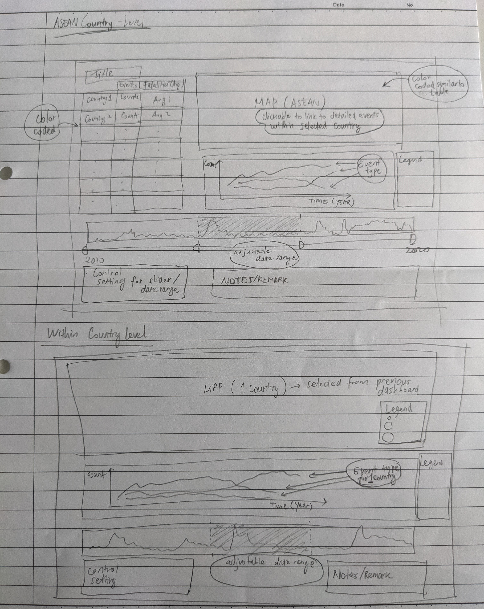
```

## Advantage of the proposed visualisation
1. The proposed visualisation comprises 2 parts, each with its own dashboard to allow overview of conflict in different countries within Southeast Asia region, followed by a more detailed information for each country.

2.	To provide comparison among countries, a choropleth map is used to display the number of conflicts with different color coding. A tabular view is included to ease the comparison between countries. Average fatalities per event is given as additional information with different color coding. 

3.	Visualisation on different event types will be displayed in one plot as line chart so that comparison among event types is more convenient on a single Y-axis scale. Color variation which exists in the original dashboard is retained to differentiate the event types.

4.	Selection of date is made possible by using a bar chart view with adjustable date range through parameters function in Tableau. This introduces flexibility for reader to explore conflicts within different period of interest.

5. Focus analysis on a particular country is also made possible through "Details-on-Demand" concept. Reader can first view the overview of Southeast Asia countries, after which he/she will be redirected to the country level dashboard upon selecting a particular country from the overview dashboard. Fatalities information is also encoded as the size of individual event points in the dashboard for ease of reference.

## Variable list

For this visualisation, we are going to consider the following variables.

| Variable      | Description |
| --- | ------------ |
|Actor1	|The named actor involved in the event|
|Actor2	|The named actor involved in the event|
|Country	|The country in which the event took place|
|Event Date	|The day, month, and year on which an event took place|
|Event Type	|The type of event|
|Latitude	|The latitude of the event location|
|Location	|The location in which the event took place|
|Longitude	|The longitude of the event location|
|Fatalities	|The number of reported fatalities which occurred during the event|

## Data import
The extracted data from ACLED covers the conflicts in South East Asia region between 2010 and Oct 2020. First, import the excel data file to Tableau.

```{r, echo=FALSE, fig.align='center', fig.cap='Importing excel file'}
include_graphics("images/dataImport.jpg")
```
```{r, echo=FALSE, fig.align='center', fig.cap='Imported data table view'}
include_graphics("images/dataSource.jpg")
```

Once imported, check the data format from metadata view. There is no further action needed as the required variables are already in the correct format.

```{r, echo=FALSE, fig.align='center', fig.cap='Format for each variable'}
include_graphics("images/dataFormat.jpg")
```
## Preparing components of dashboard

First, we will create a choropleth map to represent the number of conflicts in each country. Drag _Country_ dimension into the plot area.

```{r, echo=FALSE, out.width="150%", fig.align='center', fig.cap='Drag country to plot area'}
include_graphics("images/MapStep1.jpg")
```
Create new calculated field as a row counter of our data table.

```{r, echo=FALSE, out.width="150%", fig.align='center', fig.cap='Calculated field for row count'}
include_graphics("images/MapStep2.jpg")
```
Drag the _RowCount_ measure to the _Color_ card in the _Marks_ panel. Double click on the legend and select the _Palette_ to _Red_. Click on _Advanced_ option and set the _Start_ to 0 and _End_ to 12000. Rename the worksheet to _Map1_.

```{r, echo=FALSE, out.width="150%", fig.align='center', fig.cap='Add color based on number of rows/events'}
include_graphics("images/MapStep3.jpg")
```
Next, we will create a separate map to show each individual event according to their longitude and latitude. Select both _Latitude_ and _Longitude_ (by Ctrl+click) and drag them to the centre of the plot area.

```{r, echo=FALSE, out.width="150%", fig.align='center', fig.cap='Plot individual data points based on latitude and longitude'}
include_graphics("images/Map2Step1.jpg")
```
Tableau by default will show the aggregated value (average) of latitude and longitude. Go to _Analysis_ menu and untick _Aggregate Measures_ to map each individual event. Drag _Event Type_ to the _Color_ card in _Marks_ shelf, adjust the color _Opacity_ to 50%, and set _Border_ to white.

```{r, echo=FALSE, out.width="150%", fig.align='center', fig.cap='Color based on event type'}
include_graphics("images/Map2Step2.jpg")
```
We also want to show the number of fatalities by the size of the circle. Drag _Fatalities_ to the _Size_ card in _Marks_ shelf. Double click on the _Legend_ and slightly increase the smallest and largest size by sliding them to the right. Set the minimum and maximum value accordingly. Rename this worksheet to _Map2_.

```{r, echo=FALSE, out.width="150%", fig.align='center', fig.cap='Add fatalities information as the size of circle'}
include_graphics("images/Map2Step3.jpg")
```
Next, we will create the highlight table to make the comparison between countries easier by showing the total number of events and average fatalities per event. Drag _Country_ dimension to _Rows_ shelf. Select _Event Id No Cnty_ and _Fatalities_ by holding Ctrl+click and drag them to the blank space in the middle of the plot area.

```{r, echo=FALSE, out.width="150%", fig.align='center', fig.cap='Create tabular view of event counts and fatalities'}
include_graphics("images/TableStep1.jpg")
```
Change the measure of _Event Id No Cnty_ from _Sum_ to _Count (Distinct)_ and _Fatalities_ to _Average_.

```{r, echo=FALSE, out.width="150%", fig.align='center', fig.cap='Change calculation for event count and average fatalities'}
include_graphics("images/TableStep2.jpg")
```
Sort the values based on the number of events from highest to lowest. Edit the header of the column by right click and select _Edit Alias_. Change the _Name_ to _Events_.

```{r, echo=FALSE, out.width="150%", fig.align='center', fig.cap='Sort table values'}
include_graphics("images/TableStep3.jpg")
```
Next, set the number format for average fatalities to 2 decimal places. From the top menu bar, choose _Format_ and select _Font_ to open the _Format_ pane at the left side. Click on _Fields_ option and select _AVG(Fatalities)_. In the _Numbers_ selection, choose _Number (Custom)_.

```{r, echo=FALSE, out.width="150%", fig.align='center', fig.cap='Set number formatting'}
include_graphics("images/TableStep4.jpg")
```
Next, we will color the country numbers to show the difference qualitatively. Drag _Measure Values_ to _Color_ card in _Marks_ shelf. Subsequently, right click on it and select _Use Separate Legends_. Double click on the _Legend_ and set the color to red and brown for the number of events and average fatalities respectively. Change the visualisation type to _Square_ in the _Marks_ shelf.

```{r, echo=FALSE, out.width="150%", fig.align='center', fig.cap='Assign color according to the values'}
include_graphics("images/TableStep5.jpg")
```
The appearance of the table is shown below. Rename the worksheet as _Table_.

```{r, echo=FALSE, out.width="150%", fig.align='center', fig.cap='Appearance of highlight table'}
include_graphics("images/TableStep6.jpg")
```
For the next part, we will plot the trend of events over the year based on the event type. Create a new worksheet and drag _Event Date_ to _Columns_ shelf, _RowCount_ to _Rows_ shelf, and _Event Type_ to _Color_ card in the _Marks_ shelf. Set the _Fit_ type to _Entire View_. Right click on the Y-axis, select _Edit Axis…_ , and edit the title to “Events”. Rename the worksheet to _Type_.

```{r, echo=FALSE, out.width="150%", fig.align='center', fig.cap='Create line chart with different color for each event type'}
include_graphics("images/TypeStep1.jpg")
```
At the point of this makeover exercise, Tableau does not allow filtering action in dashboard using the Legend. To allow filtering action based on event type, we will create a table to replicate a legend which can  be used for filtering action. Create new worksheet named _Type2_ and drag _Event Type_ to _Rows_ shelf and _Color_ card in _Marks_ shelf. This will create a table with colored box which is similar to the legend that we saw in the _Type_ worksheet.

```{r, echo=FALSE, out.width="150%", fig.align='center', fig.cap='Create table view to replicate event type legend'}
include_graphics("images/Type2Step1.jpg")
```
Remove the row borderline by navigating to _Format_ menu bar and select _Borders_. Set the _Pane_ and _Header_ to _None_.

```{r, echo=FALSE, out.width="50%", fig.align='center', fig.cap='Remove borderline'}
include_graphics("images/Type2Step2.jpg")
```
Next, we will create bar chart to allow reader to select a specific period of interest. The reference article on scrolling bar chart can be found in this [link](https://www.tessellationtech.io/tableau-animations-scrolling-bar-chart/).
Create a new worksheet and rename it to _Scroll_. We will use _week_ as the smallest unit to show the bar chart. Drag _Event Date_ to _Columns_ shelf and _Event Id No Cnty_ to _Rows shelf_. Set the _Event Date_ to _Week Number_ and _Event Id No Cnty_ to _Count (Distinct)_.

```{r, echo=FALSE, out.width="150%", fig.align='center', fig.cap='Create weekly chart for event counts'}
include_graphics("images/ScrollStep1.jpg")
```
We need to create a parameter to represent our selected date when we click on the bar chart. Right click on the blank space at the left pane and select _Create Parameter_. Name it _BaselineDate_ and choose _Date_ as the _Data type_. We can set the current value to any date within our data set and select _All_ for the _Allowable values_. Create another parameter called _Range_ to represent the range of date selection i.e. how many days before and after the _BaselineDate_. Set _Integer_ as the _Date type_, 2000 as the current value, and set _Range_ as _Allowable values_ with 0 to 2000 and step size of 1.

```{r, echo=FALSE, out.width="150%", fig.align='center', fig.cap='Create two parameters representing selected date and range'}
include_graphics("images/ScrollStep2.jpg")
```
Based on these 2 parameters, we can create our set our start date and end date. Create new calculated fields: _StartDate_ and _EndDate_ with the following formula. To limit the start and end date, we use the MIN and MAX of _Event Date_ as the constraint to the formula. To color the bar chart within the start date and end date, create new calculated field _Color_.

```{r, echo=FALSE, out.width="150%", fig.align='center', fig.cap='Create calculated fields for start date, end date, and coloring'}
include_graphics("images/ScrollStep3.jpg")
```
Drag the _Color_ field to the _Color_ card in _Marks_ shelf. Double click on the legend to adjust the color using Red palette.

```{r, echo=FALSE, out.width="150%", fig.align='center', fig.cap='Adjust bar color based on date range'}
include_graphics("images/ScrollStep4.jpg")
```
Next, drag both _StartDate_ and _EndDate_ to the _Detail_ card in _Marks_ shelf. Change both of them to _Exact Date_ by right click to open the context menu. Right click on the X-axis and _Add Reference Line_. Select _Band_ type and assign _StartDate_ and _EndDate_ to the _Band From_ and _Band To_ values, set label, tooltip, and line to _None_.

```{r, echo=FALSE, out.width="150%", fig.align='center', fig.cap='Add reference band based on start and end date'}
include_graphics("images/ScrollStep5.jpg")
```
Right click on X-axis and select _Edit Axis_, leave the _Axis Titles_ as blank. Do similarly for Y-axis.

```{r, echo=FALSE, out.width="150%", fig.align='center', fig.cap='Remove axis title'}
include_graphics("images/ScrollStep6.jpg")
```
After we have the start and end date defined by the parameters, we need to set this as filter in other visualisations. Create a new calculated field to filter the _Event Date_ based on the start and end date. Back to our _Map_ worksheet, drag _RangeDate_ to the _Filters_ shelf and select _True_ value. Right click on the filter pill and go to _Apply to Worksheets_ and choose _Selected Worksheets…_. Tick all worksheets created so far (except _Scroll_) to enable filtering on those visualisations whenever the parameters are changed.

```{r, echo=FALSE, out.width="150%", fig.align='center', fig.cap='Apply filter to other worksheets'}
include_graphics("images/ScrollStep7.jpg")
```
To ease the interaction of the adjustable date range, we will create a clickable “button” to reset the date range to cover the whole data set. This is achieved by setting _BaselineDate_ to the mid-point of the entire date range and _Range_ to the largest value. A good reference on creating button in Tableau can be found [here](https://www.thedataschool.co.uk/chris-meardon/button-based-parameter-actions). First, create a new worksheet and rename it to _Reset_. Double click on the white space of _Marks_ shelf, type in ‘Reset Date’ (with the quotes) and press enter. Next, create new calculated field _min(1)_ and type in the formula. Change the type to _Number (decimal)_.

```{r, echo=FALSE, out.width="150%", fig.align='center', fig.cap='Create dummy variables'}
include_graphics("images/ResetStep1.jpg")
```
Drag the _min(1)_ measure to the _Columns_ shelf. Right click on the X-axis and select _Edit Axis…_. Set the _Range_ to _Fixed_ and set -0.01 and 1.01 as the start and end points. Untick the _Show Header_ to hide the X-axis.

```{r, echo=FALSE, out.width="150%", fig.align='center', fig.cap='Create bar chart as a button'}
include_graphics("images/ResetStep2.jpg")
```
Drag the _’Reset Date’_ in _Marks_ shelf to _Label_ card and drag the bottom of the blue box to enlarge it until the text is visible. Click on the _Label_ card and set the font size to 10 and _Bold_. Set the _Alignment_ to _Center_.

```{r, echo=FALSE, out.width="150%", fig.align='center', fig.cap='Adjust format of the button'}
include_graphics("images/ResetStep3.jpg")
```
This blue box will serve as our “button” when we add it in the dashboard. However, we need to assign information on the _BaselineDate_ and _Range_ as the _Detail_ of this button so that it can be used to change our parameter when it is clicked. First, create a new calculated field _MidDate_ to store our middle point of our data’s date range. Drag it to the _Detail_ card in _Marks_ shelf. To set max value for _Range_ parameter, double click on the white space of _Marks_ shelf, type in 2000, and press enter.

```{r, echo=FALSE, out.width="150%", fig.align='center', fig.cap='Set the value for _BaselineDate_ and _Range_ parameters'}
include_graphics("images/ResetStep4.jpg")
```
Right click on the grid line and select format. Set all line to _None_ for _Sheet_, _Rows_, and _Columns_.

```{r, echo=FALSE, out.width="150%", fig.align='center', fig.cap='Remove gridline'}
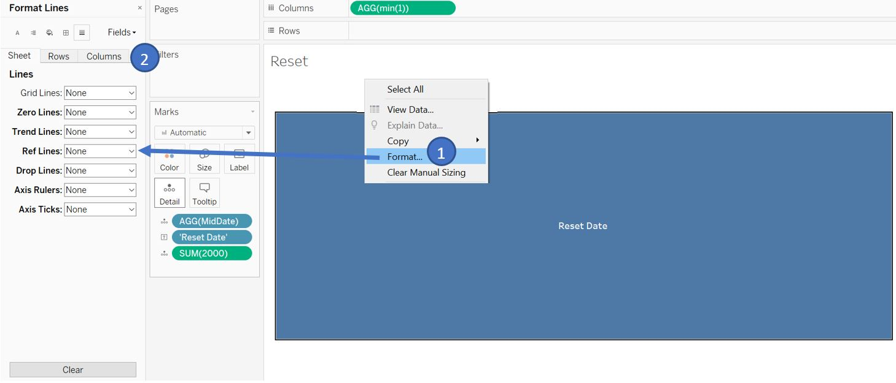
```
Finally, add one more worksheet and name it _Title_. This will serve as the main title in the dashboard later. Multiselect _Country_, _EndDate_, _StartDate_ (by Ctrl+click) and drag them to the _Detail_ card in _Marks_ shelf. Right click on _EndDate_ and change the type to _Day_ (continuous). Do the same for _StartDate_.

```{r, echo=FALSE, out.width="150%", fig.align='center', fig.cap='Add variables for title text'}
include_graphics("images/TitleStep1.jpg")
```
Right click on the _EndDate_ pill and select format to open _Format_ pane on the left side. Click on _Pane_ tab and change the _Default_ date format to dd/m/yyyy. Click on the _Fields_, select _StartDate_, and similarly change the date format.

```{r, echo=FALSE, out.width="150%", fig.align='center', fig.cap='Adjust the date format'}
include_graphics("images/TitleStep2.jpg")
```
Right click on the title bar, select _Edit Title…_, and add in _Country_, _StartDate_, and _EndDate_ to the title as follows. Set font size to 12.

```{r, echo=FALSE, out.width="150%", fig.align='center', fig.cap='Set the title content from variables'}
include_graphics("images/TitleStep3.jpg")
```
We can make the little blue boxes under our title to be invisible by setting the color to 0% opacity. Our title bar will look like this.

```{r, echo=FALSE, out.width="150%", fig.align='center', fig.cap='Hide unwanted blue boxes'}
include_graphics("images/TitleStep4.jpg")
```

## Setting up dashboard for Southeast Asian region level
Next, we will setup the first dashboard for the comparison among Southeast Asia countries. But before that, ensure that all visualisations are set to _Entire View_ for the _Fit_ setting.

```{r, echo=FALSE, out.width="150%", fig.align='center', fig.cap='Set _Fit_ to _Entire View_'}
include_graphics("images/FitSetting.jpg")
```
Create new dashboard and drag each of the visualisation following the layout below.

```{r, echo=FALSE, out.width="150%", fig.align='center', fig.cap='Add worksheets to the dashboard layout'}
include_graphics("images/Dashboard1Step1.jpg")
```
For each of the visualisation, hide the title and label (through right click context menu) as required to achieve the intended appearance.

```{r, echo=FALSE, out.width="150%", fig.align='center', fig.cap='Hide unnecessary title and label'}
include_graphics("images/Dashboard1Step2.jpg")
```
To show the _Range_ parameter slider, go to _Analysis_ menu bar, navigate to _Parameters_ ,and select _Range_. Right click on the slider, go to _Customize_ and deselect _Show readout_ and _Show buttons_ so that only slider will be displayed.

```{r, echo=FALSE, out.width="150%", fig.align='center', fig.cap='Add _Range_ parameter slider'}
include_graphics("images/Dashboard1Step3.jpg")
```
Move the slider next to the _Reset_ button and adjust the width accordingly. Add a _Text_ box to the bottom right to put our data reference.

```{r, echo=FALSE, out.width="150%", fig.align='center', fig.cap='Position the _Range_ parameter slider and add text box'}
include_graphics("images/Dashboard1Step4.jpg")
```
To add interactivity among the individual visualisation inside the dashboard, we will set a few _Action_ settings to link them with a certain user action (e.g. select and hover). First, we will look at our _Table_. We want the map on the right to be highlighted when reader hover the mouse over a country. To do so, go to _Dashboard_ menu bar and select _Actions_. In the _Actions_ window, click on _Add Action_ and select _Highlight_. In the new window, set the _Name_ to “HoverCountry” and set _Table_ as the _Source Sheets_ with _Hover_ option. Set the _Target Sheets_ to only _Map_ and choose _Selected Fields_ for _Target Highlighting_. Click _OK_ once done.

```{r, echo=FALSE, out.width="150%", fig.align='center', fig.cap='Add highlight action for country'}
include_graphics("images/Dashboard1Step5.jpg")
```
Now, when we hover over a particular country, it will also be highlighted on the map.

```{r, echo=FALSE, out.width="150%", fig.align='center', fig.cap='Highlight action when hovering over a country in _Table_'}
include_graphics("images/Dashboard1Step6.jpg")
```
Next, we also want to add a filter function when a country is clicked on the _Table_. Once clicked, we should filter the rest of the visualisation to the selected country. Open the _Action_ window and select _Add Action_. This time around, we will choose _Filter_. Name it as “FilterCountry” and choose _Table_ as the _Source Sheets_. For _Target Sheets_, select _Map_, _Scroll_, _Title_, _Type_, and _Type2_. Leave _Target Filters_ as _All Fields_.

```{r, echo=FALSE, out.width="150%", fig.align='center', fig.cap='Add filter action for selected country'}
include_graphics("images/Dashboard1Step7.jpg")
```
When we click on the country inside _Table_, the other visualisations will react based on our selection as follows (including the title).

```{r, echo=FALSE, out.width="150%", fig.align='center', fig.cap='Filter action when selecting a country'}
include_graphics("images/Dashboard1Step8.jpg")
```
Add highlight action with _Type_ line chart as the _Target Sheets_, _Type2_ as _Source Sheets_ with hover option, and choose event type as the _Selected Fields_. 

```{r, echo=FALSE, out.width="150%", fig.align='center', fig.cap='Highlight action when hovering event type'}
include_graphics("images/Dashboard1Step8-2.jpg")
```
The _Range_ parameter slider is adjustable and we can see the other visualisations also react to it.

```{r, echo=FALSE, out.width="150%", fig.align='center', fig.cap='Filter action when changing _Range_ parameter'}
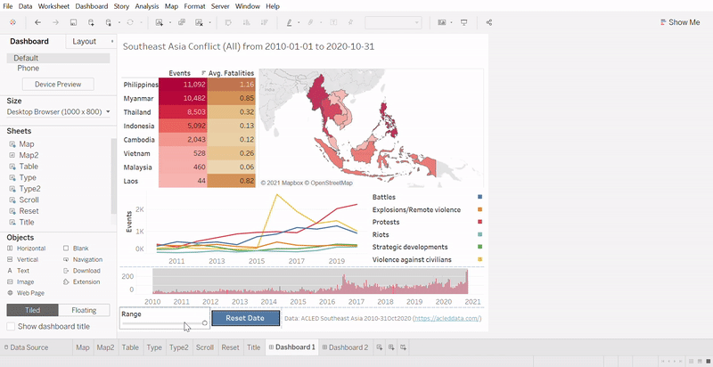
```
However, we need to add an action so that reader can click on one of the event weeks from the _Scroll_ chart and set that as the _BaselineDate_. To do so, open the _Action_ window and select _Add Action_. We will choose _Change Parameter_ this time. Set the _Name_ as “SetBaselineDate” and _Scroll_ as _Source Sheets_ with _Select_ option. For the _Target_, we choose _BaselineDate_ as the parameter with _WEEK(Event Date)_ as the _Field_ without aggregation. Click “OK” once done.

```{r, echo=FALSE, out.width="150%", fig.align='center', fig.cap='Action to change _BaselineDate_ according to selected date'}
include_graphics("images/Dashboard1Step9.jpg")
```
Now, when we click on the date in _Scroll_ chart, the _BaselineDate_ will follow accordingly.

```{r, echo=FALSE, out.width="150%", fig.align='center', fig.cap='Filter action when changing _BaselineDate_'}
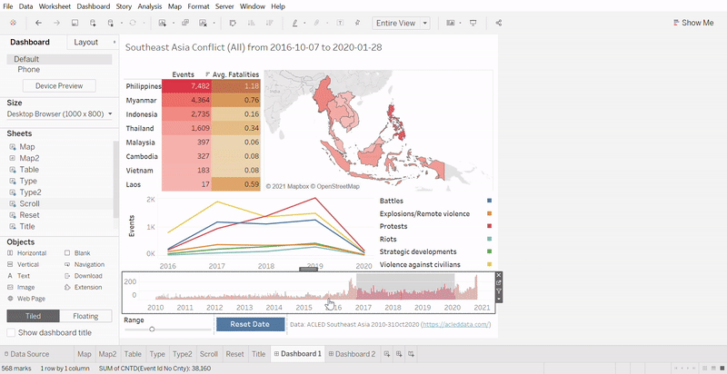
```
However, notice that when we click on the date, the color of the bar in _Scroll_ chart is greyed out. This is undesirable and we will use a workaround suggested in this [link](https://community.tableau.com/s/question/0D54T00000C6eyi/how-to-highlight-action-filter-without-greyed-out-caption).
Go back to _Scroll_ worksheet and create new calculated field called “Blank” with formula as shown below. Drag it to the _Detail_ card in _Marks_ shelf.

```{r, echo=FALSE, out.width="150%", fig.align='center', fig.cap='Create calculated field _Blank_'}
include_graphics("images/Dashboard1Step10.jpg")
```
Back to our dashboard, open _Action_ window and _Add Action_ for _Highlight_ named “Blank”. Set the settings as shown below.

```{r, echo=FALSE, out.width="150%", fig.align='center', fig.cap='Create highlight action with _Blank_ as target'}
include_graphics("images/Dashboard1Step11.jpg")
```
This will force Tableau to highlight all the bar chart when we select any bar in _Scroll_ chart, overriding the original greyed out effect.

```{r, echo=FALSE, out.width="150%", fig.align='center', fig.cap='Filter action when changing _BaselineDate_ (without greyed out effect)'}
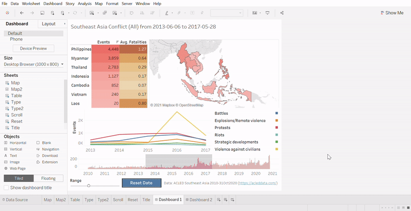
```
After we interact with the adjustable date range, we may want to reset it to show the entire date range. Rather than selecting the midpoint of the _Scroll_ chart and adjusting the _Range_ slider, the reset button will act as a shortcut to do so. Open _Action_ window and _Add Action_ for _Change Parameter_. We will create 2 new actions named “ResetBaselineDate” and “ResetRange”. The settings for both are shown below. Once done, we can click on the button to reset the date range.

```{r, echo=FALSE, out.width="150%", fig.align='center', fig.cap='Add action for reset button to assign _BaselineDate_ and _Range_ parameter values'}
include_graphics("images/Dashboard1Step12.jpg")
```
For the _Type_ chart, we will set a filtering action when we click on the yearly event counts per event type. Open _Action_ window and _Add Action_ for _Filter_. Set the _Name_ as “LineType” and set _Type_ as the _Source Sheet_ and set all as _Target Sheet_ except _Reset_ and _Title_. For _Target Filters_, choose _Selected Fields_ and set field to _Event Type_. Click “OK”.

```{r, echo=FALSE, out.width="150%", fig.align='center', fig.cap='Add action for line chart to filter other visualisations'}
include_graphics("images/Dashboard1Step13.jpg")
```
Now, when we select one of the yearly data points (protests event in 2019 for the screenshot below), the rest of the visualisation will be filtered accordingly. However, as the date range in the title is not updated, it is misleading to the reader. 

```{r, echo=FALSE, out.width="150%", fig.align='center', fig.cap='Filter based on line chart'}
include_graphics("images/Dashboard1Step14.jpg")
```
To avoid that, we can set another parameter to capture the action of filtering in the _Type_ chart and hide the date range in the title when such action is recorded. Back to the _Type_ worksheet, create new parameter called “Yearly”, set the parameter as below, and click “OK”. Double click on the white space of _Marks_ shelf, type ‘year’ (with quotes), and press enter. This value will be used to set the parameter when filtering is done on _Type_ chart.

```{r, echo=FALSE, out.width="150%", fig.align='center', fig.cap='Set parameter to capture action of filtering on line chart'}
include_graphics("images/Dashboard1Step15.jpg")
```
Back to our dashboard, open _Action_ window and _Add Action_ for _Change Parameter_. Set the setting as shown below. This will set the _Yearly_ parameter to ‘year’ when we do filtering on _Type_ chart and revert it back to ‘no’ when we clear the filter.

```{r, echo=FALSE, fig.align='center', fig.cap='Add parameter action for _Yearly_ upon filtering on line chart'}
include_graphics("images/Dashboard1Step16.jpg")
```
Next, we will use _Yearly_ parameter value to decide if we will print out the date range in our title. Go to _Title_ worksheet and create a new calculated field called _StrDateRange_. Drag it to the _Detail_ card in _Marks_ shelf and we can remove _StartDate_ and _EndDate_ from the detail. Right click on the title and select _Edit Title_. Change the title content to what is shown below.

```{r, echo=FALSE, out.width="150%", fig.align='center', fig.cap='Create calculated field to dynamically change title text'}
include_graphics("images/Dashboard1Step17.jpg")
```
Now, when we perform filtering by selection in _Type_ chart, the date range will disappear from the title to avoid confusing the reader.

```{r, echo=FALSE, out.width="150%", fig.align='center', fig.cap='Dynamic title text change based on filter'}
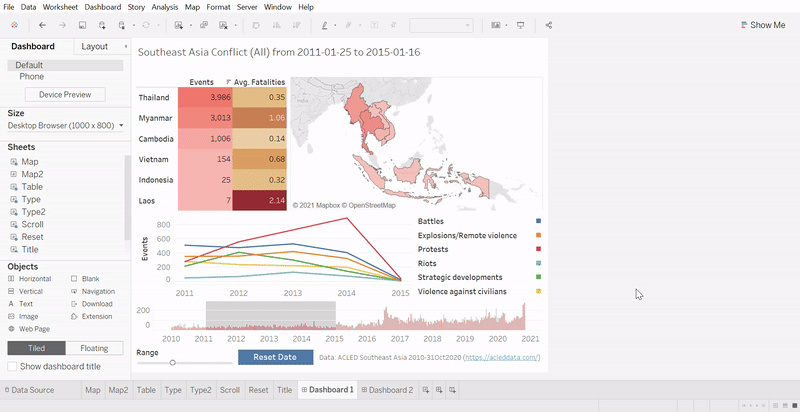
```
To allow reader to perform filter by event type in _Type2_ chart, add new action for _Filter_ called “Type” and set the settings as shown below.

```{r, echo=FALSE, out.width="150%", fig.align='center', fig.cap='Add filter action for event type from _Type2_ table'}
include_graphics("images/Dashboard1Step18.jpg")
```
Below example shows events filtered by event type Riots within the date range.

```{r, echo=FALSE, out.width="150%", fig.align='center', fig.cap='Filter based on event type in _Type2_ table'}
include_graphics("images/Dashboard1Step19.jpg")
```
For _Table_ visualisation, we don’t really need the tooltip to show us the numbers. Therefore, we can use it to tell the user what interaction can be done with the _Table_. Go back to the _Table_ worksheet and click the _Tooltip_ card in _Marks_ shelf and set the text to “Click to select this country”.

```{r, echo=FALSE, out.width="150%", fig.align='center', fig.cap='Adjust tooltip content for _Table_ worksheet'}
include_graphics("images/Dashboard1Step20.jpg")
```
Similarly, go to _Map_ worksheet and change the tooltip as follows.

```{r, echo=FALSE, out.width="150%", fig.align='center', fig.cap='Adjust tooltip content for _Map_ worksheet'}
include_graphics("images/Dashboard1Step21.jpg")
```
Go to _Type_ worksheet and adjust the tooltip as follows.

```{r, echo=FALSE, out.width="150%", fig.align='center', fig.cap='Adjust tooltip content for _Type_ worksheet'}
include_graphics("images/Dashboard1Step22.jpg")
```
Go to _Scroll_ worksheet and adjust the date format and tooltip as follows.

```{r, echo=FALSE, out.width="150%", fig.align='center', fig.cap='Adjust tooltip content and date format for _Scroll_ worksheet'}
include_graphics("images/Dashboard1Step23.jpg")
```
For _Reset_ worksheet, go to tooltip and change the text as follows.

```{r, echo=FALSE, out.width="150%", fig.align='center', fig.cap='Adjust tooltip content for _Reset_ worksheet'}
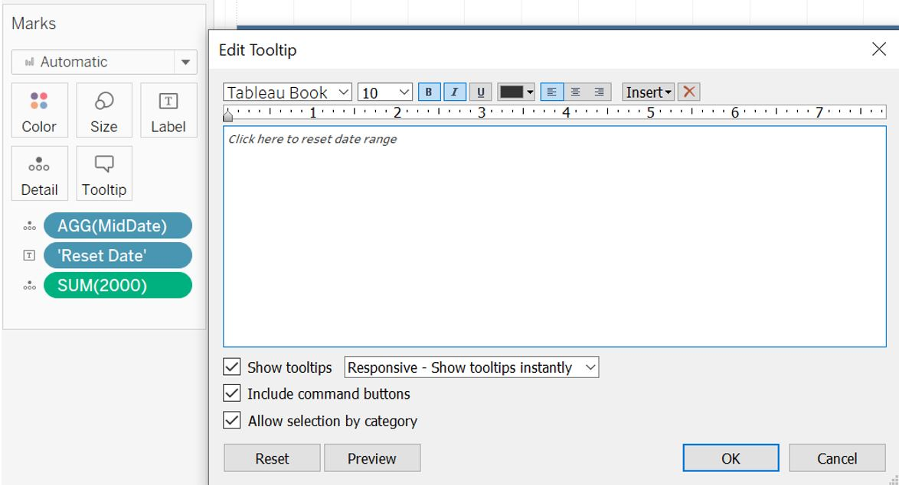
```

## Setting up dashboard for country level
Next, we will create the dashboard for country level visualisation (_Map2_). Right click on the first dashboard and select duplicate since we will reuse most of the components from the first dashboard. Rename it to _Dashboard 2_.

```{r, echo=FALSE, out.width="150%", fig.align='center', fig.cap='Duplicate _Dashboard 1_'}
include_graphics("images/Dashboard2Step1.jpg")
```
Drag _Map2_ into the dashboard below the title and remove _Table_ and _Map_ visualisations.

```{r, echo=FALSE, out.width="150%", fig.align='center', fig.cap='Add _Map2_ into the dashboard and remove _Table_ and _Map_ visualisation'}
include_graphics("images/Dashboard2Step2.jpg")
```
Hide the title of _Map2_,  remove the _Event Type_ legend, and set the _Fatalities_ legend to _Floating_.

```{r, echo=FALSE, out.width="150%", fig.align='center', fig.cap='Hide title of _Map2_ and remove legend'}
include_graphics("images/Dashboard2Step3.jpg")
```
Position the _Fatalities_ legend at the corner of _Map2_ visualisation and reduce its width.

```{r, echo=FALSE, out.width="150%", fig.align='center', fig.cap='Position _Fatalities_ legend'}
include_graphics("images/Dashboard2Step4.jpg")
```
Next, we will need to create and action to link _Dashboard 1_ and _Dashboard 2_. Go back to the _Dashboard 1_ and open the _Action_ window. Select _Add Action_ for _Filter_ and set the _Name_ to “FilterCountryDash2”. Set _Map_ as the _Source Sheets_ and all visualisations in _Dashboard 2_ except _Reset_ as the _Target Sheets_. Choose _Selected Fields_ for the _Target Filters_ and add _Country_ to the list.

```{r, echo=FALSE, out.width="150%", fig.align='center', fig.cap='Add filtering action between dashboards'}
include_graphics("images/Dashboard2Step5.jpg")
```
Now, every time reader clicks on a country from the _Map_ display, it will apply _Country_ filter to the _Dashboard 2_ and automatically navigate the view to _Dashboard 2_. Go back to _Map_ worksheet and update the tooltip to inform user about this interactivity option.

```{r, echo=FALSE, out.width="150%", fig.align='center', fig.cap='Add interactive information in the tooltip of _Map_'}
include_graphics("images/Dashboard2Step6.jpg")
```
However, if the reader would like to return to the ASEAN region level in _Dashboard 1_, we currently have no option for the reader to do so. Therefore, we create a navigation button whereby reader can go back to _Dashboard 1_ upon clicking the button. Drag _Navigation_ button from the _Objects_ pane and position it at the corner of _Map2_. Set the button to be _Floating_ and reposition the button.

```{r, echo=FALSE, out.width="150%", fig.align='center', fig.cap='Create navigation button to return to _Dashboard 1_'}
include_graphics("images/Dashboard2Step7.jpg")
```
Once again, right click on the button and select _Edit Button_. Set _Navigate to_ to _Dashboard 1_ and set the title to “Back to overview”. Set the font size to 9 with white color and the background to dark blue. Click “OK” and adjust the button size accordingly.

```{r, echo=FALSE, out.width="150%", fig.align='center', fig.cap='Adjust the format of navigation button'}
include_graphics("images/Dashboard2Step8.jpg")
```
We can use Alt+click to use the navigation button in Tableau desktop. The appearance of the _Dashboard 2_ will look like this. 

```{r, echo=FALSE, out.width="150%", fig.align='center', fig.cap='Appearance of _Dashboard 2_'}
include_graphics("images/Dashboard2Step9.jpg")
```
The rest of the functionality in _Dashboard 2_ is similar to _Dashboard 1_. However, if we try to select the date on the _Scroll_ bar chart, we observe a similar issue on the _Map 2_ display. The color of the event is greyed out due to the highlighting effect.

```{r, echo=FALSE, out.width="150%", fig.align='center', fig.cap='Greyed out issue for _Map2_ display'}
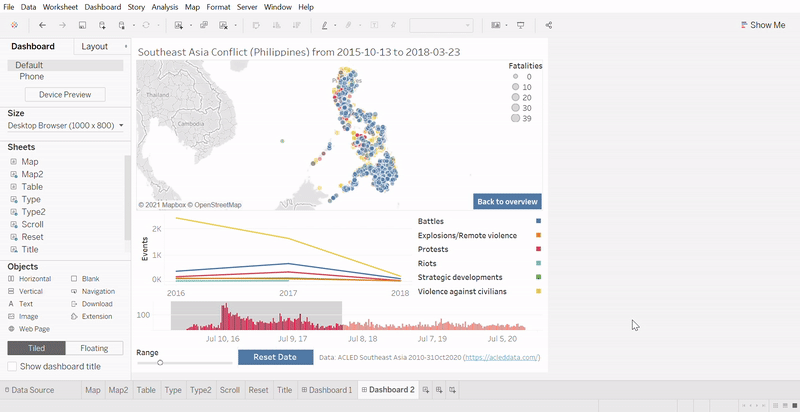
```
To fix this issue, we will again refer to the workaround as before. Go back to _Map2_ worksheet and drag _Blank_ into the _Detail_ card in _Marks_ shelf. We can also add more info into the tooltip of this map. Drag _Actor1_, _Actor2_, _Location_, and _Event Date_ to the _Tooltip_ card and click on the _Tooltip_ to edit the text as shown below.

```{r, echo=FALSE, out.width="150%", fig.align='center', fig.cap='Add _Blank_ to fix greyd out issue and adjust the tooltip content'}
include_graphics("images/Dashboard2Step10.jpg")
```
If we go back to our _Dashboard 2_, the highlighting issue has now been fixed.

```{r, echo=FALSE, out.width="150%", fig.align='center', fig.cap='Adjust date without greyed out issue'}
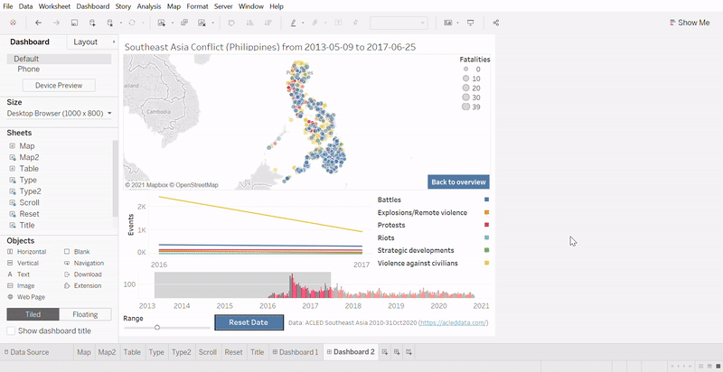
```
Since reader has the flexibility to filter based on most components in the dashboard, it will be good to improve the user experience by having a button to reset all filters. To do so, we can duplicate our _Reset_ worksheet and named it _Reset2_. Double click on the text card and change to 'Clear Filter’ (with quote). Update the tooltip text accordingly.

```{r, echo=FALSE, out.width="150%", fig.align='center', fig.cap='Create button for clear filter'}
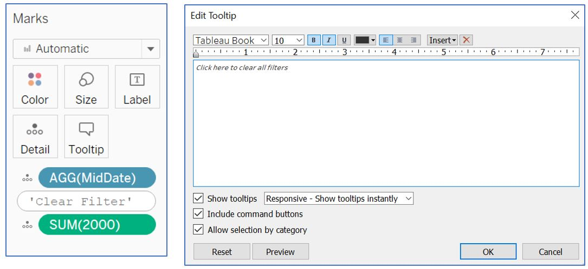
```
Go back to our _Dashboard 1_ and insert _Reset2_ to the dashboard layout. Adjust the sizing of buttons and text at the bottom.

```{r, echo=FALSE, out.width="150%", fig.align='center', fig.cap='Add clear filter button to dashboard'}
include_graphics("images/ClearFilterStep2.jpg")
```
Add _Filter_ action with _Reset2_ as _Source Sheets_, and other visualisations as _Target Sheets_ except _Reset_ and _Reset2_. Set _Select_ option and _Show all values_ for clearing of selection. Add _Country_ and _Event Type_ to the _Target Filters_ as _Selected Fields_. Ignore the warning message.

```{r, echo=FALSE, out.width="150%", fig.align='center', fig.cap='Add filter action by selecting the button'}
include_graphics("images/ClearFilterStep3.jpg")
```
Repeat the same process for _Dashboard2_, but without _Country_ in the _Target Filters_ for “ClearFilter” action. Also remove _Reset2_ from all the _Target Sheets_ of existing _Filter_ action in both dashboards.

```{r, echo=FALSE, out.width="150%", fig.align='center', fig.cap='Repeat same process for _Dashboard2_'}
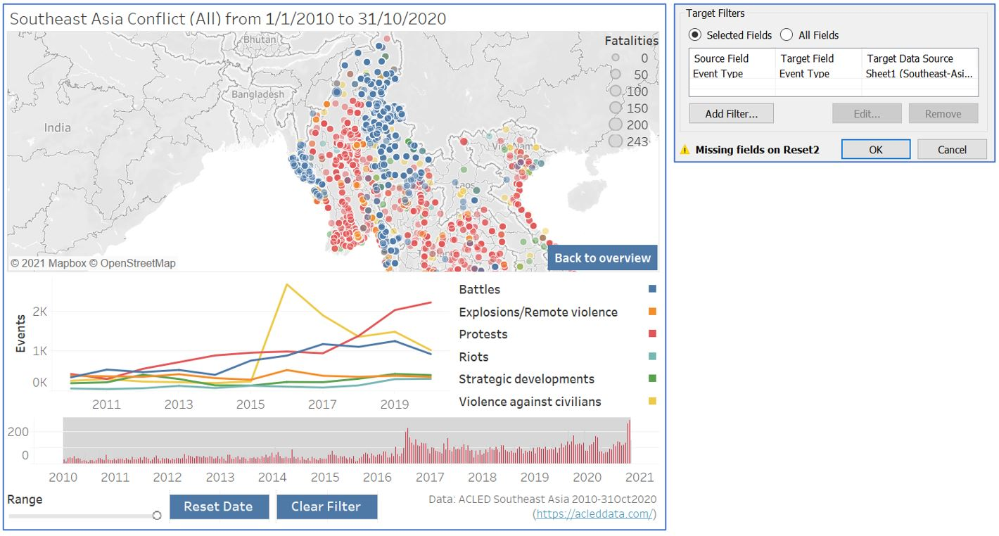
```

# 4. Observations
1.	Over the 10-year period from 1/1/2010 to 31/10/2020, the overview dashboard shows us that Philippines has the most events, followed by Myanmar. The casualty for Philippines is also the highest with average 1 fatality per event. However, the color highlight also points us to the bottom of the table where Laos has the least number of events, but the average fatalities is quite high, similar to that of Myanmar.

```{r, echo=FALSE, out.width="150%", fig.align='center', fig.cap='Overview of Southeast Asian countries'}
include_graphics("images/Observation1.jpg")
```
2.	If we look closely between Philippines and Myanmar, they have different period of conflicts even though their total numbers are quite close. As displayed by the bar chart, conflict in Myanmar has been recorded as early as 2010 and the occurrence remains constant throughout the year until 2020. On the other hand, Philippines' record of events just started in the beginning of 2016 which could be due to the unavailability of pre-2016 data for Philippines. A significant surge in July 2016 points to the start of [Philippine President Rodrigo Duterte’s War on Drugs](https://www.hrw.org/tag/philippines-war-drugs) after he took office in June 2016. Towards the end of 2018, we observe a decrease in the number of event, attributed to the [President Duterte’s decision to pull police force out of the war on drugs](https://www.theguardian.com/world/2017/oct/12/philippines-rodrigo-duterte-police-war-drugs), ending the 15 months of deadly campaign.

```{r, echo=FALSE, out.width="150%", fig.align='center', fig.cap='Observation for Philipines'}
include_graphics("images/Observation2.jpg")
```
3.	Filtering the event type by clicking on protest at the _Type2_ table, an increasing trend is observed especially between 2017-2019. If we do a brushing on the line chart for 2017-2019, we see that Indonesia has the highest recorded protest between this period. Clicking on the detail map for Indonesia shows us there is indeed a steady increase in the number of protests between 2017 and 2020. Most of the protests took place in Java island and South Sulawesi province.

```{r, echo=FALSE, out.width="150%", fig.align='center', fig.cap='Observation for Indonesia'}
include_graphics("images/Observation3.jpg")
```
4.	Still on protests, if we scroll through each country, we see an interesting trend in Thailand during 2020. The number of protests has remained stable since 2010, until we see a significant spike in 2020. Looking at the detail map and narrowing down the date range to October 2020, protests occurred at various locations, with notable hotspot at Bangkok, Phuket, and Nakhon. This is the period of [anti-government protest demanding political reform and denouncing the alleged non-democratic policies of the government](https://www.garda.com/crisis24/news-alerts/387501/thailand-protests-to-be-held-nationwide-october-9-14-update-1).

```{r, echo=FALSE, out.width="150%", fig.align='center', fig.cap='Observation for Thailand'}
include_graphics("images/Observation4.jpg")
```
5.	The overall number of conflicts in Myanmar has been quite constant throughout the 10-year period, with increasing trend observed in the bar chart starting from 2019. Although our data ends in October 2020, we still observe a noticeable decrease in both _Battles_ and _Protests_ events in 2020. However, increasing trend in violent events (Battle, Explosions/Remote violence, and Violence against civilians) is observable, especially between 2017 and 2020. A cluster is observed on the western Myanmar where Rakhine state is located.

```{r, echo=FALSE, out.width="150%", fig.align='center', fig.cap='Observation for Myanmar'}
include_graphics("images/Observation5.jpg")
```
Ethnically motivated attack on Rohingya Muslims by government official and state security forces has been a prolonged issue in Myanmar. From the spatio-temporal analysis below, we observe relatively intense conflict in 2012, involving sectarian clashes between ethnic Rakhine Buddhists and Rohingya people, which resulted in confinement of displaced Rohingya people in government-setup internment camp. This is followed by a relatively calm period before it started to get brutal from 2016 onwards, with clashes between Arakan Rohingya Salvation Army (ARSA) and state forces started in October 2016.

```{r, echo=FALSE, out.width="150%", fig.align='center', fig.cap='Violent events throughout 10-year period in Rakhine state'}
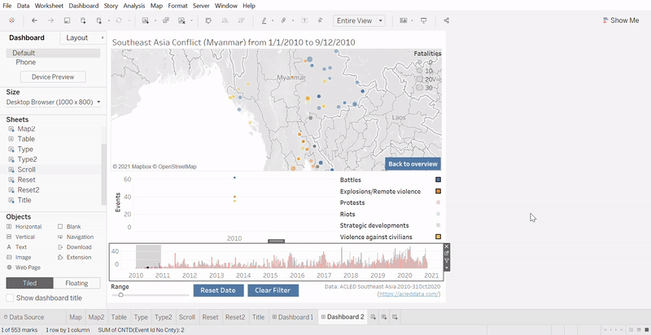
```
# 5. Conclusions
In summary, a critique on the original dashboard for spatio-temporal analysis of conflict in Southeast Asia was done based on the clarity, aesthetic, and interactivity aspects. An alternative dashboard design was proposed, with step-by-step development in Tableau provided in details. The advantages of proposed dashboard was also elaborated, together with new observations that may not be apparent in the original dashboard.

_Any suggestion and feedback is much appreciated! Email: kevin.albindo@gmail.com_

# References
Tableau idea and inspiration:  
http://www.codewander.com/makeover-monday-week-4-tableau/  
https://www.tessellationtech.io/tableau-animations-scrolling-bar-chart/  
https://www.thedataschool.co.uk/chris-meardon/button-based-parameter-actions  
https://community.tableau.com/s/question/0D54T00000C6eyi/how-to-highlight-action-filter-without-greyed-out-caption  

Observations:  
https://www.hrw.org/tag/philippines-war-drugs  
https://www.theguardian.com/world/2017/oct/12/philippines-rodrigo-duterte-police-war-drugs  
https://www.garda.com/crisis24/news-alerts/387501/thailand-protests-to-be-held-nationwide-october-9-14-update-1  
https://www.hrw.org/report/2020/10/08/open-prison-without-end/myanmars-mass-detention-rohingya-rakhine-state  

Tool for creating gif:
https://ezgif.com/video-to-gif
