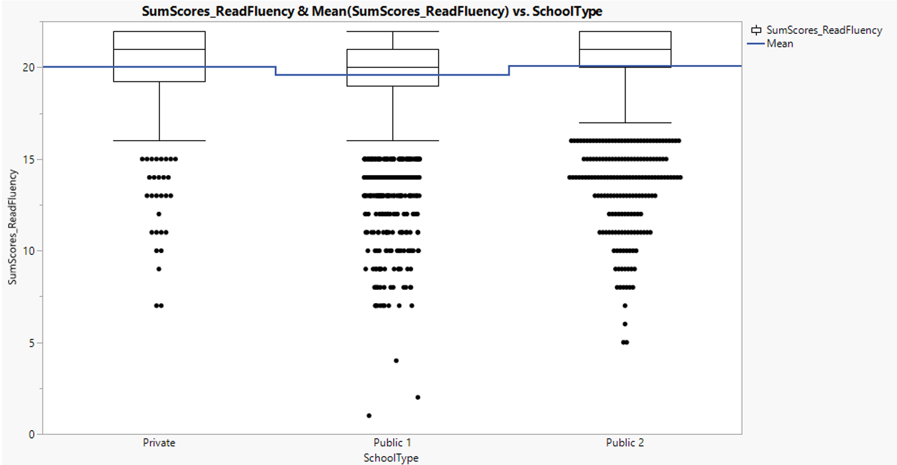

```{r setup, include=FALSE}
knitr::opts_chunk$set(echo = FALSE)
library(knitr)
```

# 1. Introduction

_This post is part of the assignment for ISSS602 Data Analytics Lab._

Programme for International Student Assessment (PISA) is a three yearly assessment conducted by the Organisation for Economic Co-operation and Development (OECD) to score the education system of more than 70 different countries. The survey not only performs test on 15 years old student in the field of mathematics, reading, and science, but also collect other attributes, for example student well-being and financial literacy. In the latest PISA 2018 result, China earns the top rank with a big jump from 10th place in 2015 PISA result, pushing Singapore to second place (Teng, 2019). Despite Singapore’s high rank, there is still opinion from the general public that disparities exist between elite school and neighbourhood school. In this assignment, Interactive Data Exploration and Analysis (IDEA) approach will be used to both verify this statement and discover other insights from PISA 2018 result for Singapore student’s cognitive aspect.

# 2.	Data

## 2.1.	Data source and structure

The 2 data sets used is publicly available from [OECD website](https://www.oecd.org/pisa/data/2018database/): cognitive item and student questionnaire data. Compendia and Codebook of PISA 2018 survey provide additional information to understand the 2 main data sets.

### 2.1.1.	Cognitive item data

Cognitive item data consists of 606,627 rows and 3,590 columns. Each row represents one student and each column represents the attributes of and responses from student. Details of column names are given in compendia and codebook. The columns used are described in Table 1.


| Name | Description | Type |
| --- | ------ | --- |
| CNTRYID	| Country identifier | NUM |
| CNT | Country code 3-character | CHAR |
| CNTSCHID | International school ID | NUM |
| CNTSTUID | International student ID | NUM |
| STRATUM	| School type identifier | CHAR |
| ADMINMODE | Mode of respondent | NUM |
| BOOKID	| Form identifier	| NUM |

Columns corresponding to assessment questions (Reading, Mathematics, Science) majority follows _ABcccQddEF_ structure where each element is described in Table 2.

| Element	| Description	| Possible value |
| --- | ------- | ----------- |
| A	| Assessment method identifier | C: Computer Based - Computer Scored <br /> D: Computer Based - Human Coded <br /> P: Paper Based |
| B	| Assessment type identifier | M: Mathematics <br /> R: Reading <br /> S: Science |
| ccc |	Unit number identifier | Any 3-digit number |
| Qdd |	Question number identifier | Any 3-digit number |
| E	| Information identifier | S: Scored Response <br /> T: Timing <br /> F: Time to First Action <br /> A: Number of Actions <br /> R: Raw Response|
| F	|Part identifier | Alphabetic starting from A to Z if part exists, otherwise element not available.|

For example, CM033Q01S is a column name for Mathematics assessment with unit code of 033 and question number 01. This unit uses computer based (computer scored) assessment and represents the scored response value.

### 2.1.2.	Student questionnaire data

In this assignment, school and gender are the main attributes. While school identifier is given in cognitive item data under CNTSCHID column (SGP0101 – public secondary type 1, SGP 0201 – public secondary type 2, and SGP0203 – private secondary), information on student gender comes from student questionnaire data (ST004D01T column) where female and male are represented by 1 and 2 respectively.

## 2.2.	Data preparation and quality issue

The following section explains steps taken to prepare analytics sandbox and describes data quality issue encountered during the preparation. Details of change log can be found in Annex A – Data change log.

### 2.2.1.	Data for Singapore

The main data set includes student’s response from all participating countries. Rows corresponding to Singapore are selected through row selection function where column CNT (country) equals to SGP (Singapore country code). Subsequently, selected rows are separated using subset function under table menu. There are 6,676 rows for Singapore data.

```{r, echo=FALSE, fig.align='center', fig.cap='Selection and Subset for Singapore data'}
include_graphics("images/selection_subset.PNG")
```

### 2.2.2.	Gender information

To retrieve gender information, join table is used with “student ID” as the common attribute between cognitive item and student questionnaire data tables. The identifiers (1 and 2) are then recoded (female and male) to create “Gender” column.

```{r, echo=FALSE, fig.align='center', fig.cap='Join table for student gender information'}
include_graphics("images/join_table.PNG")
```

### 2.2.3.	Incorrect modeling type

Majority of columns are imported with continuous modeling type. “School ID”, “Student ID”, “Book ID”, and other columns which do not contain timing information should be classified under nominal type. In columns viewer function, selection is made by specifying condition (column name does not end with “T”). Columns whose modelling type are originally nominal are unselected. Once all the specified columns have been selected, columns attributes are standardised to nominal modeling type.

```{r, echo=FALSE, fig.align='center', fig.cap='Columns attributes standardised to nominal modeling type'}
include_graphics("images/column_attr.PNG")
```

### 2.2.4.	Irrelevant data columns

As Singapore assessment is computer-based (ADMINMODE = 2 means computer-based), all columns related to paper-based assessment (column name starting with “P”) are irrelevant and hence excluded from analysis. “Missing Data Pattern” is used to show that those columns have missing data in all 6,676 rows. Other columns which are not described in Table 1 are also removed.

```{r, echo=FALSE, fig.align='center', fig.cap='Identifying missing data in column related to paper-based assessment'}
include_graphics("images/missing_data.PNG")
```

### 2.2.5.	Multiple response categories

Score value (response) varies with majority of columns consist of 2 categories (0 – no credit and 1 – full credit) while few columns contain more than 2 categories due to partial credit. To accurately sum up the scores, they are recoded into 0 – no credit, 0.5 – partial credit, and 1 – full credit. To view those columns needs recoding: Column viewer >> show summary statistics >> data table view. Columns with N categories more than 2 are recoded using standardise attributes function.

```{r, echo=FALSE, fig.align='center', fig.cap='Column viewer to identify columns with >2 categories'}
include_graphics("images/col_category.PNG")
```

```{r, echo=FALSE, fig.align='center', fig.cap='Recoding of selected columns with >2 categories'}
include_graphics("images/recode_column.PNG")
```

### 2.2.6.	Different assessment types

Data is separated according to assessment type (reading fluency, reading, mathematics, and science) for easier manipulation. Subsequently, 2 new columns are produced for each data table to store the number of questions attempted and total score attained.

```{r, echo=FALSE, fig.align='center', fig.cap='Number of questions and sum of scores'}
include_graphics("images/formula1.PNG")
```

#### 2.2.6.1.	Reading fluency

Reading fluency is a new assessment added in PISA 2018 survey as recommended by Reading Expert Group to better assess reading skills in the lower proficiency levels (OECD, 2019). Each student is tasked to evaluate a maximum of 21 or 22 sentences’ sensibility within three minutes. Student response from reading fluency assessment will be analysed separately due to its different format from main reading assessment. Reading fluency questions are classified with code “CR590” and selected by regular expression ^CR590\w*S$. Equation 1 is then applied with 168 total questions related to reading fluency.

#### 2.2.6.2.	Reading assessment

There are two main types of reading assessment: computer scored and human coded response. Regular expression ^(CR|DR)(?!590)\w*[^R](C|S)$ is used to select the final score value of these responses (raw response is excluded). Equation 1 is used with 270 total questions related to reading, to produce number of questions and sum of scores column. 2 students are excluded from analysis due to no recorded response.

#### 2.2.6.3.	Mathematics assessment

Regular expression ^(CM|DM)\w*[^R](C|S)$ is used to select the final score value of both scored and coded response (raw response is excluded). Equation 1 is used with 82 total questions related to mathematics, to produce number of questions and sum of scores column. A total of 3,952 students have no recorded response and hence are excluded from analysis. Analysis on the number of questions that students received shows that there are two clusters of total number of mathematic questions: 12 and 24.

```{r, echo=FALSE, fig.align='center', fig.cap='Count of students registering a specific number of mathematic questions'}
include_graphics("images/countStdMath.PNG")
```

Using tabulate and graph builder, the maximum number of questions corresponding to each Book ID confirms the presence of two clusters of mathematic assessment (Figure 8). Book ID 1-12 have a total of 24 questions while the remainders have a total of 12 questions.

```{r, echo=FALSE, fig.align='center', fig.cap='Maximum number of questions (mathematic) registered for each Book ID'}

```

Consequently, mathematic score of each student is normalised by total number of questions according to the assigned Book ID. Additional columns are added with the following formula for score normalisation:

```{r, echo=FALSE, fig.align='center', fig.cap='Total number of questions and normalised scores (Mathematics)'}
include_graphics("images/totalQnNormMath.PNG")
```

#### 2.2.6.4.	Science assessment

Regular expression ^(CS|DS)\w*\d(C|S)$ is used to select the final score value of both scored and coded response (raw responses is excluded). Equation 1 is used with 115 total questions related to science, to produce number of questions and sum of scores column. A total of 3,920 students are excluded from analysis due to absence of recorded response. Analysis on the number of questions that students received shows that there are two clusters of total number of science questions: 20 and 40.

```{r, echo=FALSE, fig.align='center', fig.cap='Count of students registering a specific number of science questions'}

```

Using tabulate and graph builder, maximum number of questions corresponding to each Book ID confirms the presence of two clusters of science assessment (Figure 11). Book ID 13-24 have a total of 40 questions while the remainders have a total of 20 questions. 

```{r, echo=FALSE, fig.align='center', fig.cap='Maximum number of questions (science) registered for each Book ID'}
include_graphics("images/maxQnSci.PNG")
```

Consequently, science score of each student is normalised by total number of questions according to the assigned Book ID. Additional columns are added with the following formula for score normalisation:

```{r, echo=FALSE, fig.align='center', fig.cap='Total number of questions and normalised scores (Science)'}

```

### 2.2.7.	Data set consolidation

Tables containing scores for each assessment type are combined into one table (as final analytic sandbox) by using joint table function with student ID as the common attribute. As reading assessment is not normalised by total number of questions, normalised score is created by: New Formula Column >> Distributional >> Range 0 to 1 to allow aggregation with other assessment scores.

```{r, echo=FALSE, fig.align='center', fig.cap='Normalised score for reading assessment'}

```

Total score is computed using Equation 4 for each student and normalised by number of assessments involved (not all students attempt all 4 assessment types – reading fluency, reading, mathematics, science).

```{r, echo=FALSE, fig.align='center', fig.cap='Total number of assessments and total scores (normalised)'}
include_graphics("images/totalAssessScoreNorm.PNG")
```

# 3.	Analytics
## 3.1.	Exploratory Data Analytics (EDA)

Insights on assessment scores among different gender and school types are described in this section using JMP graph builder.

### 3.1.1.	Reading fluency by gender

Comparing reading fluency scores between gender, mean score for female is slightly higher than those for male. The distribution of outliers for female is more converging towards low score while male distribution varies more. Also, extremely low score (below 7) is observed only in male score.

```{r, echo=FALSE, fig.align='center', fig.cap='Reading fluency score distribution between gender'}
include_graphics("images/readFluencyScoreGender.PNG")
```

### 3.1.2.	Reading fluency by school types

Comparing school performance on reading fluency score, private school shows higher means as compared to public school type 1. However, there seems to be less difference between private school and public school type 2.

```{r, echo=FALSE, fig.align='center', fig.cap='Reading fluency score distribution between school types'}

```

### 3.1.3.	Reading score (main assessment)

Firstly, number of questions attempted by student and the corresponding sum of scores are compared. The positive slope of mean trend line demonstrates students attain higher score with more questions attempted. The box plots show that there is variance in student performance within the same number of questions attempted which is expected. The outliers represent students who attempted large number of questions but fail to choose the correct answer (low sum of score). There are also students who attempted very low number of questions.

```{r, echo=FALSE, fig.align='center', fig.cap='Number of questions attempted and Sum of scores (reading)'}
include_graphics("images/QnSumScoreRead.PNG")
```

### 3.1.4.	Reading score (main assessment) by gender

Box plot analysis is performed on reading score for both gender. Once again, mean female score is higher than mean male score.

```{r, echo=FALSE, fig.align='center', fig.cap='Reading score distribution between gender'}

```

### 3.1.5.	Reading score (main assessment) by school types

Reading score similarly aligns with reading fluency score distribution where public school type 2 has the highest mean, followed by private school and public school type 1.

```{r, echo=FALSE, fig.align='center', fig.cap='Reading score distribution between school types'}
include_graphics("images/readScoreSchool.PNG")
```

### 3.1.6.	Mathematic score by gender

There is no apparent difference in mean mathematic score between male and female.

```{r, echo=FALSE, fig.align='center', fig.cap='Mathematic score distribution between gender'}
include_graphics("images/mathScoreGender.PNG")
```

### 3.1.7.	Mathematic score by school types

Mean mathematic score in public school type 2 and private are higher than public type 1. This observation is similar to that of reading score.

```{r, echo=FALSE, fig.align='center', fig.cap='Mathematic score distribution between school types'}

```

### 3.1.8.	Mathematic score by gender in private school

Interestingly, difference in mean mathematic score between male and female is more apparent in private school where male mean score is higher.

```{r, echo=FALSE, fig.align='center', fig.cap='Mathematic score distribution between gender in different school types'}

```

### 3.1.9.	Science score by gender

In science, male mean and median score is slightly higher than female student.

```{r, echo=FALSE, fig.align='center', fig.cap='Science score distribution between gender'}

```

### 3.1.10.	Science score by school types

Science score in public school type 2 is the highest, followed by private and public school type 1. This observation is similar to that of mathematic and reading score.

```{r, echo=FALSE, fig.align='center', fig.cap='Science score distribution between school types'}
include_graphics("images/sciScoreSchool.PNG")
```

## 3.2.	Hypothesis test

### 3.2.1.	Does female student outperform male student in reading assessment?

The null hypothesis (H0) to be tested is that there is no difference in reading proficiency between gender. Oneway analysis is performed to confirm presence of an effect with p-value criteria of <0.05 for H0 rejection. The returned p-value is <0.05 which suggests difference in reading score between gender is statistically significant (Figure 26).

```{r, echo=FALSE, fig.align='center', fig.cap='Oneway analysis for reading scores by gender'}

```

The t-test is based on 3 assumptions: normality of distribution, independence of each sample, and homoscedasticity (Navarro, 2019). The sample is independent as one student score is not influenced by the score of other students. Normality of both groups is checked using Anderson-Darling goodness-of-fit test.

```{r, echo=FALSE, fig.align='center', fig.cap='Anderson-Darling goodness-of-fit test for reading score'}
include_graphics("images/GoFread.PNG")
```

The returned p-value <0.05 indicates the score distribution is not normal for both gender groups (Figure 27). Next, variance equality for the two sample groups is checked (Figure 28). The small p-value in all 5 tests indicates unequal variances. Welch’s t-test returns small p-value which suggests significant score difference between gender. However, Welch’s t-test also assumes normal distribution.

```{r, echo=FALSE, fig.align='center', fig.cap='Variance test and Welch\'s t-test for reading score by gender'}
include_graphics("images/varWelchTestReadGender.PNG")
```

As the assumption on normal distribution and homoscedasticity are violated, non-parametric test (Wilcoxon test) is used in place of t-test (Figure 29). Wilcoxon test returns p-value <0.05 which confirms the significance of gender in readings score.

```{r, echo=FALSE, fig.align='center', fig.cap='Wilcoxon test for reading score by gender'}

```

### 3.2.2.	Does it follow that male student is better in mathematics then?

According to Figure 23, male student in private school seems to perform better in mathematics than female student. T-test returns p-value of 0.0502 which suggests no statistically significant difference in mathematics score between gender.

```{r, echo=FALSE, fig.align='center', fig.cap='T-test for mathematics score by gender (private school)'}
include_graphics("images/ttestMathGender.PNG")
```

Anderson-Darling test indicates normal distribution for female but not for male student.

```{r, echo=FALSE, fig.align='center', fig.cap='Anderson-Darling goodness-of-fit test for math scores by gender (private school)'}

```

Variances are tested to be equal and Welch’s t-test supports the null hypothesis.

```{r, echo=FALSE, fig.align='center', fig.cap='Variance test and Welch\'s t-test for mathematic score by gender (private school)'}

```

In contrast, Wilcoxon test returns p-value <0.05, suggesting statistically significant difference in mathematic score between gender in private school. However, as the male student population is not normally distributed, non-parametric test is more suitable as it is less sensitive to outlier.

```{r, echo=FALSE, fig.align='center', fig.cap='Wilcoxon test for math scores by gender (private school)'}

```

For better representation, test is repeated for all students in the data set which results in null hypothesis could not be rejected (p-value is >0.05). In general, difference in mathematics score between male and female students is not statistically significant.

```{r, echo=FALSE, fig.align='center', fig.cap='Wilcoxon test for math scores by gender (all students)'}
include_graphics("images/wilcoxMathGenderAll.PNG")
```

### 3.2.3.	Does elite school exist?

Total score is grouped by school type for comparison. First, analysis of variance (ANOVA) shows statistically significant difference in total score between school types (p-value <0.05).

```{r, echo=FALSE, fig.align='center', fig.cap='ANOVA of total score by school types'}
include_graphics("images/anovaTotalSchool.PNG")
```

Anderson-darling test confirms that all groups are not normally distributed.

```{r, echo=FALSE, fig.align='center', fig.cap='Anderson-Darling goodness-of-fit test for total scores by school types'}

```

4 different methods of variance test return mixed result. Levene and Brown-Forsythe test, being less sensitive to non-normality, suggests that variances are unequal. Welch’s t-test shows statistically significant difference of total score between school types.

```{r, echo=FALSE, fig.align='center', fig.cap='Variance test and Welch\'s t-test for total score by school types'}

```

As some academia argue, t-test is robust against non-normality for large number of sample size (Schmider, Ziegler, Danay, Beyer, & Bühner, 2010). However, non-parametric test is still carried out as additional layer of analysis. Wilcoxon test returns same result as t-test: difference in total score between school types is statistically significant.

```{r, echo=FALSE, fig.align='center', fig.cap='Wilcoxon test for total score by school types'}

```

Means comparison with Tukey test shows all pairs of means between school types are significantly different. It suggests the presence of elite schools where public school type 2 has the highest mean, followed by private and public school type 1.

```{r, echo=FALSE, fig.align='center', fig.cap='Tukey test comparing means of total score by school types'}

```

# 4.	Summary & Recommendation

Insights have been derived from Singapore student PISA score and several hypotheses have been tested. The key observations are as follows:

a.	Female students perform better in reading assessment than male students with 5% mean score difference. Supportive findings come from Reilly’s (2019) study on US students which concludes that female outperformed male student in reading and writing achievement. However, there is still challenge in determining specific cause responsible for the difference.

b.	Mean mathematics score of male students in private school is higher, while there is no statistically significant difference in bigger sample size. Diane (2007) observed high variance in male students’ quantitative abilities. Substantial evidence also suggests male advantage in mathematics is largest at the upper end of the ability distribution. This is evident by the wider interquartile range and higher count of male students who score the highest in Figure 21.

c.	The notion of elite school may have basis on the observation that higher mean score is observed in public school type 2 and private school. Although PISA report provides no information on the grouping criteria for public school, it is likely that public school type 1 refers to non-aided government school. This may suggest effect of government funding on school performance. More details can be found in Annex – Secondary school types

Research studies have shown the complexity of understanding gender difference in cognitive abilities. To supplement findings from cognitive score, study on the effect of socio-economical aspect (e.g. financial condition, family background, living environment) is necessary.

More analysis on Public school type 2 is required to understand potential factors attributing to higher cognitive score, such as:  
- Extra funding in government-aided school  
- Learning structure in school with Integrated Programme  
- Bilingual teaching in school with Special Assistance Plan

_Any suggestion and feedback is much appreciated! Email: kevin.albindo@gmail.com_

# References
Bartlett's test. (23 September, 2019). Retrieved from Wikipedia: https://en.wikipedia.org/wiki/Bartlett%27s_test

Diane F., H., Benbow, C. P., Geary, D. C., Gur, R. C., Hyde, J. S., & Gernsbacher, M. A. (2007). The Science of Sex Differences in Science and Mathematics. Psychological Science in the Public Interest, 8(1), 1-51. doi:10.1111/j.1529-1006.2007.00032.x

List of secondary schools in Singapore. (25 November, 2019). Retrieved 06 February, 2020, from Wikipedia: https://en.wikipedia.org/wiki/List_of_secondary_schools_in_Singapore

Navarro, D. (11 01, 2019). Learning statistics with R: A tutorial for psychology students and other beginners. Retrieved from https://learningstatisticswithr.com/book/ttest.html#studentassumptions

OECD. (2019). Released items from the PISA 2018 computer-based reading assessment. PISA 2018 Results (Volume I): What Students Know and Can Do. doi:https://doi.org/10.1787/098bab1a-en

Reilly, D., Neumann, D. L., & Andrews, G. (2019). Gender differences in reading and writing achievement: Evidence from the National Assessment of Educational Progress (NAEP). American Psychologist, 74(4), 445-458. doi:10.1037/amp0000356

Schmider, E., Ziegler, M., Danay, E., Beyer, L., & Bühner, M. (2010). Is It Really Robust? Reinvestigating the Robustness of ANOVA Against Violations of the Normal Distribution Assumption. Methodology European Journal of Research Methods for the Behavioral and Social Sciences, 6(4), 147–151. doi:10.1027/1614-2241/a000016

Secondary school Type. (05 Feb, 2020). Retrieved from Ministry of Education, Singapore: https://beta.moe.gov.sg/secondary/schools/types/

Teng, A. (3 December, 2019). Pisa 2018: Singapore slips to second place behind China but still chalks up high scores. Retrieved 21 January, 2020, from The Straits Times: https://www.straitstimes.com/singapore/education/pisa-2018-singapore-slips-to-second-place-behind-china-but-still-chalks-up-high

Welch's t-test. (29 January, 2020). Retrieved from Wikipedia: https://en.wikipedia.org/wiki/Welch%27s_t-test

*preview image taken from: https://www.flickr.com/photos/70109407@N00/2097402250/*

# Annex - Secondary school types
The distribution of school by its grouping is described in figure below.
 
According to Ministry of Education (MOE) [website](https://beta.moe.gov.sg/secondary/schools/types/), there are 5 types of school:

1.	Government schools, including autonomous school  
2.	Government-aided schools, including autonomous school  
3.	Independent schools  
4.	Specialised independent schools  
5.	Specialised schools

There are 100 schools under government and government-autonomous type (information taken from secondary school list in [Wikipedia](https://en.wikipedia.org/wiki/List_of_secondary_schools_in_Singapore)) which is likely represented under public school type 1 in PISA report (there are 100 schools under this type). If this is true, public school type 2 has higher score due to these potential reasons:

1.	Government-aided schools receive extra funding from government which can be spent to improve quality through better facilities, teaching staff, and learning programmes.  
2.	Schools with Integrated Programme where students with relatively higher cognitive ability are likely to be pooled, leading to better mean score.  
3.	Schools with Special Assistance Plan includes bilingual students who are often associated with higher cognitive ability.

