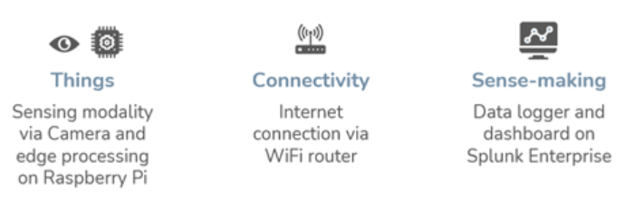
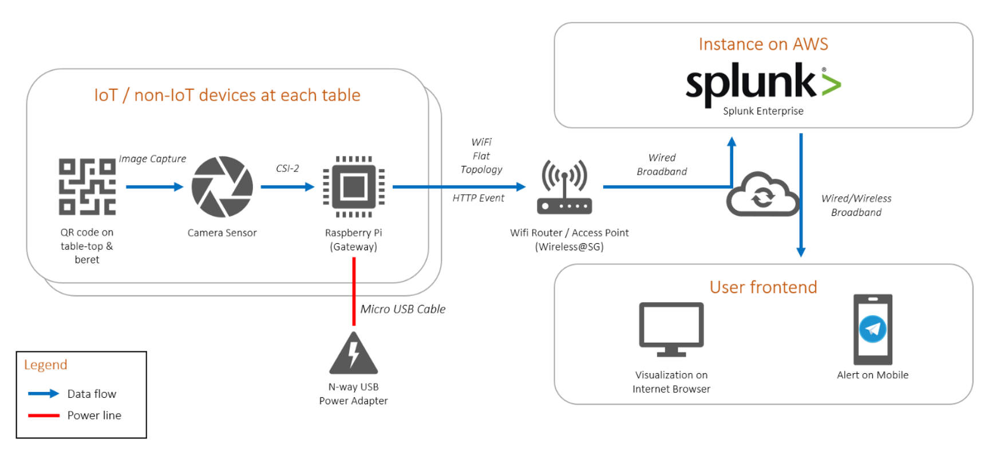
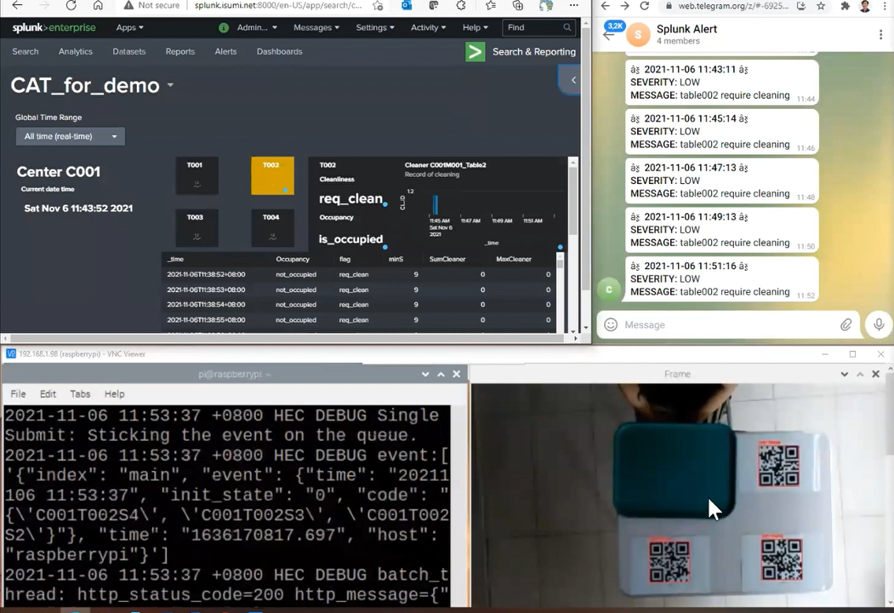
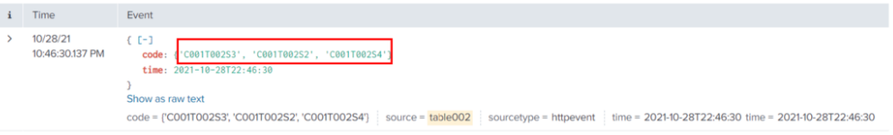
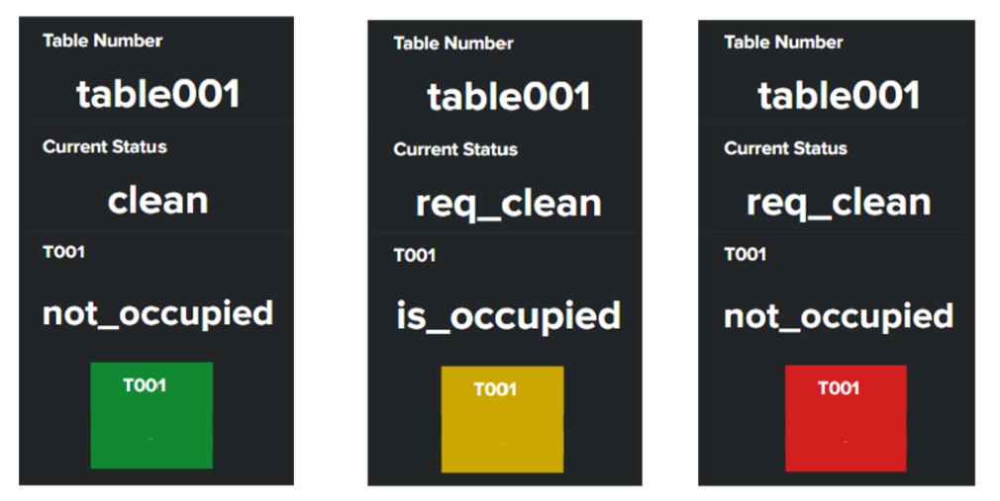
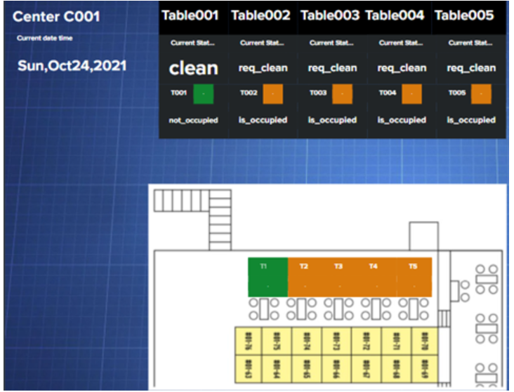
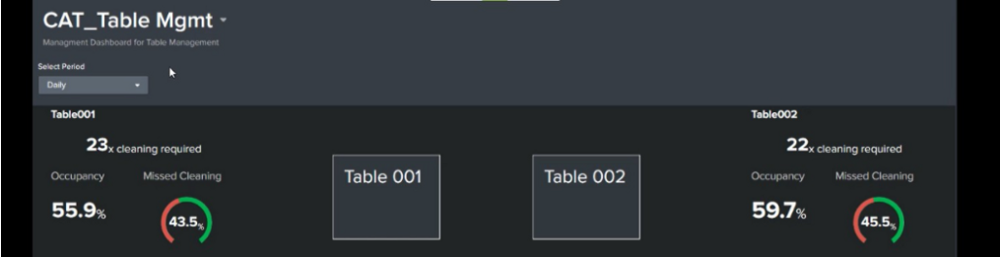
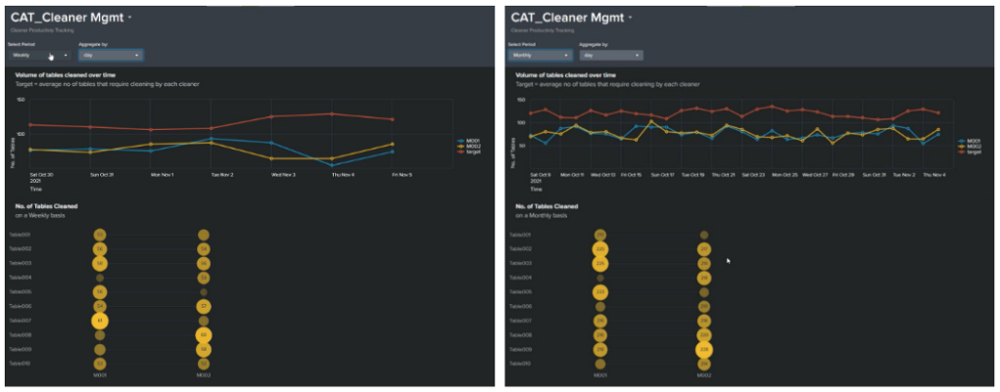

```{r setup, include=FALSE}
knitr::opts_chunk$set(echo = FALSE)
library(knitr)
```

This is a group project submitted by IS614 Team 3 (author is team member) and original submission can be found in this [Medium link](https://is614.medium.com/computer-aided-tablevision-208b3eaa61cf)

# 1. Background

Dirty trays, crockery and litter left behind by diners on the food centres’ tables is a social issue that had taken the center stage especially since the breakout of COVID-19. From 1st September 2021, the National Environment Agency (NEA) of Singapore will take enforcement action against diners who do not clean up after their meals. With this enforcement, we expect diners to clear the tables of their trays and crockery. However, a new issue begets— are the tables cleaned? Visually, without the trays and crockery on the tables, it is hard to tell if the tables are cleaned. In the following section, we discuss the problem statements for this project.

# 2. Problem Statements
*Diners* : How might we provide cleaned tables for diners at food centres after the tables have been cleared by previous diners?

*Cleaners*: How might we provide cleaners with an efficient and effective way to know which tables had been previously occupied?

*Estate owners or managers* : How might we provide information to estate managers on cleanliness of food centres and utilisation of resources?

# 3. Solution
Our Computer Aided Tablevision (CAT) project aims to use IoT technology to track the cleanliness status of the tables and regularity of cleaning following the enforcement of the tray and crockery return by diners. Solution can inform the management of the centre’s cleanliness and make cleaners’ work more efficient and effective, thereby giving diners clean tables.

Compared with the previous IOT solutions, our solution can:  
- collect more accurate and informative data using low-cost components  
- signal the cleaners to clean the table timely  
- provide analysis for management reporting and planning  

# 4. High level solution design

```{r, echo=FALSE, fig.align='center', fig.cap='Main components of IoT system'}

```

For our solution, these are the 3 main components. First, we use Camera module on Raspberry Pi as the Things. As we use QR code detection as the approach to collect contextual data, the camera provides sensing modality to capture the code on the table which will then be processed by the Raspberry Pi. Raspberry Pi also acts as the gateway which is connected to WiFi access point providing the connectivity between our Raspberry Pi and data collection server. For sense-making, we use Splunk which is a service platform that enables search, analysis, and visualization of the data gathered from our Raspberry Pi.

```{r, echo=FALSE, fig.align='center', fig.cap='Design architecture'}

```

Our solution requires QR codes to be pasted on each table in food centre to provide us with contextual data. These codes are then monitored by our Raspberry Pi camera system mounted on the ceiling or overhead structure. On the left side of our design architecture, we have our Raspberry Pi camera system where the camera is connected to Camera Serial Interface to our Raspberry Pi. The system is energised through mains power supply by USB power adapter. Once QR code is detected, Raspberry Pi will send out log file containing all the detected codes to the Splunk server. This process is done using REST protocol accommodated by connectivity from WiFi access point. Splunk server has the default HTTP event collector which can receive the log file from Raspberry Pi for storing and indexing.

The image capture, processing and transmitting script is written in Python, utilising the following main libraries:  
PiCamera: python interface to Raspberry Pi camera module  
OpenCV: computer vision library and tools  
Pyzbar: detection and decoding of QRcode  
splunk_http_event_collector: send events to a Splunk HTTP event collector  

To derive information from the raw log file, we use Splunk SPL (Search Processing Language) which performs the necessary calculation and transformation of raw data. Splunk also allow us to build a visualisation dashboard to monitor real-time table occupancy and status which gives us the knowledge/context from our log data. Subsequently, aggregated information allows long-term planning such as resource deployment and sizing through management dashboard. On top of this, alert system is setup for Splunk to send out Telegram message when a table require cleaning to give quick actionable insights.


# 5. Design consideration
The over-arching design consideration is selecting the best things, connectivity and sense-making components to deliver a functional solution in the shortest time and at the lowest cost, while minimising the risk exposures. In deciding what is “best”, needs and good-to-haves are considered, conflicting requirements are weighed, and trade-offs are made to arrive at the solution. The guiding principles are to reduce complexities and use the minimum to achieve the desired outcomes. Below are some of our considerations.

First, QR code is used as it is easily decoded and it requires less infrastructure change as compared to equipping our food centre table with multiple sensors. It also consumes less computational power as compared to image detection and classification.
We choose Raspberry Pi because it is a low-powered computer, open-source and license-free. The camera module is readily available which provides us sufficient resolution to detect QR code from overhead mounting. And because it is an embedded device, it allows us to implement our solution in a decentralised manner to avoid single point of failure which is the case if we use centralised system like common CCTV system. We also want to minimise data transfer rate requirement which is possible by edge processing within the Raspberry Pi itself.
And because lag in image processing and loss in data transmission is possible, we compensate this by periodic sensor reading at every second.
To power the system we can tap on existing supply at food centre, with Multi USB power plug to minimize power point requirement.
For connectivity, we plan to leverage on existing _"Wireless@SG"_ WiFi network which is sufficient for our solution in terms of transfer rate and coverage.
Splunk is chosen for our sense-making platform given the flexibility to setup the process through user interface with less programming requirement.


```{r, echo=FALSE, fig.align='center', fig.cap='Solution Demo'}

```

# 6. Insights from analysis

The data stream is piped into Splunk for parsing and information processing. Using our prototype setup, we noticed that there were drops in the QR code captures. For example, in the 1 sec interval, the Raspberry Pi captures only 3 QR codes for the seats even though there are 4 displayed on the table.

```{r, echo=FALSE, fig.align='center', fig.cap='QR code data in Splunk'}

```

Three QR codes for the seats are detected even though all four QR codes are not covered
These drops cause very noticeable fluctuations, and we will not be able to tell accurately if the table is occupied. Hence, we decided to use a moving window method and sum the count of the QR codes for each seat and cleaner individually over a window period. We also apply a threshold accuracy value on the aggregated data to tune the sensitivity of the system to obtain the result closest to our setup scenario.

The following test scenarios were used to determine the window period and threshold accuracy:  
- Seat position occupied to unoccupied and vice versa  
- Cleaner is present to not present and vice versa  

For test scenario 2, we expect the time for a cleaner to wipe down a table that do not have any tray or crockery to be at least 20 secs. If a simple sum was used to aggregate the Cleaner_ID, we would be restricted to half of 20secs to be able to detect the Cleaner’s presence over two windows. However using a moving window allows us to obtain the per second aggregate and gives us greater flexibility in tuning our system.

To measure cleaner accuracy, we used test scenario 2. Cleaner_Id QR code was more difficult to detect accurately than fixed seat positions due to the relatively shorter period of time and the movement of the cleaner. To improve the accuracy of detection, we used a second order moving average to detect the cleaner QR code.

From the aggregated data, we use the occupancy of the seat positions to determine if the table is occupied. The table is considered as occupied so long as one of the seat position is occupied (QR codes detected in each eleven seconds window falls below eight) and the table is not being cleaned. For example, Table001 has 4 seat positions S1, S2, S3 and S4. Table 001 is considered as occupied if there is at least one seat position occupied and if cleaner is not cleaning at the table.

We coded table occupancy as a logical variable “Occupancy” in Splunk. A table requires cleaning when a table becomes occupied and if a cleaner has not cleaned it yet, we coded table cleaning status as a logical field variable “flag” in Splunk. We will then use “Occupancy” and “flag” in our dashboard.

# 7. Sense-making for stakeholders
Our data is channeled into a dashboard that displays a real time update of the table status at the food centre for the various stakeholders.

**Cleaners**  
A “traffic light” colour system is used to indicate the status of each table in an intuitive way for the cleaners to quickly identify the tables that require cleaning. A combination of table occupancy and cleaner flag are used to derived the colours.

```{r, echo=FALSE, fig.align='center', fig.cap='Traffic light system for table status'}

```

A red box indicates that the table is unoccupied and requires cleaning while the yellow box indicates that the table is currently occupied, and the green box indicates that the table is clean and ready for diners.
Without trays and crockery on the tables, it would be more difficult for cleaners to know which tables have been previously occupied and thus requires a wipe down. With our IoT solution, cleaners would be able to tell immediately which tables require cleaning and where these tables are located, reducing the need to pace the entire food centre to locate dirty tables or trying to recall where diners had last sat at.

```{r, echo=FALSE, fig.align='center', fig.cap='Dashboard for cleaner'}

```

**Management**  
Now that tray and crockery returns are mandated, operators of food centres may be considering whether to reduce cleaners head count. To make this decision, management could utilise the table usage patterns on the dashboard to determine when the peak periods for cleaning are and where tables that are most heavily utilised are located. These insights allow managers to split the food centre into zones such that the cleaning load is evenly distributed.

```{r, echo=FALSE, fig.align='center', fig.cap='Dashboard for management (simulated data)'}

```

Further decisions about deployment of cleaners could then be made based on the volume of tables cleaned and workload to better handle peak period cleaning.

```{r, echo=FALSE, fig.align='center', fig.cap='Management dashboard with cleaner information (simulated data)'}

```

Additional analysis could be carried out on the “Missed Cleaning” table status. For example, management could set targets to lower the instances of missed cleaning to improve the cleanliness of the food centre. Understanding the reasons behind long missed cleaning duration could help cleaners be more effective. For example, how the change in shifts is affecting missed cleaning rate or if there are other routine duties that are affecting the cleaner’s ability to reach the dirty tables promptly.

**Diners**  
Our fully implemented IoT solution can enhance the dine in experience of diners. For example, the unpleasant experience of walking to a seemingly “clean” table only to realise that it has food stains on closer inspection would be reduced. Diners at food centres employing our IoT solution would dine with a peace of mind knowing that their table had been wiped down.

# 8. Conclusion
In this project, an IoT solution prototype has been developed to address challenges in ensuring table cleanliness in a food centre setting. Cost effective and IoT ready devices such as Raspberry Pi and Pi Camera Module are used to develop the solution. Real-time dashboard to indicate table status as well as management dashboard for long-term decision making are made possible by Splunk which acts as the platform to handle data stream from our Raspberry Pi.

Though the prototype worked in a controlled environment, there are potential challenges that needs to be addressed when deploying in a real food centre environment such as site considerations, sensor coverage, system maintenance, and table occupancy scenarios that have not been covered during the prototyping.
