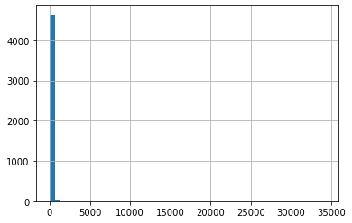
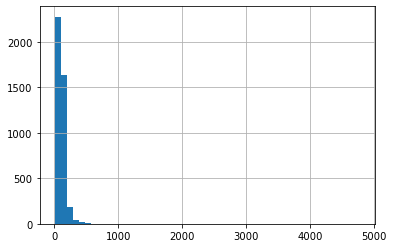

```{r setup, include=FALSE}
knitr::opts_chunk$set(echo = FALSE)
library(knitr)
```
This python notebook is used to collect necessary data about Christian Music, before we do exploration using Tableau.  
In general, what this notebook does:  
1. Import libraries and setup necessary API  
2. Collect songs from Spotify  
3. Get song lyrics from GeniusLyrics  
4. Analyse lyrics using nltk and sklearn  
5. Prepare data for Tableau 

### 1. Import libraries and setup necessary API


```python
# Spotipy for Spotify API
import spotipy
import spotipy.util as util
from spotipy.oauth2 import SpotifyClientCredentials

# lyricsgenius for Genius API
import lyricsgenius as lg

# Other common libraries
import pandas as pd
import numpy as np
import pickle
```


```python
# Setup Spotify API id and secret
client_id = 'insert_id_here'
client_secret = 'insert_secret_here'
spotify = spotipy.Spotify(client_credentials_manager=SpotifyClientCredentials(client_id=client_id,
                                                                              client_secret=client_secret))
```


```python
# Setup Genius API secret
genius_token = 'insert_token_here'
genius = lg.Genius(genius_token, timeout=20, retries=5)
```

### 2. Collect songs from Spotify


```python
# test Spotipy to retrieve Christian music genre
result = spotify.search('genre:Christian', limit=1, type='track')
print(result['tracks'])
```

    {'href': 'https://api.spotify.com/v1/search?query=genre%3AChristian&type=track&offset=0&limit=1',  
    'items': [{'album': {'album_type': 'album', 'artists': [{'external_urls': {'spotify': 'https://open.spotify.com/artist/49bzE5vRBRIota4qeHtQM8'},  
    'href': 'https://api.spotify.com/v1/artists/49bzE5vRBRIota4qeHtQM8', 'id': '49bzE5vRBRIota4qeHtQM8', 'name': 'Skillet', 'type': 'artist',  
    'uri': 'spotify:artist:49bzE5vRBRIota4qeHtQM8'}], 'available_markets': ['AD', 'AE', 'AG', 'AL', 'AM', 'AO', 'AR', 'AU', 'AZ', 'BA', 'BB', 'BD', 'BE', 'BF', 'BG', 'BH', 'BI', 'BJ', 'BN', 'BO', 'BR', 'BS', 'BT', 'BW', 'BY', 'BZ', 'CA', 'CD', 'CG', 'CI', 'CL', 'CM', 'CO', 'CR', 'CV', 'CW', 'CY', 'CZ', 'DJ', 'DK', 'DM', 'DO', 'DZ', 'EC', 'EE', 'EG', 'ES', 'FI', 'FJ', 'FM', 'FR', 'GA', 'GB', 'GD', 'GE', 'GH', 'GM', 'GN', 'GQ', 'GR', 'GT', 'GW', 'GY', 'HK', 'HN', 'HR', 'HT', 'HU', 'ID', 'IE', 'IL', 'IN', 'IQ', 'IS', 'IT', 'JM', 'JO', 'JP', 'KE', 'KG', 'KH', 'KI', 'KM', 'KN', 'KR', 'KW', 'KZ', 'LA', 'LB', 'LC', 'LI', 'LK', 'LR', 'LS', 'LT', 'LU', 'LV', 'LY', 'MA', 'MC', 'MD', 'ME', 'MG', 'MH', 'MK', 'ML', 'MN', 'MO', 'MR', 'MT', 'MU', 'MV', 'MW', 'MX', 'MY', 'MZ', 'NA', 'NE', 'NG', 'NI', 'NL', 'NO', 'NP', 'NR', 'NZ', 'OM', 'PA', 'PE', 'PG', 'PH', 'PK', 'PL', 'PS', 'PT', 'PW', 'PY', 'QA', 'RO', 'RS', 'RW', 'SA', 'SB', 'SC', 'SE', 'SI', 'SK', 'SL', 'SM', 'SN', 'SR', 'ST', 'SV', 'SZ', 'TD', 'TG', 'TH', 'TJ', 'TL', 'TN', 'TO', 'TR', 'TT', 'TV', 'TW', 'TZ', 'UA', 'UG', 'US', 'UY', 'UZ', 'VC', 'VE', 'VN', 'VU', 'WS', 'XK', 'ZA', 'ZM', 'ZW'],  
    'external_urls': {'spotify': 'https://open.spotify.com/album/0RySAmM6oDPGSE03X3dzi1'}, 'href': 'https://api.spotify.com/v1/albums/0RySAmM6oDPGSE03X3dzi1', 'id': '0RySAmM6oDPGSE03X3dzi1', 'images': [{'height': 640,  
    'url': 'https://i.scdn.co/image/ab67616d0000b27343e531d5f69170aba281ef43', 'width': 640}, {'height': 300, 'url': 'https://i.scdn.co/image/ab67616d00001e0243e531d5f69170aba281ef43', 'width': 300}, {'height': 64, 'url': 'https://i.scdn.co/image/ab67616d0000485143e531d5f69170aba281ef43', 'width': 64}], 'name': 'Awake', 'release_date': '2009-08-21', 'release_date_precision': 'day', 'total_tracks': 12, 'type': 'album',  
    'uri': 'spotify:album:0RySAmM6oDPGSE03X3dzi1'}, 'artists': [{'external_urls': {'spotify': 'https://open.spotify.com/artist/49bzE5vRBRIota4qeHtQM8'}, 'href': 'https://api.spotify.com/v1/artists/49bzE5vRBRIota4qeHtQM8',  
    'id': '49bzE5vRBRIota4qeHtQM8', 'name': 'Skillet', 'type': 'artist', 'uri': 'spotify:artist:49bzE5vRBRIota4qeHtQM8'}], 'available_markets': ['AD', 'AE', 'AG', 'AL', 'AM', 'AO', 'AR', 'AU', 'AZ', 'BA', 'BB', 'BD', 'BE', 'BF', 'BG', 'BH', 'BI', 'BJ', 'BN', 'BO', 'BR', 'BS', 'BT', 'BW', 'BY', 'BZ', 'CA', 'CD', 'CG', 'CI', 'CL', 'CM', 'CO', 'CR', 'CV', 'CW', 'CY', 'CZ', 'DJ', 'DK', 'DM', 'DO', 'DZ', 'EC', 'EE', 'EG', 'ES', 'FI', 'FJ', 'FM', 'FR', 'GA', 'GB', 'GD', 'GE', 'GH', 'GM', 'GN', 'GQ', 'GR', 'GT', 'GW', 'GY', 'HK', 'HN', 'HR', 'HT', 'HU', 'ID', 'IE', 'IL', 'IN', 'IQ', 'IS', 'IT', 'JM', 'JO', 'JP', 'KE', 'KG', 'KH', 'KI', 'KM', 'KN', 'KR', 'KW', 'KZ', 'LA', 'LB', 'LC', 'LI', 'LK', 'LR', 'LS', 'LT', 'LU', 'LV', 'LY', 'MA', 'MC', 'MD', 'ME', 'MG', 'MH', 'MK', 'ML', 'MN', 'MO', 'MR', 'MT', 'MU', 'MV', 'MW', 'MX', 'MY', 'MZ', 'NA', 'NE', 'NG', 'NI', 'NL', 'NO', 'NP', 'NR', 'NZ', 'OM', 'PA', 'PE', 'PG', 'PH', 'PK', 'PL', 'PS', 'PT', 'PW', 'PY', 'QA', 'RO', 'RS', 'RW', 'SA', 'SB', 'SC', 'SE', 'SI', 'SK', 'SL', 'SM', 'SN', 'SR', 'ST', 'SV', 'SZ', 'TD', 'TG', 'TH', 'TJ', 'TL', 'TN', 'TO', 'TR', 'TT', 'TV', 'TW', 'TZ', 'UA', 'UG', 'US', 'UY', 'UZ', 'VC', 'VE', 'VN', 'VU', 'WS', 'XK', 'ZA', 'ZM', 'ZW'], 'disc_number': 1, 'duration_ms': 178013, 'explicit': False,  
    'external_ids': {'isrc': 'USAT20901851'}, 'external_urls': {'spotify': 'https://open.spotify.com/track/2UREu1Y8CO4jXkbvqAtP7g'}, 'href': 'https://api.spotify.com/v1/tracks/2UREu1Y8CO4jXkbvqAtP7g', 'id': '2UREu1Y8CO4jXkbvqAtP7g', 'is_local': False, 'name': 'Monster',  
    'popularity': 78, 'preview_url': 'https://p.scdn.co/mp3-preview/7b31bef137993a2f2a1389e333cfb70df4aefb0d?cid=7ff96ed29e48468ca89c5e2dd2903b21', 'track_number': 2, 'type': 'track', 'uri': 'spotify:track:2UREu1Y8CO4jXkbvqAtP7g'}], 'limit': 1,  
    'next': 'https://api.spotify.com/v1/search?query=genre%3AChristian&type=track&offset=1&limit=1', 'offset': 0, 'previous': None, 'total': 10000}
    


```python
# collect more tracks from year 1990 - 2021
ls_year = list(range(1990,2022))
result_year = {}

for y in ls_year:
    print('collecting songs from ' + str(y))
    query = 'genre:"christian music"+year:'+str(y)
    result = spotify.search(query, limit=50, type='track')
    ls_tracks = result['tracks']['items']

    while result['tracks']['next'] and len(ls_tracks)<1000: # Spotify API limits up to 1000 songs
        try:
            result = spotify.next(result['tracks'])
            ls_tracks.extend(result['tracks']['items'])
        except:
            # break while loop if there is no more song to be retrieved
            break
    result_year[y] = ls_tracks
```

    collecting songs from 1990
    collecting songs from 1991
    collecting songs from 1992
    collecting songs from 1993
    collecting songs from 1994
    collecting songs from 1995
    collecting songs from 1996
    collecting songs from 1997
    collecting songs from 1998
    collecting songs from 1999
    collecting songs from 2000
    collecting songs from 2001
    collecting songs from 2002
    collecting songs from 2003
    collecting songs from 2004
    collecting songs from 2005
    collecting songs from 2006
    collecting songs from 2007
    collecting songs from 2008
    collecting songs from 2009
    collecting songs from 2010
    collecting songs from 2011
    collecting songs from 2012
    collecting songs from 2013
    collecting songs from 2014
    collecting songs from 2015
    collecting songs from 2016
    collecting songs from 2017
    collecting songs from 2018
    collecting songs from 2019
    collecting songs from 2020
    collecting songs from 2021
    


```python
# convert result to Pandas dataframe for manipulation
df1 = pd.DataFrame()
for k in result_year.keys():
    df_temp = pd.DataFrame(result_year[k])
    df1 = pd.concat([df1, df_temp],ignore_index=True)
    
df1.head()
```


<div class="scrollit">
<style scoped>
    .dataframe tbody tr th:only-of-type {
        vertical-align: middle;
    }

    .dataframe tbody tr th {
        vertical-align: top;
    }

    .dataframe thead th {
        text-align: right;
    }
    
    .scrollit {
    overflow:scroll;
    height:500px;
    }
</style>
<table border="1" class="dataframe">
  <thead>
    <tr style="text-align: right;">
      <th></th>
      <th>album</th>
      <th>artists</th>
      <th>available_markets</th>
      <th>disc_number</th>
      <th>duration_ms</th>
      <th>explicit</th>
      <th>external_ids</th>
      <th>external_urls</th>
      <th>href</th>
      <th>id</th>
      <th>is_local</th>
      <th>name</th>
      <th>popularity</th>
      <th>preview_url</th>
      <th>track_number</th>
      <th>type</th>
      <th>uri</th>
    </tr>
  </thead>
  <tbody>
    <tr>
      <th>0</th>
      <td>{'album_type': 'album', 'artists': [{'external...</td>
      <td>[{'external_urls': {'spotify': 'https://open.s...</td>
      <td>[AD, AE, AG, AL, AM, AO, AR, AT, AU, AZ, BA, B...</td>
      <td>1</td>
      <td>280866</td>
      <td>False</td>
      <td>{'isrc': 'USCM19311591'}</td>
      <td>{'spotify': 'https://open.spotify.com/track/1e...</td>
      <td>https://api.spotify.com/v1/tracks/1egPCejtdWP3...</td>
      <td>1egPCejtdWP3KRNwGNxbtZ</td>
      <td>False</td>
      <td>How Beautiful</td>
      <td>52</td>
      <td>None</td>
      <td>6</td>
      <td>track</td>
      <td>spotify:track:1egPCejtdWP3KRNwGNxbtZ</td>
    </tr>
    <tr>
      <th>1</th>
      <td>{'album_type': 'album', 'artists': [{'external...</td>
      <td>[{'external_urls': {'spotify': 'https://open.s...</td>
      <td>[AD, AE, AG, AL, AM, AO, AR, AT, AU, AZ, BA, B...</td>
      <td>1</td>
      <td>240173</td>
      <td>False</td>
      <td>{'isrc': 'USRR49000003'}</td>
      <td>{'spotify': 'https://open.spotify.com/track/0P...</td>
      <td>https://api.spotify.com/v1/tracks/0PKTBeN87JYJ...</td>
      <td>0PKTBeN87JYJ1mRzrq5Aog</td>
      <td>False</td>
      <td>Place In This World</td>
      <td>47</td>
      <td>https://p.scdn.co/mp3-preview/1bd0020320eed3b0...</td>
      <td>3</td>
      <td>track</td>
      <td>spotify:track:0PKTBeN87JYJ1mRzrq5Aog</td>
    </tr>
    <tr>
      <th>2</th>
      <td>{'album_type': 'album', 'artists': [{'external...</td>
      <td>[{'external_urls': {'spotify': 'https://open.s...</td>
      <td>[AD, AE, AG, AL, AM, AO, AR, AT, AZ, BA, BB, B...</td>
      <td>1</td>
      <td>297666</td>
      <td>False</td>
      <td>{'isrc': 'USBE19000006'}</td>
      <td>{'spotify': 'https://open.spotify.com/track/6z...</td>
      <td>https://api.spotify.com/v1/tracks/6zTrDHttc6yX...</td>
      <td>6zTrDHttc6yXR5Wc9n816G</td>
      <td>False</td>
      <td>Where There Is Faith</td>
      <td>33</td>
      <td>https://p.scdn.co/mp3-preview/c2f2189f9e559c02...</td>
      <td>6</td>
      <td>track</td>
      <td>spotify:track:6zTrDHttc6yXR5Wc9n816G</td>
    </tr>
    <tr>
      <th>3</th>
      <td>{'album_type': 'album', 'artists': [{'external...</td>
      <td>[{'external_urls': {'spotify': 'https://open.s...</td>
      <td>[AD, AE, AG, AL, AM, AO, AR, AT, AU, AZ, BA, B...</td>
      <td>1</td>
      <td>327800</td>
      <td>False</td>
      <td>{'isrc': 'USWR60100020'}</td>
      <td>{'spotify': 'https://open.spotify.com/track/3g...</td>
      <td>https://api.spotify.com/v1/tracks/3gVhqz1WJ3TS...</td>
      <td>3gVhqz1WJ3TSr4ildgU0KD</td>
      <td>False</td>
      <td>Another Time, Another Place</td>
      <td>35</td>
      <td>https://p.scdn.co/mp3-preview/6b688e7cde4c07d2...</td>
      <td>2</td>
      <td>track</td>
      <td>spotify:track:3gVhqz1WJ3TSr4ildgU0KD</td>
    </tr>
    <tr>
      <th>4</th>
      <td>{'album_type': 'album', 'artists': [{'external...</td>
      <td>[{'external_urls': {'spotify': 'https://open.s...</td>
      <td>[AD, AE, AG, AL, AM, AO, AR, AT, AU, AZ, BA, B...</td>
      <td>1</td>
      <td>284466</td>
      <td>False</td>
      <td>{'isrc': 'USWR60251849'}</td>
      <td>{'spotify': 'https://open.spotify.com/track/4e...</td>
      <td>https://api.spotify.com/v1/tracks/4eBAni9FeqKv...</td>
      <td>4eBAni9FeqKv9JQqwOF4VM</td>
      <td>False</td>
      <td>Home Free</td>
      <td>32</td>
      <td>https://p.scdn.co/mp3-preview/7312bcd0ffcd2a7e...</td>
      <td>4</td>
      <td>track</td>
      <td>spotify:track:4eBAni9FeqKv9JQqwOF4VM</td>
    </tr>
  </tbody>
</table>
</div>


```python
# extract relevant information about songs
df1['release_date'] = df1.apply(lambda x: x['album']['release_date'], axis=1)
df1['artists_name'] = df1.apply(lambda x: x['album']['artists'][0]['name'], axis=1)
df1['track_name'] = df1.apply(lambda x: x['album']['name'], axis=1)
df1['release_year'] = df1.apply(lambda x: x['release_date'][:4], axis=1)
df1.head()
```


<div class="scrollit">
<style scoped>
    .dataframe tbody tr th:only-of-type {
        vertical-align: middle;
    }

    .dataframe tbody tr th {
        vertical-align: top;
    }

    .dataframe thead th {
        text-align: right;
    }
    .scrollit {
    overflow:scroll;
    height:500px;
    }
</style>
<table border="1" class="dataframe">
  <thead>
    <tr style="text-align: right;">
      <th></th>
      <th>album</th>
      <th>artists</th>
      <th>available_markets</th>
      <th>disc_number</th>
      <th>duration_ms</th>
      <th>explicit</th>
      <th>external_ids</th>
      <th>external_urls</th>
      <th>href</th>
      <th>id</th>
      <th>...</th>
      <th>name</th>
      <th>popularity</th>
      <th>preview_url</th>
      <th>track_number</th>
      <th>type</th>
      <th>uri</th>
      <th>release_date</th>
      <th>artists_name</th>
      <th>track_name</th>
      <th>release_year</th>
    </tr>
  </thead>
  <tbody>
    <tr>
      <th>0</th>
      <td>{'album_type': 'album', 'artists': [{'external...</td>
      <td>[{'external_urls': {'spotify': 'https://open.s...</td>
      <td>[AD, AE, AG, AL, AM, AO, AR, AT, AU, AZ, BA, B...</td>
      <td>1</td>
      <td>280866</td>
      <td>False</td>
      <td>{'isrc': 'USCM19311591'}</td>
      <td>{'spotify': 'https://open.spotify.com/track/1e...</td>
      <td>https://api.spotify.com/v1/tracks/1egPCejtdWP3...</td>
      <td>1egPCejtdWP3KRNwGNxbtZ</td>
      <td>...</td>
      <td>How Beautiful</td>
      <td>52</td>
      <td>None</td>
      <td>6</td>
      <td>track</td>
      <td>spotify:track:1egPCejtdWP3KRNwGNxbtZ</td>
      <td>1990-01-01</td>
      <td>Twila Paris</td>
      <td>Cry For The Desert</td>
      <td>1990</td>
    </tr>
    <tr>
      <th>1</th>
      <td>{'album_type': 'album', 'artists': [{'external...</td>
      <td>[{'external_urls': {'spotify': 'https://open.s...</td>
      <td>[AD, AE, AG, AL, AM, AO, AR, AT, AU, AZ, BA, B...</td>
      <td>1</td>
      <td>240173</td>
      <td>False</td>
      <td>{'isrc': 'USRR49000003'}</td>
      <td>{'spotify': 'https://open.spotify.com/track/0P...</td>
      <td>https://api.spotify.com/v1/tracks/0PKTBeN87JYJ...</td>
      <td>0PKTBeN87JYJ1mRzrq5Aog</td>
      <td>...</td>
      <td>Place In This World</td>
      <td>47</td>
      <td>https://p.scdn.co/mp3-preview/1bd0020320eed3b0...</td>
      <td>3</td>
      <td>track</td>
      <td>spotify:track:0PKTBeN87JYJ1mRzrq5Aog</td>
      <td>1990</td>
      <td>Michael W. Smith</td>
      <td>Go West Young Man</td>
      <td>1990</td>
    </tr>
    <tr>
      <th>2</th>
      <td>{'album_type': 'album', 'artists': [{'external...</td>
      <td>[{'external_urls': {'spotify': 'https://open.s...</td>
      <td>[AD, AE, AG, AL, AM, AO, AR, AT, AZ, BA, BB, B...</td>
      <td>1</td>
      <td>297666</td>
      <td>False</td>
      <td>{'isrc': 'USBE19000006'}</td>
      <td>{'spotify': 'https://open.spotify.com/track/6z...</td>
      <td>https://api.spotify.com/v1/tracks/6zTrDHttc6yX...</td>
      <td>6zTrDHttc6yXR5Wc9n816G</td>
      <td>...</td>
      <td>Where There Is Faith</td>
      <td>33</td>
      <td>https://p.scdn.co/mp3-preview/c2f2189f9e559c02...</td>
      <td>6</td>
      <td>track</td>
      <td>spotify:track:6zTrDHttc6yXR5Wc9n816G</td>
      <td>1990</td>
      <td>4Him</td>
      <td>4Him</td>
      <td>1990</td>
    </tr>
    <tr>
      <th>3</th>
      <td>{'album_type': 'album', 'artists': [{'external...</td>
      <td>[{'external_urls': {'spotify': 'https://open.s...</td>
      <td>[AD, AE, AG, AL, AM, AO, AR, AT, AU, AZ, BA, B...</td>
      <td>1</td>
      <td>327800</td>
      <td>False</td>
      <td>{'isrc': 'USWR60100020'}</td>
      <td>{'spotify': 'https://open.spotify.com/track/3g...</td>
      <td>https://api.spotify.com/v1/tracks/3gVhqz1WJ3TS...</td>
      <td>3gVhqz1WJ3TSr4ildgU0KD</td>
      <td>...</td>
      <td>Another Time, Another Place</td>
      <td>35</td>
      <td>https://p.scdn.co/mp3-preview/6b688e7cde4c07d2...</td>
      <td>2</td>
      <td>track</td>
      <td>spotify:track:3gVhqz1WJ3TSr4ildgU0KD</td>
      <td>1990-10-01</td>
      <td>Sandi Patty</td>
      <td>Another Time...Another Place</td>
      <td>1990</td>
    </tr>
    <tr>
      <th>4</th>
      <td>{'album_type': 'album', 'artists': [{'external...</td>
      <td>[{'external_urls': {'spotify': 'https://open.s...</td>
      <td>[AD, AE, AG, AL, AM, AO, AR, AT, AU, AZ, BA, B...</td>
      <td>1</td>
      <td>284466</td>
      <td>False</td>
      <td>{'isrc': 'USWR60251849'}</td>
      <td>{'spotify': 'https://open.spotify.com/track/4e...</td>
      <td>https://api.spotify.com/v1/tracks/4eBAni9FeqKv...</td>
      <td>4eBAni9FeqKv9JQqwOF4VM</td>
      <td>...</td>
      <td>Home Free</td>
      <td>32</td>
      <td>https://p.scdn.co/mp3-preview/7312bcd0ffcd2a7e...</td>
      <td>4</td>
      <td>track</td>
      <td>spotify:track:4eBAni9FeqKv9JQqwOF4VM</td>
      <td>1990-01-01</td>
      <td>Wayne Watson</td>
      <td>Home Free</td>
      <td>1990</td>
    </tr>
  </tbody>
</table>
<p>5 rows × 21 columns</p>
</div>


```python
# check how many songs succesfully retrieved for each year (at least there are 100 songs for each eyar)
df1.groupby(by=['release_year']).agg({'release_year': 'count'})
```


<div class="scrollit">
<style scoped>
    .dataframe tbody tr th:only-of-type {
        vertical-align: middle;
    }

    .dataframe tbody tr th {
        vertical-align: top;
    }

    .dataframe thead th {
        text-align: right;
    }
    .scrollit {
    overflow:scroll;
    height:500px;
    }
</style>
<table border="1" class="dataframe">
  <thead>
    <tr style="text-align: right;">
      <th></th>
      <th>release_year</th>
    </tr>
    <tr>
      <th>release_year</th>
      <th></th>
    </tr>
  </thead>
  <tbody>
    <tr>
      <th>1990</th>
      <td>239</td>
    </tr>
    <tr>
      <th>1991</th>
      <td>170</td>
    </tr>
    <tr>
      <th>1992</th>
      <td>291</td>
    </tr>
    <tr>
      <th>1993</th>
      <td>316</td>
    </tr>
    <tr>
      <th>1994</th>
      <td>291</td>
    </tr>
    <tr>
      <th>1995</th>
      <td>468</td>
    </tr>
    <tr>
      <th>1996</th>
      <td>339</td>
    </tr>
    <tr>
      <th>1997</th>
      <td>481</td>
    </tr>
    <tr>
      <th>1998</th>
      <td>490</td>
    </tr>
    <tr>
      <th>1999</th>
      <td>796</td>
    </tr>
    <tr>
      <th>2000</th>
      <td>706</td>
    </tr>
    <tr>
      <th>2001</th>
      <td>1000</td>
    </tr>
    <tr>
      <th>2002</th>
      <td>1000</td>
    </tr>
    <tr>
      <th>2003</th>
      <td>1000</td>
    </tr>
    <tr>
      <th>2004</th>
      <td>984</td>
    </tr>
    <tr>
      <th>2005</th>
      <td>1000</td>
    </tr>
    <tr>
      <th>2006</th>
      <td>1000</td>
    </tr>
    <tr>
      <th>2007</th>
      <td>1000</td>
    </tr>
    <tr>
      <th>2008</th>
      <td>1000</td>
    </tr>
    <tr>
      <th>2009</th>
      <td>1000</td>
    </tr>
    <tr>
      <th>2010</th>
      <td>1000</td>
    </tr>
    <tr>
      <th>2011</th>
      <td>1000</td>
    </tr>
    <tr>
      <th>2012</th>
      <td>1000</td>
    </tr>
    <tr>
      <th>2013</th>
      <td>1000</td>
    </tr>
    <tr>
      <th>2014</th>
      <td>1000</td>
    </tr>
    <tr>
      <th>2015</th>
      <td>1000</td>
    </tr>
    <tr>
      <th>2016</th>
      <td>1000</td>
    </tr>
    <tr>
      <th>2017</th>
      <td>1000</td>
    </tr>
    <tr>
      <th>2018</th>
      <td>1000</td>
    </tr>
    <tr>
      <th>2019</th>
      <td>1000</td>
    </tr>
    <tr>
      <th>2020</th>
      <td>1000</td>
    </tr>
    <tr>
      <th>2021</th>
      <td>1000</td>
    </tr>
  </tbody>
</table>
</div>


```python
# get audio track features (max 100 ids per request)
i=0
while i < len(df1):
    if i+99 < len(df1):
        df1.loc[i:i+99,'track_features'] = spotify.audio_features(tracks=df1.loc[i:i+99,'id'].to_list())
    else:
        df1.loc[i:,'track_features'] = spotify.audio_features(tracks=df1.loc[i:,'id'].to_list())
    i+=100
df1.head()
```


<div class='scrollit'>
<style scoped>
    .dataframe tbody tr th:only-of-type {
        vertical-align: middle;
    }

    .dataframe tbody tr th {
        vertical-align: top;
    }

    .dataframe thead th {
        text-align: right;
    }
    .scrollit {
    overflow:scroll;
    height:500px;
    }
</style>
<table border="1" class="dataframe">
  <thead>
    <tr style="text-align: right;">
      <th></th>
      <th>album</th>
      <th>artists</th>
      <th>available_markets</th>
      <th>disc_number</th>
      <th>duration_ms</th>
      <th>explicit</th>
      <th>external_ids</th>
      <th>external_urls</th>
      <th>href</th>
      <th>id</th>
      <th>...</th>
      <th>popularity</th>
      <th>preview_url</th>
      <th>track_number</th>
      <th>type</th>
      <th>uri</th>
      <th>release_date</th>
      <th>artists_name</th>
      <th>track_name</th>
      <th>release_year</th>
      <th>track_features</th>
    </tr>
  </thead>
  <tbody>
    <tr>
      <th>0</th>
      <td>{'album_type': 'album', 'artists': [{'external...</td>
      <td>[{'external_urls': {'spotify': 'https://open.s...</td>
      <td>[AD, AE, AG, AL, AM, AO, AR, AT, AU, AZ, BA, B...</td>
      <td>1</td>
      <td>280866</td>
      <td>False</td>
      <td>{'isrc': 'USCM19311591'}</td>
      <td>{'spotify': 'https://open.spotify.com/track/1e...</td>
      <td>https://api.spotify.com/v1/tracks/1egPCejtdWP3...</td>
      <td>1egPCejtdWP3KRNwGNxbtZ</td>
      <td>...</td>
      <td>52</td>
      <td>None</td>
      <td>6</td>
      <td>track</td>
      <td>spotify:track:1egPCejtdWP3KRNwGNxbtZ</td>
      <td>1990-01-01</td>
      <td>Twila Paris</td>
      <td>Cry For The Desert</td>
      <td>1990</td>
      <td>{'danceability': 0.296, 'energy': 0.284, 'key'...</td>
    </tr>
    <tr>
      <th>1</th>
      <td>{'album_type': 'album', 'artists': [{'external...</td>
      <td>[{'external_urls': {'spotify': 'https://open.s...</td>
      <td>[AD, AE, AG, AL, AM, AO, AR, AT, AU, AZ, BA, B...</td>
      <td>1</td>
      <td>240173</td>
      <td>False</td>
      <td>{'isrc': 'USRR49000003'}</td>
      <td>{'spotify': 'https://open.spotify.com/track/0P...</td>
      <td>https://api.spotify.com/v1/tracks/0PKTBeN87JYJ...</td>
      <td>0PKTBeN87JYJ1mRzrq5Aog</td>
      <td>...</td>
      <td>47</td>
      <td>https://p.scdn.co/mp3-preview/1bd0020320eed3b0...</td>
      <td>3</td>
      <td>track</td>
      <td>spotify:track:0PKTBeN87JYJ1mRzrq5Aog</td>
      <td>1990</td>
      <td>Michael W. Smith</td>
      <td>Go West Young Man</td>
      <td>1990</td>
      <td>{'danceability': 0.446, 'energy': 0.559, 'key'...</td>
    </tr>
    <tr>
      <th>2</th>
      <td>{'album_type': 'album', 'artists': [{'external...</td>
      <td>[{'external_urls': {'spotify': 'https://open.s...</td>
      <td>[AD, AE, AG, AL, AM, AO, AR, AT, AZ, BA, BB, B...</td>
      <td>1</td>
      <td>297666</td>
      <td>False</td>
      <td>{'isrc': 'USBE19000006'}</td>
      <td>{'spotify': 'https://open.spotify.com/track/6z...</td>
      <td>https://api.spotify.com/v1/tracks/6zTrDHttc6yX...</td>
      <td>6zTrDHttc6yXR5Wc9n816G</td>
      <td>...</td>
      <td>33</td>
      <td>https://p.scdn.co/mp3-preview/c2f2189f9e559c02...</td>
      <td>6</td>
      <td>track</td>
      <td>spotify:track:6zTrDHttc6yXR5Wc9n816G</td>
      <td>1990</td>
      <td>4Him</td>
      <td>4Him</td>
      <td>1990</td>
      <td>{'danceability': 0.542, 'energy': 0.582, 'key'...</td>
    </tr>
    <tr>
      <th>3</th>
      <td>{'album_type': 'album', 'artists': [{'external...</td>
      <td>[{'external_urls': {'spotify': 'https://open.s...</td>
      <td>[AD, AE, AG, AL, AM, AO, AR, AT, AU, AZ, BA, B...</td>
      <td>1</td>
      <td>327800</td>
      <td>False</td>
      <td>{'isrc': 'USWR60100020'}</td>
      <td>{'spotify': 'https://open.spotify.com/track/3g...</td>
      <td>https://api.spotify.com/v1/tracks/3gVhqz1WJ3TS...</td>
      <td>3gVhqz1WJ3TSr4ildgU0KD</td>
      <td>...</td>
      <td>35</td>
      <td>https://p.scdn.co/mp3-preview/6b688e7cde4c07d2...</td>
      <td>2</td>
      <td>track</td>
      <td>spotify:track:3gVhqz1WJ3TSr4ildgU0KD</td>
      <td>1990-10-01</td>
      <td>Sandi Patty</td>
      <td>Another Time...Another Place</td>
      <td>1990</td>
      <td>{'danceability': 0.377, 'energy': 0.537, 'key'...</td>
    </tr>
    <tr>
      <th>4</th>
      <td>{'album_type': 'album', 'artists': [{'external...</td>
      <td>[{'external_urls': {'spotify': 'https://open.s...</td>
      <td>[AD, AE, AG, AL, AM, AO, AR, AT, AU, AZ, BA, B...</td>
      <td>1</td>
      <td>284466</td>
      <td>False</td>
      <td>{'isrc': 'USWR60251849'}</td>
      <td>{'spotify': 'https://open.spotify.com/track/4e...</td>
      <td>https://api.spotify.com/v1/tracks/4eBAni9FeqKv...</td>
      <td>4eBAni9FeqKv9JQqwOF4VM</td>
      <td>...</td>
      <td>32</td>
      <td>https://p.scdn.co/mp3-preview/7312bcd0ffcd2a7e...</td>
      <td>4</td>
      <td>track</td>
      <td>spotify:track:4eBAni9FeqKv9JQqwOF4VM</td>
      <td>1990-01-01</td>
      <td>Wayne Watson</td>
      <td>Home Free</td>
      <td>1990</td>
      <td>{'danceability': 0.573, 'energy': 0.331, 'key'...</td>
    </tr>
  </tbody>
</table>
<p>5 rows × 22 columns</p>
</div>


```python
# check dataframe columns
df1.columns.sort_values()
```


    Index(['album', 'artists', 'artists_name', 'available_markets', 'disc_number',
           'duration_ms', 'explicit', 'external_ids', 'external_urls', 'href',
           'id', 'is_local', 'name', 'popularity', 'preview_url', 'release_date',
           'release_year', 'track_features', 'track_name', 'track_number', 'type',
           'uri'],
          dtype='object')


```python
# expand features to dataframe columns
feat_cols = ['danceability', 'energy', 'key', 'loudness', 'mode', 'speechiness',
             'acousticness', 'instrumentalness', 'liveness', 'valence', 'tempo', 'time_signature']
df2 = pd.concat([df1.drop(['track_features'], axis=1),
                 df1['track_features'].apply(lambda x: pd.Series(x)[feat_cols])], axis=1)
```


```python
# check data types
df2.info()
```

    <class 'pandas.core.frame.DataFrame'>
    RangeIndex: 25571 entries, 0 to 25570
    Data columns (total 33 columns):
     #   Column             Non-Null Count  Dtype  
    ---  ------             --------------  -----  
     0   album              25571 non-null  object 
     1   artists            25571 non-null  object 
     2   available_markets  25571 non-null  object 
     3   disc_number        25571 non-null  int64  
     4   duration_ms        25571 non-null  int64  
     5   explicit           25571 non-null  bool   
     6   external_ids       25571 non-null  object 
     7   external_urls      25571 non-null  object 
     8   href               25571 non-null  object 
     9   id                 25571 non-null  object 
     10  is_local           25571 non-null  bool   
     11  name               25571 non-null  object 
     12  popularity         25571 non-null  int64  
     13  preview_url        14738 non-null  object 
     14  track_number       25571 non-null  int64  
     15  type               25571 non-null  object 
     16  uri                25571 non-null  object 
     17  release_date       25571 non-null  object 
     18  artists_name       25571 non-null  object 
     19  track_name         25571 non-null  object 
     20  release_year       25571 non-null  object 
     21  danceability       25571 non-null  float64
     22  energy             25571 non-null  float64
     23  key                25571 non-null  int64  
     24  loudness           25571 non-null  float64
     25  mode               25571 non-null  int64  
     26  speechiness        25571 non-null  float64
     27  acousticness       25571 non-null  float64
     28  instrumentalness   25571 non-null  float64
     29  liveness           25571 non-null  float64
     30  valence            25571 non-null  float64
     31  tempo              25571 non-null  float64
     32  time_signature     25571 non-null  int64  
    dtypes: bool(2), float64(9), int64(7), object(15)
    memory usage: 6.1+ MB
    


```python
# export dataframe to pickle for easy retrieval next time
with open('songs.pickle', 'wb') as f:
    pickle.dump(df2, f, pickle.HIGHEST_PROTOCOL)

# for importing the exported pickle files
with open('songs.pickle', 'rb') as f:
    df2 = pickle.load(f)
```


```python
dfg = df2.groupby(by=['name','artists_name']).agg({'id':'count'}).sort_values(by='id', ascending=False)
dfg[dfg['id']>1]
```


<div class='scrollit'>
<style scoped>
    .dataframe tbody tr th:only-of-type {
        vertical-align: middle;
    }

    .dataframe tbody tr th {
        vertical-align: top;
    }

    .dataframe thead th {
        text-align: right;
    }
    .scrollit {
    overflow:scroll;
    height:500px;
    }
</style>
<table border="1" class="dataframe">
  <thead>
    <tr style="text-align: right;">
      <th></th>
      <th></th>
      <th>id</th>
    </tr>
    <tr>
      <th>name</th>
      <th>artists_name</th>
      <th></th>
    </tr>
  </thead>
  <tbody>
    <tr>
      <th>Shout to the Lord</th>
      <th>Various Artists</th>
      <td>10</td>
    </tr>
    <tr>
      <th>Shine</th>
      <th>Newsboys</th>
      <td>10</td>
    </tr>
    <tr>
      <th>Mercy Came Running</th>
      <th>Phillips, Craig &amp; Dean</th>
      <td>9</td>
    </tr>
    <tr>
      <th>Jesus Freak</th>
      <th>DC Talk</th>
      <td>8</td>
    </tr>
    <tr>
      <th>I Wanna Remember (feat. Carrie Underwood)</th>
      <th>NEEDTOBREATHE</th>
      <td>8</td>
    </tr>
    <tr>
      <th>...</th>
      <th>...</th>
      <td>...</td>
    </tr>
    <tr>
      <th>White Christmas</th>
      <th>Amy Grant</th>
      <td>2</td>
    </tr>
    <tr>
      <th>Simplicity</th>
      <th>Rend Collective</th>
      <td>2</td>
    </tr>
    <tr>
      <th>Spirit - Listen Louder Album Version</th>
      <th>Various Artists</th>
      <td>2</td>
    </tr>
    <tr>
      <th>Never Fail - Live</th>
      <th>Hillsong Young &amp; Free</th>
      <td>2</td>
    </tr>
    <tr>
      <th>He Shall Reign - Live</th>
      <th>Hillsong Worship</th>
      <td>2</td>
    </tr>
  </tbody>
</table>
<p>3229 rows × 1 columns</p>
</div>


```python
# drop duplicate if song, artist, released_year are the same
df2.drop_duplicates(['name', 'artists_name', 'release_year'], inplace=True)
```

### 3. Get song lyrics from GeniusLyrics


```python
# test genius API to get song lyrics
title_name = df2.loc[0, 'track_name']
artist_name = df2.loc[0, 'artists_name']

song = genius.search_song(title=title_name, artist=artist_name)
print(song.lyrics)
```

    Searching for "Cry For The Desert" by Twila Paris...
    Done.
    Verse I
    I will cry for the desert
    When He's bleeding from His heart and soul
    Die for the desert
    And remove my hands from what I hold
    
    Deeper in my heart I will hear Him call
    Deeper in my heart I will give it all
    Deeper in my heart
    
    CHORUS
    
    I will cry for the desert
    Oh
    I will cry for the desert
    Oh
    I will cry
    
    Verse II
    Cry for the desert;
    I will tremble and recieve His pain
    Die for the desert;
    I will pour my life on this terrain
    
    Deeper in my heart I will hear Him call
    Deeper in my heart I will give it all
    Deeper in my heart
    Bridge
    
    The smallest grain of sand
    Is held inside my hand
    And when I look
    I see His face
    
    The smallest grain of sand
    Is held inside my hand
    And when I look
    I see His face
    
    REPEAT VERSE I
    
    REPEAT CHORUSEmbedShare URLCopyEmbedCopy
    


```python
df2.shape
```


    (24167, 33)


```python
# import necessary libraries for text analysis
import nltk
import re
from nltk.stem import WordNetLemmatizer
from nltk.tokenize import RegexpTokenizer
from nltk.corpus import stopwords
from nltk.corpus import words
from sklearn.feature_extraction.text import TfidfVectorizer
from sklearn.feature_extraction import text as sktext
from sklearn.cluster import KMeans
import matplotlib.pyplot as plt
from PIL import Image
from wordcloud import WordCloud, STOPWORDS, ImageColorGenerator
%matplotlib inline
```


```python
# remove medley songs
df3 = df2[df2['name'].apply(lambda x: 'medley' not in x.lower())]
# remove non-english song
setofwords = set(words.words())
df3 = df3[df3['name'].apply(lambda x: any([n in setofwords for n in x]))]
print(df3.shape)
# remove tracks with multiple artists
df3 = df3[df3['artists_name'].apply(lambda x: ('various' not in x.lower()) and (',' not in x.lower()))]
print(df3.shape)
```

    (23919, 33)
    (22440, 33)
    


```python
df3.columns
```


    Index(['album', 'artists', 'available_markets', 'disc_number', 'duration_ms',
           'explicit', 'external_ids', 'external_urls', 'href', 'id', 'is_local',
           'name', 'popularity', 'preview_url', 'track_number', 'type', 'uri',
           'release_date', 'artists_name', 'track_name', 'release_year',
           'danceability', 'energy', 'key', 'loudness', 'mode', 'speechiness',
           'acousticness', 'instrumentalness', 'liveness', 'valence', 'tempo',
           'time_signature'],
          dtype='object')


```python
# save image url for display later
df3['image_url'] = df3['album'].apply(lambda x: x['images'][1]['url'])
```


```python
# get top 150 songs by popularity for each year
df_top = df3.sort_values('popularity',ascending = False).groupby('release_year')\
['name', 'artists_name', 'image_url', 'release_year', 'duration_ms', 'external_urls', 'popularity', 'danceability', 'energy', 'loudness', 'speechiness',
 'acousticness', 'instrumentalness', 'liveness', 'valence', 'tempo', 'key', 'time_signature'].head(150)
df_top.sort_values('release_year').head()
```

    C:\Users\cowfu\Anaconda3\lib\site-packages\ipykernel_launcher.py:3: FutureWarning: Indexing with multiple keys (implicitly converted to a tuple of keys) will be deprecated, use a list instead.
      This is separate from the ipykernel package so we can avoid doing imports until
    


<div class='scrollit'>
<style scoped>
    .dataframe tbody tr th:only-of-type {
        vertical-align: middle;
    }

    .dataframe tbody tr th {
        vertical-align: top;
    }

    .dataframe thead th {
        text-align: right;
    }
    .scrollit {
    overflow:scroll;
    height:500px;
    }
</style>
<table border="1" class="dataframe">
  <thead>
    <tr style="text-align: right;">
      <th></th>
      <th>name</th>
      <th>artists_name</th>
      <th>image_url</th>
      <th>release_year</th>
      <th>duration_ms</th>
      <th>external_urls</th>
      <th>popularity</th>
      <th>danceability</th>
      <th>energy</th>
      <th>loudness</th>
      <th>speechiness</th>
      <th>acousticness</th>
      <th>instrumentalness</th>
      <th>liveness</th>
      <th>valence</th>
      <th>tempo</th>
      <th>key</th>
      <th>time_signature</th>
    </tr>
  </thead>
  <tbody>
    <tr>
      <th>82</th>
      <td>Freedom</td>
      <td>Wayne Watson</td>
      <td>https://i.scdn.co/image/ab67616d00001e02aea734...</td>
      <td>1990</td>
      <td>304200</td>
      <td>{'spotify': 'https://open.spotify.com/track/0G...</td>
      <td>12</td>
      <td>0.659</td>
      <td>0.542</td>
      <td>-10.487</td>
      <td>0.0289</td>
      <td>0.0759</td>
      <td>0.0</td>
      <td>0.0524</td>
      <td>0.840</td>
      <td>114.576</td>
      <td>2</td>
      <td>4</td>
    </tr>
    <tr>
      <th>92</th>
      <td>Storyline - Powerhouse Album Version</td>
      <td>Whiteheart</td>
      <td>https://i.scdn.co/image/ab67616d00001e02f117a6...</td>
      <td>1990</td>
      <td>261686</td>
      <td>{'spotify': 'https://open.spotify.com/track/38...</td>
      <td>13</td>
      <td>0.701</td>
      <td>0.701</td>
      <td>-11.453</td>
      <td>0.0357</td>
      <td>0.4290</td>
      <td>0.0</td>
      <td>0.0520</td>
      <td>0.485</td>
      <td>115.926</td>
      <td>2</td>
      <td>4</td>
    </tr>
    <tr>
      <th>60</th>
      <td>What Kind Of Joy</td>
      <td>Steven Curtis Chapman</td>
      <td>https://i.scdn.co/image/ab67616d00001e02c6ae7e...</td>
      <td>1990</td>
      <td>276466</td>
      <td>{'spotify': 'https://open.spotify.com/track/5r...</td>
      <td>13</td>
      <td>0.528</td>
      <td>0.496</td>
      <td>-13.614</td>
      <td>0.0326</td>
      <td>0.3520</td>
      <td>0.0</td>
      <td>0.0912</td>
      <td>0.578</td>
      <td>157.727</td>
      <td>2</td>
      <td>3</td>
    </tr>
    <tr>
      <th>90</th>
      <td>How Majestic Is Your Name</td>
      <td>Sandi Patty</td>
      <td>https://i.scdn.co/image/ab67616d00001e0206a08c...</td>
      <td>1990</td>
      <td>167307</td>
      <td>{'spotify': 'https://open.spotify.com/track/5v...</td>
      <td>13</td>
      <td>0.389</td>
      <td>0.833</td>
      <td>-9.022</td>
      <td>0.2500</td>
      <td>0.5980</td>
      <td>0.0</td>
      <td>0.9790</td>
      <td>0.832</td>
      <td>175.964</td>
      <td>2</td>
      <td>4</td>
    </tr>
    <tr>
      <th>73</th>
      <td>Undivided Heart - Cry For The Desert Album Ver...</td>
      <td>Twila Paris</td>
      <td>https://i.scdn.co/image/ab67616d00001e02c860b3...</td>
      <td>1990</td>
      <td>290133</td>
      <td>{'spotify': 'https://open.spotify.com/track/3v...</td>
      <td>13</td>
      <td>0.551</td>
      <td>0.862</td>
      <td>-4.822</td>
      <td>0.0472</td>
      <td>0.3630</td>
      <td>0.0</td>
      <td>0.7440</td>
      <td>0.389</td>
      <td>105.848</td>
      <td>7</td>
      <td>4</td>
    </tr>
  </tbody>
</table>
</div>


```python
#remove extra info from song title i.e. '-' and '()'
df_top.rename(columns={'name':'original_name'}, inplace=True)
df_top['name'] = df_top['original_name'].apply(lambda x: x.split('-')[0])
df_top['name'] = df_top['name'].apply(lambda x: x.split('(')[0].strip())
```

```python
# create helper function to retrieve lyrics
def get_lyrics(title, artist):
    while True:
        try:
            song = genius.search_song(title=title, artist=artist)
            if song:
                return song.lyrics
            else:
                return None
            break
        except:
            pass    
```

```python
# get the lyrics of the songs
df_top['lyrics'] = df_top.apply(lambda x: get_lyrics(x['name'], x['artists_name']), axis=1)
```

    Searching for "Monster" by Skillet...
    Done.
    Searching for "You Say" by Lauren Daigle...
    Done.
    Searching for "Feel Invincible" by Skillet...
    Done.
    Searching for "Hero" by Skillet...
    Done.
    Searching for "The Resistance" by Skillet...
    Done.
    Searching for "Reckless Love" by Cory Asbury...
    Done.
    Searching for "Rescue" by Lauren Daigle...
    Done.
    Searching for "Awake and Alive" by Skillet...
    Done.
    Searching for "Comatose" by Skillet...
    Done.
    Searching for "Oceans" by Hillsong UNITED...
    Done.
    Searching for "O Come to the Altar" by Elevation Worship...
    Done.
    Searching for "Nobody" by Casting Crowns...
    Done.
    Searching for "Not Gonna Die" by Skillet...
    Done.
    Searching for "Little Drummer Boy" by for KING & COUNTRY...
    Done.
    Searching for "Good Good Father" by Chris Tomlin...
    Done.
    Searching for "Way Maker" by Leeland...
    Done.
    Searching for "Jireh" by Elevation Worship...
    Done.
    Searching for "10,000 Reasons" by Matt Redman...
    Done.
    Searching for "Do It Again" by Elevation Worship...
    Done.
    Searching for "I Can Only Imagine" by MercyMe...
    Done.
    Searching for "Whispers in the Dark" by Skillet...
    Done.
    Searching for "What A Beautiful Name" by Hillsong Worship...
    Done.
    Searching for "Trust in You" by Lauren Daigle...
    Done.
    Searching for "Tributary" by Twila Paris...
    Specified song does not contain lyrics. Rejecting.
    Searching for "Everywhere I Look" by Phil Keaggy...
    Done.
    ..........and more..........


```python
# save dataframe with lyrics as pickle for easy retrieval next time
with open('df_top_lyrics.pickle', 'wb') as f:
    pickle.dump(df_top, f, pickle.HIGHEST_PROTOCOL)

with open('df_top_lyrics.pickle', 'rb') as f:
    df_top = pickle.load(f)
```


```python
# check how many song with missing lyrics
'% missing lyrics: {:.2f}%'.format(sum(df_top['lyrics'].isnull())*100/df_top.shape[0])
```


    '% missing lyrics: 0.85%'


```python
df_top[df_top['lyrics'].isnull()][['name','artists_name']]
```


<div class='scrollit'>
<style scoped>
    .dataframe tbody tr th:only-of-type {
        vertical-align: middle;
    }

    .dataframe tbody tr th {
        vertical-align: top;
    }

    .dataframe thead th {
        text-align: right;
    }
    .scrollit {
    overflow:scroll;
    height:500px;
    }
</style>
<table border="1" class="dataframe">
  <thead>
    <tr style="text-align: right;">
      <th></th>
      <th>name</th>
      <th>artists_name</th>
    </tr>
  </thead>
  <tbody>
    <tr>
      <th>23571</th>
      <td>Graves Into Gardens</td>
      <td>Elevation Worship</td>
    </tr>
    <tr>
      <th>23588</th>
      <td>Graves Into Gardens</td>
      <td>Elevation Worship</td>
    </tr>
    <tr>
      <th>24661</th>
      <td>Winter Wonderland</td>
      <td>Sarah Reeves</td>
    </tr>
    <tr>
      <th>18640</th>
      <td>Joy to the World/Our God Saves</td>
      <td>Paul Baloche</td>
    </tr>
    <tr>
      <th>16684</th>
      <td>El Dios que Adoramos</td>
      <td>Sovereign Grace Music</td>
    </tr>
    <tr>
      <th>11601</th>
      <td>So Good To Me</td>
      <td>Matt Gilman &amp; Cory Asbury</td>
    </tr>
    <tr>
      <th>20761</th>
      <td>As The Deer</td>
      <td>David Phelps</td>
    </tr>
    <tr>
      <th>19990</th>
      <td>Ven Aquí</td>
      <td>Planetshakers</td>
    </tr>
    <tr>
      <th>16870</th>
      <td>Un Siervo para Tu Gloria</td>
      <td>Sovereign Grace Music</td>
    </tr>
    <tr>
      <th>17689</th>
      <td>O Come, O Come, Emmanuel</td>
      <td>Kim Walker-Smith</td>
    </tr>
    <tr>
      <th>5595</th>
      <td>In The Belly Of A Whale</td>
      <td>VeggieTales</td>
    </tr>
    <tr>
      <th>16912</th>
      <td>Más Grande de lo que Imagino</td>
      <td>Sovereign Grace Music</td>
    </tr>
    <tr>
      <th>15702</th>
      <td>The Perfect Wisdom Of Our God</td>
      <td>Keith &amp; Kristyn Getty</td>
    </tr>
    <tr>
      <th>2606</th>
      <td>O Christmas Tree</td>
      <td>Michael W. Smith</td>
    </tr>
    <tr>
      <th>9649</th>
      <td>Great Is Thy Faithfulness</td>
      <td>Fernando Ortega</td>
    </tr>
    <tr>
      <th>11669</th>
      <td>Come, Thou Long Expected Jesus</td>
      <td>Fernando Ortega</td>
    </tr>
    <tr>
      <th>9693</th>
      <td>The LarryBoy Theme Song</td>
      <td>VeggieTales</td>
    </tr>
    <tr>
      <th>3920</th>
      <td>It Is Well With My Soul</td>
      <td>4Him</td>
    </tr>
    <tr>
      <th>3938</th>
      <td>Freedom</td>
      <td>Michael W. Smith</td>
    </tr>
    <tr>
      <th>10701</th>
      <td>The Gift Of St.Cecilia</td>
      <td>Jars Of Clay</td>
    </tr>
    <tr>
      <th>3950</th>
      <td>Thy Word</td>
      <td>Michael W. Smith</td>
    </tr>
    <tr>
      <th>7680</th>
      <td>I Could Sing Of Your Love Forever/God's Romance</td>
      <td>Hillsong Worship</td>
    </tr>
    <tr>
      <th>2136</th>
      <td>The Little Drummer Boy</td>
      <td>4Him</td>
    </tr>
    <tr>
      <th>3959</th>
      <td>Hibernia</td>
      <td>Michael W. Smith</td>
    </tr>
    <tr>
      <th>3175</th>
      <td>Next Five Minutes</td>
      <td>Steven Curtis Chapman</td>
    </tr>
    <tr>
      <th>3987</th>
      <td>The Call</td>
      <td>Michael W. Smith</td>
    </tr>
    <tr>
      <th>3980</th>
      <td>Free Man</td>
      <td>Michael W. Smith</td>
    </tr>
    <tr>
      <th>4677</th>
      <td>Rockin' Around The Christmas Tree</td>
      <td>Newsong</td>
    </tr>
    <tr>
      <th>5757</th>
      <td>Trading My Sorrows</td>
      <td>The Katinas</td>
    </tr>
    <tr>
      <th>3179</th>
      <td>Coventry Carol</td>
      <td>Phil Keaggy</td>
    </tr>
    <tr>
      <th>1475</th>
      <td>Debes Vivir Dentro de Mir</td>
      <td>Bryan Duncan</td>
    </tr>
    <tr>
      <th>105</th>
      <td>Shaalu Shalom Yerushalayim</td>
      <td>Maranatha! Music</td>
    </tr>
    <tr>
      <th>104</th>
      <td>Baruch Hashem Adonai</td>
      <td>Maranatha! Music</td>
    </tr>
    <tr>
      <th>101</th>
      <td>Baruch Ha Ba</td>
      <td>Maranatha! Music</td>
    </tr>
    <tr>
      <th>1906</th>
      <td>Stomp</td>
      <td>Phil Keaggy</td>
    </tr>
    <tr>
      <th>1498</th>
      <td>Freedom</td>
      <td>Michael W. Smith</td>
    </tr>
    <tr>
      <th>108</th>
      <td>Tributary</td>
      <td>Twila Paris</td>
    </tr>
    <tr>
      <th>838</th>
      <td>U7 AKA My Scum Sweetheart</td>
      <td>Audio Adrenaline</td>
    </tr>
    <tr>
      <th>142</th>
      <td>Banay Y' Rush Alayim</td>
      <td>Maranatha! Music</td>
    </tr>
    <tr>
      <th>162</th>
      <td>Dancing In Jerusalem</td>
      <td>Maranatha! Music</td>
    </tr>
    <tr>
      <th>329</th>
      <td>Ele E Exaltado</td>
      <td>Twila Paris</td>
    </tr>
  </tbody>
</table>
</div>


```python
# check for missing lyrics
idx_missing = df_top.index[df_top['lyrics'].isnull()]
idx_missing
```


    Int64Index([23571, 23588, 24661, 18640, 16684, 11601, 20761, 19990, 16870,
                17689,  5595, 16912, 15702,  2606,  9649, 11669,  9693,  3920,
                 3938, 10701,  3950,  7680,  2136,  3959,  3175,  3987,  3980,
                 4677,  5757,  3179,  1475,   105,   104,   101,  1906,  1498,
                  108,   838,   142,   162,   329],
               dtype='int64')


```python
# get lyrics based on song name without artist name for those missing
df_top.loc[idx_missing,'lyrics'] = df_top.loc[idx_missing,'name'].apply(lambda x:  get_lyrics(x, ''))
```

    Searching for "Graves Into Gardens"...
    Done.
    Searching for "Graves Into Gardens"...
    Done.
    Searching for "Winter Wonderland"...
    Done.
    Searching for "Joy to the World/Our God Saves"...
    Done.
    Searching for "El Dios que Adoramos"...
    Done.
    Searching for "So Good To Me"...
    Done.
    Searching for "As The Deer"...
    Done.
    Searching for "Ven Aquí"...
    Done.
    Searching for "Un Siervo para Tu Gloria"...
    Done.
    Searching for "O Come, O Come, Emmanuel"...
    Done.
    Searching for "In The Belly Of A Whale"...
    Done.
    Searching for "Más Grande de lo que Imagino"...
    Done.
    Searching for "The Perfect Wisdom Of Our God"...
    Done.
    Searching for "O Christmas Tree"...
    Done.
    Searching for "Great Is Thy Faithfulness"...
    Done.
    Searching for "Come, Thou Long Expected Jesus"...
    Done.
    Searching for "The LarryBoy Theme Song"...
    Done.
    Searching for "It Is Well With My Soul"...
    Done.
    Searching for "Freedom"...
    Done.
    Searching for "The Gift Of St.Cecilia"...
    Done.
    Searching for "Thy Word"...
    Done.
    Searching for "I Could Sing Of Your Love Forever/God's Romance"...
    Done.
    Searching for "The Little Drummer Boy"...
    Done.
    Searching for "Hibernia"...
    Done.
    Searching for "Next Five Minutes"...
    Done.
    Searching for "The Call"...
    Done.
    Searching for "Free Man"...
    Done.
    Searching for "Rockin' Around The Christmas Tree"...
    Done.
    Searching for "Trading My Sorrows"...
    Done.
    Searching for "Coventry Carol"...
    Done.
    Searching for "Debes Vivir Dentro de Mir"...
    Done.
    Searching for "Shaalu Shalom Yerushalayim"...
    No results found for: 'Shaalu Shalom Yerushalayim'
    Searching for "Baruch Hashem Adonai"...
    Done.
    ..........and more..........


```python
# check again % of song with missing lyrics
'% missing lyrics: {:.2f}%'.format(sum(df_top['lyrics'].isnull())*100/df_top.shape[0])
```


    '% missing lyrics: 0.06%'


```python
# drop those songs without lyrics
idx_missing = df_top.index[df_top['lyrics'].isnull()]
df_top.drop(index=idx_missing, inplace=True)
```

### 4. Analyse lyrics using nltk and sklearn 


```python
# add this term as stop words
stop_words = sktext.ENGLISH_STOP_WORDS.union(['urlcopyembedcopy'])
# for lemmatisation
wnl = WordNetLemmatizer()

# helper function to tokenise lyrics
def lyric_tokenize(text):
    text = text.split('\n')
    #remove verse, chorus indicator
    text = [t for t in text if ('chorus' not in t.lower()) & ('verse' not in t.lower()) & 
            ('refrain' not in t.lower()) & ('intro' not in t.lower()) &
            ('outro' not in t.lower()) & (t.lower() != 'bridge') & (len(t)>1)]
    #remove word in parentheses
    text = [re.sub(r'\((repeat|bridge|verse|chorus)\)', '', t.lower()) for t in text]
    #replace hyphen with space
    text = [re.sub(r'-', ' ', t.lower()) for t in text]
    #remove 'embedshare'
    text = [re.sub(r'(embedshare|urlcopyembedcopy)', '', t.lower()) for t in text]
    text = [re.sub(r'\'\w*', '', t.lower()) for t in text]
    #sub multi space with 1 space
    text = [re.sub(r'\s{2,}', ' ', t.lower()) for t in text]
    #tokenize lyrics
    tokenizer = RegexpTokenizer(r"[a-zA-Z]{2,}")
    token = [tokenizer.tokenize(t) for t in text]
    token = [item for sublist in token for item in sublist if item not in stop_words]
    token = [wnl.lemmatize(word) for word in token]
    return token
```


```python
# tokenise lyrics
df_top['tokens'] = df_top['lyrics'].apply(lambda x: lyric_tokenize(x) if pd.notnull(x) else 'NA')
```


```python
# check distribution of lyrics length
df_top['length_tokens'] = df_top['tokens'].apply(lambda x: len(x))
df_top['length_tokens'].hist(bins=50)
```


    <matplotlib.axes._subplots.AxesSubplot at 0x22161b9e550>


    

    


```python
# remove song with 0 tokens
df_top.drop(index=df_top.index[df_top['length_tokens']==0], inplace=True)
```


```python
# remove non-english song (defined english song as song with >80% english word)
df_top = df_top[df_top['tokens'].apply(lambda token: (sum([n in setofwords for n in token])/len(token)) > 0.8 )]
```


```python
# sort song based on token length
df_sorted = df_top['length_tokens'].sort_values().reset_index()
df_sorted['pct_rank'] = df_sorted['length_tokens'].rank(pct=True)
df_sorted

# look at song with short token length (<1 percentile)
for i in df_sorted.loc[df_sorted['pct_rank'] < 0.01, 'index']:
    print('==', df_top.loc[i,'name'], '-', df_top.loc[i,'artists_name'], '==')
    print(df_top.loc[i,'tokens'])
```

    == Our God Reigns - Jesus Culture ==
    ['god', 'reign', 'god', 'reign', 'forever', 'kingdom', 'reign']
    == Highland Cathedral - Amy Grant ==
    ['amy', 'grant', 'christmas', 'remember', 'highland', 'cathedral', 'instrumental']
    == Kick - Relient K ==
    ['oh', 'kick', 'hope', 'sick', 'relient', 'song', 'play', 'want', 'throw', 'cd', 'away']
    == The Anthem - Planetshakers ==
    ['hallelujah', 'won', 'victory', 'hallelujah', 'won', 'death', 'hold', 'risen', 'king', 'seated', 'majesty', 'risen', 'king']
    == The Anthem - Planetshakers ==
    ['hallelujah', 'won', 'victory', 'hallelujah', 'won', 'death', 'hold', 'risen', 'king', 'seated', 'majesty', 'risen', 'king']
    == Radio Daze - Petra ==
    ['love', 'world', 'don', 'let', 'heart', 'hardened', 'father', 'bother', 'coloring', 'song', 'thankful', 'heart', 'power', 'ya']
    == I Will Exalt You - Hillsong Worship ==
    ['exalt', 'exalt', 'exalt', 'god', 'hiding', 'place', 'safe', 'refuge', 'treasure', 'lord', 'friend', 'king', 'anointed', 'holy', 'fear']
    == My Soul Longs For You - Jesus Culture ==
    ['soul', 'longs', 'soul', 'longs', 'believe', 'come', 'like', 'rain', 'come', 'like', 'rain', 'let', 'rain', 'let', 'rain']
    == Faithful One - Brian Doerksen ==
    ['faithful', 'unchanging', 'ageless', 'rock', 'peace', 'lord', 'depend', 'rock', 'time', 'trouble', 'lift', 'fall', 'storm', 'love', 'anchor', 'hope']
    == Amazed - Desperation Band ==
    ['dance', 'unaware', 'sing', 'hear', 'sound', 'lord', 'amazed', 'lord', 'amazed', 'lord', 'amazed', 'love', 'wide', 'deep', 'great', 'love']
    == I Give You My Heart - The Katinas ==
    ['desire', 'honor', 'lord', 'heart', 'worship', 'praise', 'adore', 'lord', 'heart', 'soul', 'live', 'breath', 'moment', 'awake', 'lord', 'way']
    == Draw Me Close - Maranatha! Music ==
    ['jesus', 'draw', 'close', 'closer', 'lord', 'let', 'world', 'fade', 'away', 'jesus', 'draw', 'close', 'closer', 'lord', 'desire', 'worship', 'obey']
    == Come Away - Jesus Culture ==
    ['come', 'away', 'come', 'away', 'late', 'late', 'late', 'plan', 'plan', 'gonna', 'wild', 'gonna', 'great', 'gonna', 'open', 'heart', 'let']
    == Lullaby - JJ Heller ==
    ['sleep', 'little', 'peaceful', 'dream', 'lovely', 'thing', 'awake', 'real', 'little', 'close', 'eye', 'little', 'lullaby', 'love', 'god', 'evident', 'miracle', 'little']
    == 10,000 Reasons - Matt Redman ==
    ['reason', 'heart', 'sing', 'bless', 'lord', 'soul', 'soul', 'worship', 'holy', 'sing', 'like', 'soul', 'worship', 'holy', 'worship', 'holy', 'worship', 'holy']
    == 10,000 Reasons - Matt Redman ==
    ['reason', 'heart', 'sing', 'bless', 'lord', 'soul', 'soul', 'worship', 'holy', 'sing', 'like', 'soul', 'worship', 'holy', 'worship', 'holy', 'worship', 'holy']
    == There Is No Other Name - Robin Mark ==
    ['man', 'saved', 'heaven', 'rest', 'soul', 'wounded', 'captive', 'set', 'free', 'forgiven', 'love', 'known', 'grace', 'flowed', 'unrighteousness', 'heart', 'soul', 'tongue', 'confess']
    == Doxology - Passion ==
    ['praise', 'god', 'blessing', 'flow', 'praise', 'creature', 'praise', 'ye', 'heavenly', 'host', 'praise', 'father', 'son', 'holy', 'ghost', 'amen', 'amen', 'amen', 'amen']
    == All Consuming Fire - Jesus Culture ==
    ['consuming', 'heart', 'desire', 'living', 'flame', 'love', 'come', 'baptize', 'let', 'fall', 'love', 'wanna', 'know', 'high', 'deep', 'wide', 'love', 'love', 'love']
    == Through It All - Hillsong Worship ==
    ['forever', 'life', 'season', 'cover', 'hand', 'lead', 'righteousness', 'look', 'wait', 'sing', 'lord', 'hymn', 'love', 'faithfulness', 'carried', 'everlasting', 'arm', 'let', 'hallelujah', 'hallelujah']
    == Fall In This Place - Planetshakers ==
    ['place', 'lord', 'longing', 'presence', 'know', 'calling', 'stand', 'long', 'embrace', 'place', 'come', 'holy', 'spirit', 'fall', 'place', 'need', 'power', 'spirit', 'lord', 'cry']
    == As The Deer - Bryan Duncan ==
    ['deer', 'panteth', 'water', 'soul', 'longeth', 'thee', 'heart', 'desire', 'long', 'worship', 'thee', 'strength', 'shield', 'spirit', 'yield', 'heart', 'desire', 'long', 'worship', 'thee']
    == You Are Good - Planetshakers ==
    ['god', 'place', 'life', 'holding', 'plan', 'life', 'come', 'control', 'cause', 'good', 'good', 'time', 'love', 'endures', 'forever', 'good', 'time', 'good', 'like', 'jesus']
    == Come Thou Fount - Jadon Lavik ==
    ['come', 'thou', 'fount', 'blessing', 'oh', 'grace', 'greater', 'debtor', 'prone', 'wander', 'lord', 'feel', 'prone', 'leave', 'god', 'love', 'heart', 'lord', 'seal', 'seal', 'thy', 'court']
    == I Will Wait - Twila Paris ==
    ['wait', 'lord', 'wait', 'word', 'fear', 'holy', 'wait', 'wait', 'wait', 'lord', 'wait', 'word', 'speak', 'perfect', 'wisdom', 'seek', 'wait', 'long', 'take', 'wait', 'lord', 'wait', 'lord']
    == Come Holy Spirit - Planetshakers ==
    ['come', 'holy', 'spirit', 'fall', 'afresh', 'power', 'satisfy', 'need', 'make', 'strength', 'make', 'grow', 'come', 'holy', 'spirit', 'fall', 'afresh', 'pour', 'lord', 'pour', 'lord', 'pour', 'spirit']
    == For All You've Done - Hillsong Worship ==
    ['saviour', 'redeemer', 'lifted', 'miry', 'clay', 'almighty', 'forever', 'came', 'near', 'everlasting', 'world', 'live', 'father', 'son', 'lived', 'died', 'rose', 'high', 'opened', 'way', 'world', 'live', 'hallelujah']
    == I Need Words - David Crowder Band ==
    ['need', 'word', 'wide', 'sky', 'need', 'language', 'large', 'longing', 'inside', 'need', 'voice', 'bigger', 'need', 'song', 'sing', 'need', 'oh', 'need', 'need', 'oh', 'need', 'hear', 'hear']
    == Take My Life and Let It Be - Bryan Duncan ==
    ['life', 'let', 'consecrated', 'lord', 'thee', 'hand', 'let', 'impulse', 'thy', 'love', 'impulse', 'thy', 'love', 'love', 'god', 'pour', 'thy', 'foot', 'treasure', 'store', 'life', 'thee', 'thee']
    == Take My Life And Let It Be - Bryan Duncan ==
    ['life', 'let', 'consecrated', 'lord', 'thee', 'hand', 'let', 'impulse', 'thy', 'love', 'impulse', 'thy', 'love', 'love', 'god', 'pour', 'thy', 'foot', 'treasure', 'store', 'life', 'thee', 'thee']
    == You're Worthy Of My Praise - Passion ==
    ['worship', 'heart', 'praise', 'strength', 'seek', 'day', 'follow', 'way', 'worship', 'praise', 'long', 'worship', 'worthy', 'praise', 'bow', 'hail', 'king', 'serve', 'lift', 'eye', 'throne', 'trust', 'trust']
    == Taste And See - Newsboys ==
    ['taste', 'lord', 'good', 'taste', 'good', 'light', 'bring', 'harvest', 'good', 'plenty', 'don', 'believe', 'life', 'don', 'let', 'taken', 'foolish', 'word', 'men', 'say', 'god', 'tasteless', 'tasted']
    == Jesus Lover Of My Soul - Hillsong UNITED ==
    ['jesus', 'lover', 'soul', 'jesus', 'let', 'youve', 'taken', 'miry', 'clay', 'set', 'foot', 'rock', 'know', 'love', 'need', 'world', 'fall', 'let', 'saviour', 'closest', 'friend', 'worship', 'end']
    == One Desire - Hillsong Worship ==
    ['gave', 'soul', 'desire', 'devoted', 'fail', 'love', 'rescued', 'devoted', 'oh', 'moved', 'lord', 'way', 'cause', 'lord', 'just', 'thing', 'seek', 'desire', 'lord', 'forever', 'song', 'desire', 'jesus']
    == Breathe - Rebecca St. James ==
    ['air', 'breathe', 'air', 'breathe', 'holy', 'presence', 'living', 'daily', 'bread', 'daily', 'bread', 'word', 'spoken', 'desperate', 'lost', 'lost', 'lost', 'air', 'breathe', 'air', 'breathe', 'holy', 'presence', 'living']
    == Simple Man - Newsboys ==
    ['time', 'rain', 'did', 'fall', 'cloud', 'started', 'form', 'lived', 'life', 'simple', 'man', 'heart', 'make', 'sound', 'tried', 'man', 'storing', 'rich', 'seen', 'felt', 'flame', 'warm', 'started', 'burn']
    == Detainer - Day Of Fire ==
    ['hey', 'gonna', 'bring', 'home', 'hey', 'gonna', 'break', 'hold', 'want', 'want', 'want', 'let', 'want', 'want', 'want', 'let', 'hey', 'gonna', 'bring', 'home', 'hey', 'gonna', 'break', 'hold']
    == I Will Celebrate - Paul Baloche ==
    ['celebrate', 'sing', 'unto', 'lord', 'sing', 'lord', 'new', 'song', 'celebrate', 'sing', 'unto', 'lord', 'sing', 'lord', 'new', 'song', 'heart', 'rejoicing', 'mind', 'focused', 'hand', 'raised', 'heaven', 'worshiping']
    == The A,B,Cs - Go Fish ==
    ['know', 'time', 'won', 'sing', 'bridge', 'love', 'alphabet', 'letter', 'love', 'alphabet', 'won', 'sing', 'know', 'time', 'won', 'sing', 'know', 'alphabet', 'know', 'know', 'alphabet', 'time', 'won', 'sing']
    == O Come Let Us Adore Him - Shane & Shane ==
    ['oh', 'come', 'let', 'adore', 'oh', 'come', 'let', 'adore', 'oh', 'come', 'let', 'adore', 'christ', 'lord', 'worthy', 'worthy', 'worthy', 'christ', 'lord', 'glory', 'glory', 'glory', 'christ', 'lord']
    


```python
# look at song with long token length (>99.5 percentile)
df_sorted = df_top['length_tokens'].sort_values().reset_index()
df_sorted['pct_rank'] = df_sorted['length_tokens'].rank(pct=True)
for i in df_sorted.loc[df_sorted['pct_rank'] > 0.995, 'index']:
    print('==', df_top.loc[i,'name'], '-', df_top.loc[i,'artists_name'], '==')
    print(df_top.loc[i,'lyrics'])
```

    == Next Five Minutes - Steven Curtis Chapman ==
    The Machine Stops LyricsI
    THE AIR-SHIP
    
             Imagine, if you can, a small room, hexagonal in shape, like the cell of a bee. It is lighted neither by window nor by lamp, yet it is filled with a soft radiance. There are no apertures for ventilation, yet the air is fresh. There are no musical instruments, and yet, at the moment that my meditation opens, this room is throbbing with melodious sounds. An armchair is in the centre, by its side a reading-desk—that is all the furniture. And in the armchair there sits a swaddled lump of flesh—a woman, about five feet high, with a face as white as a fungus. It is to her that the little room belongs.
            An electric bell rang.
            The woman touched a switch and the music was silent.
             "I suppose I must see who it is", she thought, and set her chair in motion. The chair, like the music, was worked by machinery and it rolled her to the other side of the room where the bell still rang importunately.
             "Who is it?" she called. Her voice was irritable, for she had been interrupted often since the music began. She knew several thousand people; in certain directions human intercourse had advanced enormously.
             But when she listened into the receiver, her white face wrinkled into smiles, and she said:
             "Very well. Let us talk, I will isolate myself. I do not expect anything important will happen for the next five minutes—for I can give you fully five minutes, Kuno. Then I must deliver my lecture on 'Music during the Australian Period.' "
             She touched the isolation knob, so that no one else could speak to her. Then she touched the lighting apparatus, and the little room was plunged into darkness.
             "Be quick!" She called, her irritation returning. "Be quick, Kuno; here I am in the dark wasting my time."
             But it was fully fifteen seconds before the round plate that she held in her hands began to glow. A faint blue light shot across it, darkening to purple, and presently she could see the image of her son, who lived on the other side of the earth, and he could see her.
             "Kuno, how slow you are."
             He smiled gravely.
             "I really believe you enjoy dawdling."
             "I have called you before, mother, but you were always busy or isolated. I have something particular to say."
             "What is it, dearest boy? Be quick. Why could you not send it by pneumatic post?"
             "Because I prefer saying such a thing. I want—"
             "Well?"
             "I want you to come and see me."
             Vashti watched his face in the blue plate.
             "But I can see you!" she exclaimed. "What more do you want?"
             "I want to see you not through the Machine," said Kuno. "I want to speak to you not through the wearisome Machine."
             "Oh, hush!" said his mother, vaguely shocked. "You mustn"t say anything against the Machine."
             "Why not?"
             "One mustn"t."
             "You talk as if a god had made the Machine," cried the other. "I believe that you pray to it when you are unhappy. Men made it, do not forget that. Great men, but men. The Machine is much, but it is not everything. I see something like you in this plate, but I do not see you. I hear something like you through this telephone, but I do not hear you. That is why I want you to come. Pay me a visit, so that we can meet face to face, and talk about the hopes that are in my mind."
             She replied that she could scarcely spare the time for a visit.
             "The air-ship barely takes two days to fly between me and you."
             "I dislike air-ships."
             "Why?"
             "I dislike seeing the horrible brown earth, and the sea, and the stars when it is dark. I get no ideas in an air-ship."
             "I do not get them anywhere else."
             "What kind of ideas can the air give you?"
             He paused for an instant.
             "Do you not know four big stars that form an oblong, and three stars close together in the middle of the oblong, and hanging from these stars, three other stars?"
             "No, I do not. I dislike the stars. But did they give you an idea? How interesting; tell me."
             "I had an idea that they were like a man."
             "I do not understand."
             "The four big stars are the man's shoulders and his knees. The three stars in the middle are like the belts that men wore once, and the three stars hanging are like a sword."
             "A sword?"
             "Men carried swords about with them, to kill animals and other men."
             "It does not strike me as a very good idea, but it is certainly original. When did it come to you first?"
             "In the air-ship—" He broke off, and she fancied that he looked sad. She could not be sure, for the Machine did not transmit nuances of expression. It only gave a general idea of people—an idea that was good enough for all practical purposes, Vashti thought. The imponderable bloom, declared by a discredited philosophy to be the actual essence of intercourse, was rightly ignored by the Machine, just as the imponderable bloom of the grape was ignored by the manufacturers of artificial fruit. Something "good enough" had long since been accepted by our race.
             "The truth is," he continued, "that I want to see these stars again. They are curious stars. I want to see them not from the air-ship, but from the surface of the earth, as our ancestors did, thousands of years ago. I want to visit the surface of the earth."
             She was shocked again.
             "Mother, you must come, if only to explain to me what is the harm of visiting the surface of the earth."
             "No harm," she replied, controlling herself. "But no advantage. The surface of the earth is only dust and mud; no life remains on it, and you would need a respirator, or the cold of the outer air would kill you. One dies immediately in the outer air."
             "I know; of course I shall take all precautions."
             "And besides—"
             "Well?"
             She considered, and chose her words with care. Her son had a queer temper, and she wished to dissuade him from the expedition.
             "It is contrary to the spirit of the age," she asserted.
             "Do you mean by that, contrary to the Machine?"
             "In a sense, but—"
             His image is the blue plate faded.
             "Kuno!"
             He had isolated himself.
             For a moment Vashti felt lonely.
             Then she generated the light, and the sight of her room, flooded with radiance and studded with electric buttons, revived her. There were buttons and switches everywhere—buttons to call for food, for music, for clothing. There was the hot-bath button, by pressure of which a basin of (imitation) marble rose out of the floor, filled to the brim with a warm deodorized liquid. There was the cold-bath button. There was the button that produced literature. And there were of course the buttons by which she communicated with her friends. The room, though it contained nothing, was in touch with all that she cared for in the world.
....
    

Some songs have very long token length because of incorrect lyrics (random literature assigned as the lyrics)


```python
# try to search for lyrics again without artist name (for songs with long token length >1000)
idx_redo = df_top.index[df_top['tokens'].apply(lambda x: len(x))>1000]
for idx in idx_redo:
    df_top.loc[idx, 'lyrics'] = get_lyrics(df_top.loc[idx, 'name'], '')
```

    Searching for "As the Deer"...
    Done.
    Searching for "Psalm 139"...
    Done.
    Searching for "Ding Dong Merrily On High"...
    Done.
    Searching for "When Life Gets Broken"...
    Done.
    Searching for "There Is a Redeemer"...
    Done.
    Searching for "All Creatures Of Our God And King"...
    Done.
    Searching for "1,000 Miles"...
    Done.
    Searching for "And Can It Be That I Should Gain"...
    Done.
    Searching for "Guide Me O Thou Great Jehovah"...
    Done.
    Searching for "Word Of God Speak"...
    Done.
    Searching for "Santa Claus Is Coming to Town"...
    Done.
    Searching for "The Gift Of St.Cecilia"...
    Done.
    Searching for "The Thirst Is Taking Over"...
    Done.
    Searching for "Little Drummer Boy"...
    Done.
    Searching for "My Jesus I Love Thee/'Tis So Sweet"...
    Done.
    Searching for "My Deliverer"...
    Done.
    Searching for "Next Five Minutes"...
    Done.
    Searching for "Have Yourself A Merry Little Christmas"...
    Done.
    Searching for "I Waited for the Lord On High"...
    Done.
    Searching for "Angels We Have Heard On High"...
    Done.
    Searching for "To Be Pleasing You"...
    Done.
    Searching for "We Choose The Fear Of The Lord"...
    Done.
    Searching for "When The Roll Is Called Up Yonder"...
    Done.
    ..........and more..........
    


```python
# tokenize new lyrics
df_top.loc[idx_redo, 'tokens'] = df_top.loc[idx_redo, 'lyrics'].apply(lambda x: lyric_tokenize(x) if pd.notnull(x) else 'NA')

# replot distribution of token length
df_top['length_tokens'] = df_top['tokens'].apply(lambda x: len(x))
df_top['length_tokens'].hist(bins=50)
```


    <matplotlib.axes._subplots.AxesSubplot at 0x221613a1c50>


    

    


```python
# relook at long token length >500
idx_redo = df_top.index[df_top['tokens'].apply(lambda x: len(x))>500]
df_top.loc[idx_redo, ['name','lyrics','artists_name']]
```


<div class='scrollit'>
<style scoped>
    .dataframe tbody tr th:only-of-type {
        vertical-align: middle;
    }

    .dataframe tbody tr th {
        vertical-align: top;
    }

    .dataframe thead th {
        text-align: right;
    }
    .scrollit {
    overflow:scroll;
    height:500px;
    }
</style>
<table border="1" class="dataframe">
  <thead>
    <tr style="text-align: right;">
      <th></th>
      <th>name</th>
      <th>lyrics</th>
      <th>artists_name</th>
    </tr>
  </thead>
  <tbody>
    <tr>
      <th>24709</th>
      <td>1,000 Names</td>
      <td>[Verse 1: Chris Rivers]\nPlease believe these ...</td>
      <td>Passion</td>
    </tr>
    <tr>
      <th>5608</th>
      <td>God Of Wonders</td>
      <td>DON CARLOS; the MARQUIS POSA enters.\n\nCARLOS...</td>
      <td>Passion</td>
    </tr>
    <tr>
      <th>10701</th>
      <td>The Gift Of St.Cecilia</td>
      <td>My First Acquaintance With Poets LyricsMy fath...</td>
      <td>Jars Of Clay</td>
    </tr>
    <tr>
      <th>7711</th>
      <td>The Solid Rock</td>
      <td>HIS SUFFERINGS SINCE HE BECAME THE SLAVE OF LO...</td>
      <td>Passion</td>
    </tr>
    <tr>
      <th>3175</th>
      <td>Next Five Minutes</td>
      <td>The Machine Stops LyricsI\nTHE AIR-SHIP\n\n   ...</td>
      <td>Steven Curtis Chapman</td>
    </tr>
    <tr>
      <th>6726</th>
      <td>Dear Slim Pt. 2</td>
      <td>[Verse 1]\nDear Slim, I wrote you but you ain'...</td>
      <td>KJ-52</td>
    </tr>
    <tr>
      <th>6864</th>
      <td>There's A lot Of Pain</td>
      <td>[Verse 1]\nThey said you better dot your I's a...</td>
      <td>Robin Mark</td>
    </tr>
    <tr>
      <th>765</th>
      <td>When A Window Is A Mirror</td>
      <td>[Intro]\nGo\nBuck, buck, buck\n\n[Verse 1]\nI ...</td>
      <td>Michael Card</td>
    </tr>
    <tr>
      <th>2762</th>
      <td>The Tabernacle</td>
      <td>Chloraseptic (Remix) Lyrics[Intro: 2 Chainz]\n...</td>
      <td>Bill &amp; Gloria Gaither</td>
    </tr>
    <tr>
      <th>1174</th>
      <td>Power Praise</td>
      <td>Most conscious attempts to predict the future ...</td>
      <td>Petra</td>
    </tr>
    <tr>
      <th>62</th>
      <td>Job Suite: His Story, His Lament, His God, His...</td>
      <td>The Crying of Lot 49 Chapter 1 LyricsThe Cryin...</td>
      <td>Michael Card</td>
    </tr>
    <tr>
      <th>843</th>
      <td>Inside Out</td>
      <td>[Intro]\n169\n\n[Verse 1]\nI spent my 19th bir...</td>
      <td>David Meece</td>
    </tr>
  </tbody>
</table>
</div>


```python
# remove long tokens
df_top.drop(index=idx_redo, inplace=True)
```


```python
# count number of songs for each year
df_top.groupby('release_year')['name'].count()
```


    release_year
    1990    120
    1991    125
    1992    121
    1993    131
    1994    141
    1995    124
    1996    136
    1997    125
    1998    130
    1999    105
    2000    138
    2001    125
    2002    139
    2003    128
    2004    138
    2005    136
    2006    133
    2007    132
    2008    138
    2009    139
    2010    136
    2011    140
    2012    137
    2013    128
    2014    121
    2015    132
    2016    131
    2017    128
    2018    129
    2019    120
    2020    122
    2021    128
    Name: name, dtype: int64


use TFIDF to check word distribution


```python
# combine token
df_top['sentences'] = df_top['tokens'].apply(lambda x: ' '.join(x))
```


```python
def tokenize(text):
    # tokenize sentence and word
    tokenizer = RegexpTokenizer(r"[a-zA-Z]{2,}")
    tokens = [word for word in tokenizer.tokenize(text)]
    return tokens
 
# define vectorizer parameters
tfidf_vectorizer_n = TfidfVectorizer(max_features=1000, lowercase=True, tokenizer=lyric_tokenize,
                                 use_idf=True, ngram_range=(1,2))

ls_lyrics = df_top['lyrics'].to_list()

# fit the vectorizer
%time tfidf_matrix_n = tfidf_vectorizer_n.fit_transform(ls_lyrics)

print(tfidf_matrix_n.shape)
```

    Wall time: 10.2 s
    (4156, 1000)
    


```python
#get top tf-idf term
def get_top_keywords(data, clusters, labels, n_terms):
    df = pd.DataFrame(data.todense()).groupby(clusters).mean()
    for i,r in df.iterrows():
        print('\nYear {}'.format(i))
        print(','.join([labels[t] for t in np.argsort(r)[-n_terms:].sort_index(ascending=False)]))
            
get_top_keywords(tfidf_matrix_n, df_top['release_year'].to_list(), tfidf_vectorizer_n.get_feature_names(), 10)
```

    
    Year 1990
    love,know,lord,oh,need,god,just,time,world,long
    
    Year 1991
    love,know,don,oh,come,day,need,heart,time,got
    
    Year 1992
    love,heart,know,let,don,time,got,oh,world,christmas
    
    Year 1993
    love,god,world,know,heart,life,day,man,jesus,way
    
    Year 1994
    love,know,lord,let,life,heart,jesus,god,light,just
    
    Year 1995
    love,god,life,know,heart,need,lord,come,time,don
    
    Year 1996
    love,god,know,let,don,like,life,heart,want,oh
    
    Year 1997
    love,lord,god,like,know,time,let,oh,just,way
    
    Year 1998
    love,lord,god,know,thou,life,heaven,soul,world,heart
    
    Year 1999
    love,know,good,god,like,way,yeah,lord,away,time
    
    Year 2000
    know,love,god,yeah,lord,life,just,let,like,heart
    
    Year 2001
    love,god,want,know,lord,oh,way,let,heart,thing
    
    Year 2002
    lord,love,know,god,praise,heart,oh,holy,like,let
    
    Year 2003
    love,know,life,just,lord,god,don,want,let,like
    
    Year 2004
    love,know,lord,want,just,life,beautiful,heart,don,let
    
    Year 2005
    love,holy,lord,god,let,come,day,know,world,christmas
    
    Year 2006
    let,love,lord,know,want,life,sing,don,god,say
    
    Year 2007
    love,christmas,day,oh,just,know,heart,come,let,lord
    
    Year 2008
    love,come,oh,time,like,know,let,heart,jesus,god
    
    Year 2009
    love,oh,know,come,don,like,let,heart,world,just
    
    Year 2010
    god,love,oh,let,know,lord,heart,want,great,tonight
    
    Year 2011
    god,love,sing,come,let,oh,jesus,holy,lord,know
    
    Year 2012
    come,love,let,oh,god,lord,life,know,heart,jesus
    
    Year 2013
    love,oh,oh oh,god,jesus,life,hope,heart,need,like
    
    Year 2014
    love,oh,come,god,let,heart,life,jesus,oh oh,glory
    
    Year 2015
    love,oh,god,lord,let,come,life,heart,like,know
    
    Year 2016
    oh,love,heart,god,come,lord,life,like,praise,jesus
    
    Year 2017
    love,let,oh,heart,come,jesus,god,like,know,hope
    
    Year 2018
    oh,love,god,won,jesus,know,don,like,heart,hallelujah
    
    Year 2019
    oh,god,oh oh,know,jesus,praise,love,don,heart,need
    
    Year 2020
    oh,oh oh,god,love,let,know,yeah,sing,come,like
    
    Year 2021
    oh,oh oh,god,love,don,know,come,yeah,need,believe
    


```python
# get top 10 word count for each year
for year in sorted(set(df_top['release_year'])):
    all_tokens = []
    df_temp = df_top.loc[df_top['release_year']==year, 'tokens']
    print(year)
    [all_tokens.extend(t) for t in df_temp]
    print(nltk.FreqDist(all_tokens).most_common(10))
```

    1990
    [('oh', 370), ('love', 222), ('lord', 164), ('know', 143), ('god', 135), ('heart', 106), ('just', 103), ('light', 102), ('world', 100), ('life', 99)]
    1991
    [('love', 244), ('know', 215), ('oh', 168), ('don', 141), ('heart', 130), ('just', 116), ('la', 112), ('like', 107), ('come', 107), ('need', 106)]
    1992
    [('love', 361), ('know', 206), ('heart', 198), ('oh', 161), ('let', 149), ('come', 148), ('free', 130), ('god', 129), ('don', 128), ('got', 124)]
    1993
    [('love', 360), ('god', 199), ('heart', 179), ('know', 159), ('lord', 143), ('way', 142), ('jesus', 124), ('life', 123), ('like', 123), ('just', 120)]
    1994
    [('love', 357), ('know', 194), ('lord', 193), ('heart', 154), ('let', 148), ('life', 137), ('sing', 130), ('god', 127), ('just', 120), ('come', 118)]
    1995
    [('love', 366), ('god', 190), ('oh', 163), ('day', 160), ('lord', 153), ('come', 140), ('life', 138), ('know', 136), ('heart', 129), ('sing', 108)]
    1996
    [('god', 263), ('love', 246), ('know', 222), ('let', 217), ('heart', 173), ('oh', 158), ('life', 143), ('yeah', 133), ('like', 127), ('come', 123)]
    1997
    [('love', 212), ('god', 166), ('lord', 148), ('know', 145), ('like', 145), ('oh', 122), ('time', 114), ('just', 110), ('let', 109), ('come', 105)]
    1998
    [('love', 296), ('god', 167), ('lord', 152), ('know', 150), ('life', 122), ('heart', 118), ('good', 114), ('come', 109), ('let', 109), ('oh', 107)]
    1999
    [('love', 273), ('know', 202), ('want', 145), ('like', 141), ('day', 139), ('god', 123), ('lord', 119), ('way', 116), ('sing', 106), ('yeah', 105)]
    2000
    [('love', 289), ('know', 251), ('god', 174), ('lord', 172), ('yeah', 171), ('oh', 155), ('like', 147), ('heart', 140), ('come', 136), ('life', 130)]
    2001
    [('love', 287), ('oh', 225), ('god', 192), ('know', 166), ('na', 159), ('sing', 158), ('yeah', 143), ('let', 142), ('holy', 139), ('come', 125)]
    2002
    [('love', 359), ('lord', 342), ('la', 306), ('know', 235), ('god', 216), ('oh', 175), ('heart', 128), ('like', 119), ('let', 116), ('life', 112)]
    2003
    [('love', 306), ('know', 165), ('oh', 155), ('life', 138), ('god', 136), ('don', 130), ('say', 127), ('just', 125), ('lord', 122), ('let', 119)]
    2004
    [('love', 297), ('lord', 250), ('oh', 207), ('sing', 198), ('know', 179), ('holy', 170), ('want', 158), ('god', 156), ('heart', 153), ('just', 153)]
    2005
    [('god', 255), ('love', 209), ('lord', 172), ('holy', 142), ('come', 139), ('know', 136), ('world', 136), ('need', 133), ('let', 131), ('day', 130)]
    2006
    [('let', 244), ('love', 210), ('lord', 186), ('know', 178), ('god', 164), ('life', 148), ('want', 145), ('come', 133), ('don', 132), ('like', 124)]
    2007
    [('love', 265), ('la', 245), ('oh', 196), ('day', 172), ('know', 156), ('just', 150), ('come', 139), ('don', 129), ('heart', 125), ('lord', 121)]
    2008
    [('love', 353), ('come', 238), ('oh', 218), ('like', 167), ('god', 154), ('know', 148), ('let', 146), ('heart', 138), ('time', 129), ('world', 112)]
    2009
    [('oh', 307), ('love', 267), ('know', 193), ('like', 183), ('come', 182), ('just', 176), ('let', 158), ('don', 146), ('life', 141), ('god', 141)]
    2010
    [('god', 361), ('love', 324), ('oh', 302), ('let', 190), ('like', 156), ('know', 143), ('heart', 143), ('la', 128), ('just', 123), ('need', 121)]
    2011
    [('love', 500), ('god', 422), ('oh', 311), ('let', 238), ('come', 229), ('heart', 171), ('know', 155), ('sing', 153), ('jesus', 152), ('way', 150)]
    2012
    [('love', 343), ('oh', 329), ('come', 326), ('god', 248), ('let', 216), ('life', 213), ('know', 188), ('heart', 187), ('lord', 180), ('la', 145)]
    2013
    [('oh', 554), ('love', 410), ('god', 221), ('life', 187), ('heart', 183), ('like', 167), ('come', 156), ('know', 153), ('jesus', 145), ('let', 136)]
    2014
    [('oh', 439), ('love', 369), ('come', 192), ('heart', 177), ('like', 163), ('life', 161), ('let', 160), ('god', 157), ('jesus', 154), ('know', 122)]
    2015
    [('love', 372), ('oh', 363), ('god', 266), ('lord', 236), ('heart', 209), ('come', 198), ('let', 194), ('know', 186), ('life', 175), ('like', 175)]
    2016
    [('oh', 385), ('love', 376), ('come', 229), ('heart', 219), ('god', 216), ('lord', 201), ('life', 169), ('know', 154), ('let', 141), ('like', 134)]
    2017
    [('love', 474), ('oh', 261), ('let', 242), ('god', 217), ('come', 208), ('heart', 197), ('like', 197), ('know', 192), ('life', 170), ('jesus', 159)]
    2018
    [('oh', 446), ('love', 312), ('god', 238), ('know', 205), ('let', 187), ('like', 165), ('heart', 164), ('jesus', 161), ('won', 156), ('come', 144)]
    2019
    [('oh', 495), ('god', 349), ('love', 335), ('know', 306), ('heart', 199), ('don', 184), ('jesus', 179), ('come', 175), ('just', 156), ('like', 150)]
    2020
    [('oh', 683), ('god', 391), ('love', 309), ('let', 290), ('know', 271), ('yeah', 249), ('like', 221), ('come', 216), ('lord', 201), ('sing', 181)]
    2021
    [('oh', 1367), ('god', 333), ('love', 326), ('know', 270), ('come', 250), ('yeah', 248), ('lord', 244), ('don', 212), ('wait', 205), ('say', 185)]
    

```python
# create word cloud
for year in sorted(set(df_top['release_year'])):
    all_tokens = []
    df_temp = df_top.loc[df_top['release_year']==year, 'tokens']
    print(year)
    [all_tokens.extend(t) for t in df_temp]
    wordcloud_n = WordCloud().generate(' '.join(all_tokens))
    # Display the generated image:
    plt.imshow(wordcloud_n, interpolation='bilinear')
    plt.axis("off")
    plt.show()
```

    1990
    


    

    


    1991
    


    

    


    1992
    


    

    


    1993
    


    

    


    1994
    


    

    


    1995
    


    

    


    1996
    


    

    


    1997
    


    

    


    1998
    


    

    


    1999
    


    

    


    2000
    


    

    


    2001
    


    

    


    2002
    


    

    


    2003
    


    

    


    2004
    


    

    


    2005
    


    

    


    2006
    


    

    


    2007
    


    

    


    2008
    


    

    


    2009
    


    

    


    2010
    


    

    


    2011
    


    

    


    2012
    


    

    


    2013
    


    

    


    2014
    


    

    


    2015
    


    

    


    2016
    


    

    


    2017
    


    

    


    2018
    


    

    


    2019
    


    

    


    2020
    


    

    


    2021
    


    

    

**'Love' has been the common theme of Christian songs throughout the years. Other words are also frequently found like 'know' and 'heart'**
We will explore this more using Tableau dashboard.

### 5. Prepare data for Tableau


```python
# sort dataframe by release year and name
df_final = df_top.sort_values(by=['release_year','name']).reset_index(drop=True).reset_index()
df_final.head()
```


<div class='scrollit'>
<style scoped>
    .dataframe tbody tr th:only-of-type {
        vertical-align: middle;
    }

    .dataframe tbody tr th {
        vertical-align: top;
    }

    .dataframe thead th {
        text-align: right;
    }
    .scrollit {
    overflow:scroll;
    height:500px;
    }
</style>
<table border="1" class="dataframe">
  <thead>
    <tr style="text-align: right;">
      <th></th>
      <th>index</th>
      <th>original_name</th>
      <th>artists_name</th>
      <th>image_url</th>
      <th>release_year</th>
      <th>duration_ms</th>
      <th>external_urls</th>
      <th>popularity</th>
      <th>danceability</th>
      <th>energy</th>
      <th>...</th>
      <th>instrumentalness</th>
      <th>liveness</th>
      <th>valence</th>
      <th>tempo</th>
      <th>key</th>
      <th>time_signature</th>
      <th>name</th>
      <th>lyrics</th>
      <th>tokens</th>
      <th>length_tokens</th>
    </tr>
  </thead>
  <tbody>
    <tr>
      <th>0</th>
      <td>0</td>
      <td>A Love Calling - Powerhouse Album Version</td>
      <td>Whiteheart</td>
      <td>https://i.scdn.co/image/ab67616d00001e02f117a6...</td>
      <td>1990</td>
      <td>385472</td>
      <td>{'spotify': 'https://open.spotify.com/track/5y...</td>
      <td>14</td>
      <td>0.531</td>
      <td>0.342</td>
      <td>...</td>
      <td>0.000660</td>
      <td>0.1040</td>
      <td>0.108</td>
      <td>92.955</td>
      <td>9</td>
      <td>4</td>
      <td>A Love Calling</td>
      <td>Like the dawn breaking\nThe light came shining...</td>
      <td>[like, dawn, breaking, light, came, shining, h...</td>
      <td>97</td>
    </tr>
    <tr>
      <th>1</th>
      <td>1</td>
      <td>Agnus Dei</td>
      <td>Michael W. Smith</td>
      <td>https://i.scdn.co/image/ab67616d00001e02cc9004...</td>
      <td>1990</td>
      <td>308800</td>
      <td>{'spotify': 'https://open.spotify.com/track/75...</td>
      <td>29</td>
      <td>0.369</td>
      <td>0.456</td>
      <td>...</td>
      <td>0.000010</td>
      <td>0.0532</td>
      <td>0.152</td>
      <td>137.425</td>
      <td>0</td>
      <td>4</td>
      <td>Agnus Dei</td>
      <td>[Instrumental]\n\n[Verse]\nAlleluia, Alleluia\...</td>
      <td>[instrumental, alleluia, alleluia, lord, god, ...</td>
      <td>88</td>
    </tr>
    <tr>
      <th>2</th>
      <td>2</td>
      <td>Ain't No Stoppin' Now</td>
      <td>Bryan Duncan</td>
      <td>https://i.scdn.co/image/ab67616d00001e02481b86...</td>
      <td>1990</td>
      <td>246693</td>
      <td>{'spotify': 'https://open.spotify.com/track/6U...</td>
      <td>12</td>
      <td>0.697</td>
      <td>0.843</td>
      <td>...</td>
      <td>0.000004</td>
      <td>0.0995</td>
      <td>0.732</td>
      <td>138.266</td>
      <td>2</td>
      <td>4</td>
      <td>Ain't No Stoppin' Now</td>
      <td>Well, the world's full of crazy people\nHaven'...</td>
      <td>[world, crazy, people, haven, got, clue, oh, o...</td>
      <td>249</td>
    </tr>
    <tr>
      <th>3</th>
      <td>3</td>
      <td>All I Can See - Hell Is For Wimps Album Version</td>
      <td>Newsboys</td>
      <td>https://i.scdn.co/image/ab67616d00001e028a0b96...</td>
      <td>1990</td>
      <td>291246</td>
      <td>{'spotify': 'https://open.spotify.com/track/11...</td>
      <td>8</td>
      <td>0.440</td>
      <td>0.411</td>
      <td>...</td>
      <td>0.000000</td>
      <td>0.1140</td>
      <td>0.211</td>
      <td>128.266</td>
      <td>2</td>
      <td>5</td>
      <td>All I Can See</td>
      <td>We have walked in the shadows\nBeen through th...</td>
      <td>[walked, shadow, storm, fought, battle, living...</td>
      <td>47</td>
    </tr>
    <tr>
      <th>4</th>
      <td>4</td>
      <td>All Is Forgiven</td>
      <td>Bryan Duncan</td>
      <td>https://i.scdn.co/image/ab67616d00001e02481b86...</td>
      <td>1990</td>
      <td>262106</td>
      <td>{'spotify': 'https://open.spotify.com/track/5j...</td>
      <td>9</td>
      <td>0.636</td>
      <td>0.589</td>
      <td>...</td>
      <td>0.000003</td>
      <td>0.0701</td>
      <td>0.521</td>
      <td>138.444</td>
      <td>1</td>
      <td>4</td>
      <td>All Is Forgiven</td>
      <td>Never been all that close to you\nStartin' to ...</td>
      <td>[close, startin, wonder, deeper, conversation,...</td>
      <td>131</td>
    </tr>
  </tbody>
</table>
<p>5 rows × 23 columns</p>
</div>


```python
# get top 100 songs by popularity for each year
df_final = df_final.sort_values('popularity', ascending = False).groupby('release_year')\
['index', 'original_name', 'image_url', 'name', 'artists_name', 'release_year', 'duration_ms',
 'external_urls', 'popularity', 'danceability', 'energy', 'loudness', 'speechiness',
 'acousticness', 'instrumentalness', 'liveness', 'valence', 'tempo', 'key', 'time_signature',
 'lyrics', 'tokens', 'length_tokens'].head(100)
df_final.sort_values(by=['release_year','popularity'], ascending = [True, False])
```

    C:\Users\cowfu\Anaconda3\lib\site-packages\ipykernel_launcher.py:3: FutureWarning: Indexing with multiple keys (implicitly converted to a tuple of keys) will be deprecated, use a list instead.
      This is separate from the ipykernel package so we can avoid doing imports until
    


<div class='scrollit'>
<style scoped>
    .dataframe tbody tr th:only-of-type {
        vertical-align: middle;
    }

    .dataframe tbody tr th {
        vertical-align: top;
    }

    .dataframe thead th {
        text-align: right;
    }
    .scrollit {
    overflow:scroll;
    height:500px;
    }
</style>
<table border="1" class="dataframe">
  <thead>
    <tr style="text-align: right;">
      <th></th>
      <th>index</th>
      <th>original_name</th>
      <th>image_url</th>
      <th>name</th>
      <th>artists_name</th>
      <th>release_year</th>
      <th>duration_ms</th>
      <th>external_urls</th>
      <th>popularity</th>
      <th>danceability</th>
      <th>...</th>
      <th>acousticness</th>
      <th>instrumentalness</th>
      <th>liveness</th>
      <th>valence</th>
      <th>tempo</th>
      <th>key</th>
      <th>time_signature</th>
      <th>lyrics</th>
      <th>tokens</th>
      <th>length_tokens</th>
    </tr>
  </thead>
  <tbody>
    <tr>
      <th>35</th>
      <td>35</td>
      <td>How Beautiful</td>
      <td>https://i.scdn.co/image/ab67616d00001e02c860b3...</td>
      <td>How Beautiful</td>
      <td>Twila Paris</td>
      <td>1990</td>
      <td>280866</td>
      <td>{'spotify': 'https://open.spotify.com/track/1e...</td>
      <td>52</td>
      <td>0.296</td>
      <td>...</td>
      <td>0.9250</td>
      <td>0.000013</td>
      <td>0.0577</td>
      <td>0.256</td>
      <td>105.392</td>
      <td>9</td>
      <td>3</td>
      <td>How Beautiful the hands that served\nThe Wine ...</td>
      <td>[beautiful, hand, served, wine, bread, son, ea...</td>
      <td>90</td>
    </tr>
    <tr>
      <th>76</th>
      <td>76</td>
      <td>Place In This World</td>
      <td>https://i.scdn.co/image/ab67616d00001e02cc9004...</td>
      <td>Place In This World</td>
      <td>Michael W. Smith</td>
      <td>1990</td>
      <td>240173</td>
      <td>{'spotify': 'https://open.spotify.com/track/0P...</td>
      <td>47</td>
      <td>0.446</td>
      <td>...</td>
      <td>0.3880</td>
      <td>0.000018</td>
      <td>0.1530</td>
      <td>0.372</td>
      <td>145.419</td>
      <td>4</td>
      <td>4</td>
      <td>[Verse 1]\nThe wind is moving\nBut I am standi...</td>
      <td>[wind, moving, standing, life, page, waiting, ...</td>
      <td>82</td>
    </tr>
    <tr>
      <th>7</th>
      <td>7</td>
      <td>Another Time, Another Place</td>
      <td>https://i.scdn.co/image/ab67616d00001e02236103...</td>
      <td>Another Time, Another Place</td>
      <td>Sandi Patty</td>
      <td>1990</td>
      <td>327800</td>
      <td>{'spotify': 'https://open.spotify.com/track/3g...</td>
      <td>35</td>
      <td>0.377</td>
      <td>...</td>
      <td>0.5120</td>
      <td>0.000000</td>
      <td>0.0980</td>
      <td>0.133</td>
      <td>96.856</td>
      <td>0</td>
      <td>4</td>
      <td>[female]\nI've always heard there is a land\nB...</td>
      <td>[female, heard, land, mortal, dream, man, male...</td>
      <td>102</td>
    </tr>
    <tr>
      <th>41</th>
      <td>41</td>
      <td>I Am on the Rock</td>
      <td>https://i.scdn.co/image/ab67616d00001e0208e1b2...</td>
      <td>I Am on the Rock</td>
      <td>Petra</td>
      <td>1990</td>
      <td>277626</td>
      <td>{'spotify': 'https://open.spotify.com/track/6d...</td>
      <td>33</td>
      <td>0.559</td>
      <td>...</td>
      <td>0.0080</td>
      <td>0.000005</td>
      <td>0.0675</td>
      <td>0.622</td>
      <td>94.488</td>
      <td>2</td>
      <td>4</td>
      <td>The earth is shakin'\nIt's like a bad dream\nT...</td>
      <td>[earth, shakin, like, bad, dream, world, crumb...</td>
      <td>66</td>
    </tr>
    <tr>
      <th>115</th>
      <td>115</td>
      <td>Where There Is Faith</td>
      <td>https://i.scdn.co/image/ab67616d00001e02aa02b1...</td>
      <td>Where There Is Faith</td>
      <td>4Him</td>
      <td>1990</td>
      <td>297666</td>
      <td>{'spotify': 'https://open.spotify.com/track/6z...</td>
      <td>33</td>
      <td>0.542</td>
      <td>...</td>
      <td>0.2480</td>
      <td>0.000001</td>
      <td>0.0940</td>
      <td>0.431</td>
      <td>124.841</td>
      <td>3</td>
      <td>4</td>
      <td>I believe in faithfulness\nI believe in giving...</td>
      <td>[believe, faithfulness, believe, giving, belie...</td>
      <td>110</td>
    </tr>
    <tr>
      <th>...</th>
      <td>...</td>
      <td>...</td>
      <td>...</td>
      <td>...</td>
      <td>...</td>
      <td>...</td>
      <td>...</td>
      <td>...</td>
      <td>...</td>
      <td>...</td>
      <td>...</td>
      <td>...</td>
      <td>...</td>
      <td>...</td>
      <td>...</td>
      <td>...</td>
      <td>...</td>
      <td>...</td>
      <td>...</td>
      <td>...</td>
      <td>...</td>
    </tr>
    <tr>
      <th>4063</th>
      <td>4063</td>
      <td>Graves into Gardens</td>
      <td>https://i.scdn.co/image/ab67616d00001e02646e94...</td>
      <td>Graves into Gardens</td>
      <td>Bethel Music</td>
      <td>2021</td>
      <td>453706</td>
      <td>{'spotify': 'https://open.spotify.com/track/2s...</td>
      <td>50</td>
      <td>0.311</td>
      <td>...</td>
      <td>0.9650</td>
      <td>0.000504</td>
      <td>0.1590</td>
      <td>0.216</td>
      <td>130.416</td>
      <td>5</td>
      <td>3</td>
      <td>I searched the world\nBut it couldn't fill me\...</td>
      <td>[searched, world, couldn, man, praise, treasur...</td>
      <td>95</td>
    </tr>
    <tr>
      <th>4090</th>
      <td>4090</td>
      <td>Kingdom Come</td>
      <td>https://i.scdn.co/image/ab67616d00001e0255498b...</td>
      <td>Kingdom Come</td>
      <td>Rebecca St. James</td>
      <td>2021</td>
      <td>238666</td>
      <td>{'spotify': 'https://open.spotify.com/track/4e...</td>
      <td>50</td>
      <td>0.618</td>
      <td>...</td>
      <td>0.0234</td>
      <td>0.000003</td>
      <td>0.1180</td>
      <td>0.204</td>
      <td>107.978</td>
      <td>0</td>
      <td>4</td>
      <td>[Intro: Joel Smallbone &amp; Luke Smallbone]\nOh-o...</td>
      <td>[oh, oh, oh, let, rejoice, oh, oh, oh, kingdom...</td>
      <td>205</td>
    </tr>
    <tr>
      <th>4150</th>
      <td>4150</td>
      <td>Where I'm Standing Now (feat. Brandon Lake)</td>
      <td>https://i.scdn.co/image/ab67616d00001e02d1b612...</td>
      <td>Where I'm Standing Now</td>
      <td>Phil Wickham</td>
      <td>2021</td>
      <td>270560</td>
      <td>{'spotify': 'https://open.spotify.com/track/3J...</td>
      <td>50</td>
      <td>0.303</td>
      <td>...</td>
      <td>0.0891</td>
      <td>0.000000</td>
      <td>0.1390</td>
      <td>0.255</td>
      <td>156.203</td>
      <td>8</td>
      <td>3</td>
      <td>[Verse 1: Phil Wickham]\nOut of the wilderness...</td>
      <td>[wilderness, deliverance, look, standing, hand...</td>
      <td>165</td>
    </tr>
    <tr>
      <th>4095</th>
      <td>4095</td>
      <td>Milk &amp; Honey</td>
      <td>https://i.scdn.co/image/ab67616d00001e02dc0719...</td>
      <td>Milk &amp; Honey</td>
      <td>Crowder</td>
      <td>2021</td>
      <td>226633</td>
      <td>{'spotify': 'https://open.spotify.com/track/6i...</td>
      <td>50</td>
      <td>0.500</td>
      <td>...</td>
      <td>0.0453</td>
      <td>0.000000</td>
      <td>0.3220</td>
      <td>0.413</td>
      <td>84.003</td>
      <td>0</td>
      <td>4</td>
      <td>[Verse 1]\nI'm headed to a place where the riv...</td>
      <td>[headed, place, river, flow, headed, place, st...</td>
      <td>144</td>
    </tr>
    <tr>
      <th>4059</th>
      <td>4059</td>
      <td>Godsend</td>
      <td>https://i.scdn.co/image/ab67616d00001e02f44f1c...</td>
      <td>Godsend</td>
      <td>Riley Clemmons</td>
      <td>2021</td>
      <td>251746</td>
      <td>{'spotify': 'https://open.spotify.com/track/2S...</td>
      <td>50</td>
      <td>0.517</td>
      <td>...</td>
      <td>0.5980</td>
      <td>0.000000</td>
      <td>0.1400</td>
      <td>0.287</td>
      <td>75.955</td>
      <td>0</td>
      <td>4</td>
      <td>[Verse 1]\nI had added it up\nI had made all m...</td>
      <td>[added, plan, road, paved, turned, dust, just,...</td>
      <td>174</td>
    </tr>
  </tbody>
</table>
<p>3200 rows × 23 columns</p>
</div>


```python
# enclose lyric in quotes
df_final['lyrics'] = df_final['lyrics'].apply(lambda x: '"'+x+'"')
# get medium sized album image
df_final['image_url'] = df_final['external_urls'].apply(lambda x:\
    df3.loc[df3['external_urls']==x,'album'].iloc[0]['images'][1]['url'])
```


```python
# export as csv
ls_col = ['index','name', 'artists_name', 'image_url', 'duration_ms', 'release_year', 'popularity', 'danceability',
       'energy', 'loudness', 'speechiness', 'acousticness', 'instrumentalness',
       'liveness', 'valence', 'tempo', 'key', 'time_signature', 'lyrics', 'length_tokens']
df_final[ls_col].to_csv('top100.csv', index=False)
```


```python
# token counts table
dfg = df_final[['index','name','artists_name','tokens','release_year']].explode('tokens').\
groupby(['index','name','artists_name','release_year','tokens']).agg(count = ('tokens','count')).reset_index()
# export to csv
dfg.to_csv('top100_counts.csv', index=False)
```

### Tableau dashboard
Click [here](https://public.tableau.com/app/profile/kevin.gunawan.albindo/viz/ChristianSongs/Dashboard1?publish=yes) for exploration of track features in Tableau.


**Notes about track features:**  
Acousticness - A confidence measure from 0.0 to 1.0 of whether the track is acoustic. 1.0 represents high confidence the track is acoustic.  

Danceability - Describes how suitable a track is for dancing based on a combination of musical elements including tempo, rhythm stability, beat strength, and overall regularity. A value of 0.0 is least danceable and 1.0 is most danceable.  

Energy - A measure from 0.0 to 1.0 and represents a perceptual measure of intensity and activity. Typically, energetic tracks feel fast, loud, and noisy. For example, death metal has high energy, while a Bach prelude scores low on the scale. Perceptual features contributing to this attribute include dynamic range, perceived loudness, timbre, onset rate, and general entropy.  

Instrumentalness - Predicts whether a track contains no vocals. "Ooh" and "aah" sounds are treated as instrumental in this context. Rap or spoken word tracks are clearly "vocal". The closer the instrumentalness value is to 1.0, the greater likelihood the track contains no vocal content. Values above 0.5 are intended to represent instrumental tracks, but confidence is higher as the value approaches 1.0.  

Liveness - Detects the presence of an audience in the recording. Higher liveness values represent an increased probability that the track was performed live. A value above 0.8 provides strong likelihood that the track is live.  

Loudness - The overall loudness of a track in decibels (dB). Loudness values are averaged across the entire track and are useful for comparing relative loudness of tracks. Loudness is the quality of a sound that is the primary psychological correlate of physical strength (amplitude). Values typically range between -60 and 0 db.  

Speechiness - Detects the presence of spoken words in a track. The more exclusively speech-like the recording (e.g. talk show, audio book, poetry), the closer to 1.0 the attribute value. Values above 0.66 describe tracks that are probably made entirely of spoken words. Values between 0.33 and 0.66 describe tracks that may contain both music and speech, either in sections or layered, including such cases as rap music. Values below 0.33 most likely represent music and other non-speech-like tracks.  

Tempo - The overall estimated tempo of a track in beats per minute (BPM). In musical terminology, tempo is the speed or pace of a given piece and derives directly from the average beat duration.  

Valence - A measure from 0.0 to 1.0 describing the musical positiveness conveyed by a track. Tracks with high valence sound more positive (e.g. happy, cheerful, euphoric), while tracks with low valence sound more negative (e.g. sad, depressed, angry).  

Popularity - The popularity of the track. The value will be between 0 and 100, with 100 being the most popular.
The popularity of a track is a value between 0 and 100, with 100 being the most popular. The popularity is calculated by algorithm and is based, in the most part, on the total number of plays the track has had and how recent those plays are.
Generally speaking, songs that are being played a lot now will have a higher popularity than songs that were played a lot in the past. Duplicate tracks (e.g. the same track from a single and an album) are rated independently. Artist and album popularity is derived mathematically from track popularity.


```python

```
